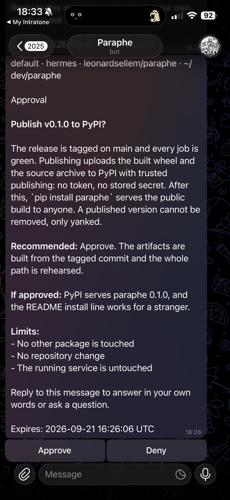

# Paraphe

<!-- mcp-name: io.github.leonardsellem/paraphe -->

[](https://github.com/leonardsellem/paraphe/actions/workflows/ci.yml)

The owner-decision inbox for agents. An agent raises one decision, you answer
it on your phone or on the machine running it, and that same agent picks the
answer up and carries on.

It is for people who run agents that should ask before they act. Paraphe is
the small, self-hosted thing that holds the question until the human answers
it — not a task tracker, not a chat client, and not a workflow engine.


## Install and run

Python 3.11 or newer, and nothing else.

```bash
pip install paraphe
```

In a checkout, the same install inside a virtual environment, with a
configuration file to start from:

```bash
python3 -m venv .venv
.venv/bin/pip install .

cp config.example.toml paraphe.toml     # then fill in two values you make up
.venv/bin/paraphe --config paraphe.toml
```

Those two values are yours:

| Value | Who holds it |
|---|---|
| `mcp_create_bearer` | the agent. It creates cards and reads answers. |
| `owner_answer_token` | you. It answers them, and it is never given to an agent. |

With `pip install paraphe` and no checkout, create `paraphe.toml` with those
two lines; Paraphe reads it from the directory it runs in.

```
Paraphe ready: mcp http://127.0.0.1:8787/mcp answer-path on
```

To send decisions to your phone:

1. Open Telegram's BotFather, run `/newbot`, and keep the token it gives you
   private.
2. Open the new bot and send it `/start`. Find your own numeric Telegram user
   id using a user-info bot you trust.
3. Set `bot_token` and `owner_telegram_id` in `paraphe.toml`, then check the
   pair before starting the server:

   ```bash
   .venv/bin/paraphe check telegram
   .venv/bin/paraphe --config paraphe.toml
   ```

The check names the bot and sends a plain setup message to your phone. It does
not print the token or create a decision card. If delivery is refused, verify
the numeric id and make sure you opened a private chat with the bot first.
Without the two phone settings, cards are printed where you are looking, which
is what the local run above does.

Or run the container, with the data location mounted:

```bash
mkdir -p paraphe-data && chmod 0777 paraphe-data
docker build -t paraphe .
docker run --rm -v "$PWD/paraphe-data:/data" \
  -e PARAPHE_MCP_CREATE_BEARER=... -e PARAPHE_OWNER_ANSWER_TOKEN=... paraphe
```

It binds loopback inside the container, because the answer path refuses a
non-loopback bind. To reach it from outside, configure the phone destination
(a bot token and your Telegram id) and set `PARAPHE_MCP_HOST=0.0.0.0`; the
answer path is then off, and taps arrive on the phone.

## The loop

```
ask → you see the card → you answer → the asking agent resumes
```

The answer returns through the ask itself: the call may wait (`wait_seconds`),
`paraphe wait` can hold the card's lifetime, and any run that missed both
drains the answer from the store at its next boundary. Nothing has to be said
in chat.

On the phone the card is ordered rich text, not a wall of prose: it names who
is asking and from where (agent, runtime, repository, worktree, ticket), bolds
its title, numbers the choices with their one-line notes and marks what is
recommended, and lists the limits, links and expiry. A long-press reply
answers it in your own words — or asks a question — and that text returns to
the exact session that asked.



The approval card as it arrives on the phone.

[`docs/demo/console-loop.md`](docs/demo/console-loop.md) is a recorded run of
exactly that, on a clean checkout, with no third-party credential and no
external service: the agent asks, the card is printed, the agent's own
credential is refused when it tries to answer, the owner answers, and the
agent picks the answer up.

## The line this product draws

**The credential an agent holds cannot answer a decision.** It creates and it
reads. Answering needs the owner's credential, on a path the agent's cannot
reach. An inbox an agent can approve on its behalf is not an owner-decision
inbox, so this is not configurable.

## Documentation

| Document | What it covers |
|---|---|
| [`docs/tools.md`](docs/tools.md) | the MCP tool surface and the card lifecycle |
| [`docs/adapters.md`](docs/adapters.md) | adding a destination, in two methods |
| [`skills/paraphe-return-path/SKILL.md`](skills/paraphe-return-path/SKILL.md) | the async return protocol, per runtime |
| [`CONTEXT.md`](CONTEXT.md) | what the words mean (card, tap, return path, owner) |
| [`docs/adr/`](docs/adr/) | the decisions behind the shape |
| [`docs/specs/paraphe-v1.md`](docs/specs/paraphe-v1.md) | the v1 specification |
| [`docs/roadmap.md`](docs/roadmap.md) | what is next, and what is not planned |
| [`openwiki/index.md`](openwiki/index.md) | the generated wiki index |
| [`openwiki/quickstart.md`](openwiki/quickstart.md) | what Paraphe is, and every route to a running inbox |
| [`openwiki/architecture/`](openwiki/architecture/) | how the inbox runs, page by page |

## Dependencies

The runtime imports nothing outside the Python standard library, so using
Paraphe pulls no dependency tree. Installing it fetches the build backend
once, at install time, and nothing after that.

## Licence

AGPL-3.0-or-later ([`LICENSE`](LICENSE)). Modify it and serve it to other
people over a network and you must offer them your modified source; nothing
here obliges a company to publish the application it builds on top.

## Where your data lives

Cards are a SQLite file in your per-user data directory
(`$XDG_DATA_HOME/paraphe`, else `~/.local/share/paraphe`) unless you set
`store_path`. The directory is created `0700` and the file `0600`, and Paraphe
never reads or writes outside that location.

**Upgrading from a release that used `/var/lib/paraphe`:** set `store_path` to
`/var/lib/paraphe/inbox.sqlite` explicitly. Paraphe refuses to start with the
default when a store exists at that location, rather than quietly beginning a
second, empty inbox.
