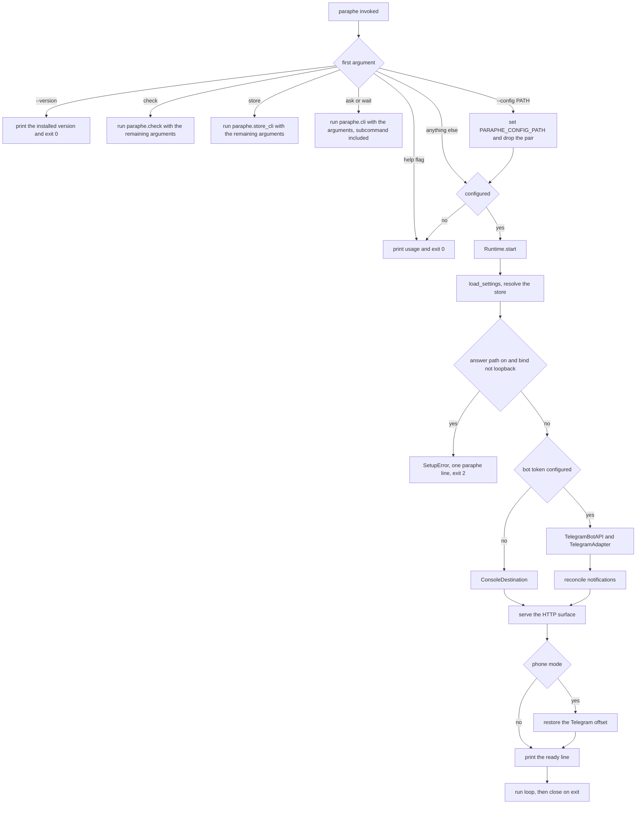
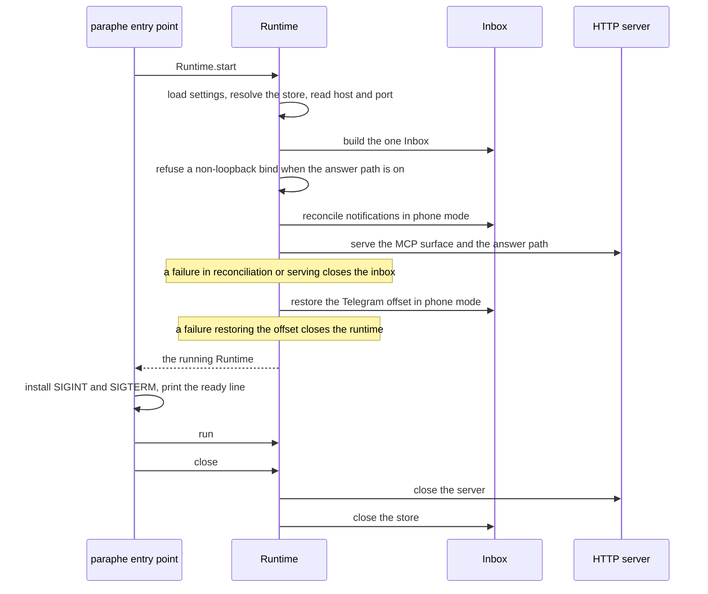

# Composition root and runtime

One process, one store, one command. The installed `paraphe` script
(`paraphe = "paraphe.__main__:main"`) is the whole product's front door: it starts
the inbox, and the same command carries the shell client that talks to it (`ask`,
`wait`) and the owner-side commands (`check`, `store`) — so the server, the client
and the operator's preflight are never separate installs. `python3 -m paraphe`
reaches the same `main`. This page follows a single invocation from argument
dispatch to a running inbox: settings resolution, the destination chosen from
configuration, the ordered startup with its rollbacks, the two run modes, the
ready line, and the shutdown order.

Two constraints shape every line of it:

- **The standard library is the whole dependency list.** `pyproject.toml` declares
  `dependencies = []`, and every module here imports only the standard library and
  the package itself.
- **The answer path refuses a non-loopback bind**, and the listener itself only
  accepts loopback or a Tailnet address. Both checks are in the startup path, not
  in the configuration file.

## The entry point

`src/paraphe/__main__.py` is both the installed `paraphe` command (via the
`paraphe.__main__:main` console script) and `python3 -m paraphe`. Its dispatch, in
order:

| Invocation | Behaviour |
|---|---|
| `-h`, `--help`, `help` as the first argument | prints usage, exits `0` |
| `--version` as the first argument | prints the installed distribution's version, exits `0` |
| `check ...` | imports `paraphe.check` and runs it with the remaining arguments |
| `store ...` | imports `paraphe.store_cli` and runs it with the remaining arguments |
| `ask ...` or `wait ...` | imports `paraphe.cli` and runs it with those arguments (the subcommand included), so the client path handles the command |
| `--config PATH` (repeatable, leading the argument list) | sets `PARAPHE_CONFIG_PATH` and consumes the pair |
| nothing configured | prints the same usage, exits `0` |
| configured | imports and runs `paraphe.inbox.runtime.main` |

Every row is decided on the **first** argument, and each import happens inside its
own branch, so a server run never imports the client and a client run never
imports the server. `--version` prints `importlib.metadata.version("paraphe")`
rather than a second literal, so the value cannot drift from `pyproject.toml`; a
checkout whose package was never installed has no distribution metadata to read.

"Configured" means any `PARAPHE_*` variable is present in the environment — the
test is name-based, so even a blank export counts — or the file it names (the
default `paraphe.toml` in the working directory, which is git-ignored) exists.
`--config PATH` is repeatable and the last pair wins;
`--config` with no path is its own error: one `paraphe: --config needs a path`
line on stderr and exit `2`. The loop consumes only *leading* pairs and then
discards whatever is left, so a word after `--config` never runs:
`paraphe --config paraphe.toml check telegram` starts the server. A subcommand is
recognized as the first argument or not at all.

A `SetupError` from the runtime is printed as one `paraphe: <message>` line with
exit `2` — never a traceback, and never a partially started service. The help row
and the nothing-configured row print the same usage on purpose: a reader who runs
the command before configuring anything should see what to do, not a stack trace.

### The routes it hands off to

`paraphe check telegram` and `paraphe store relocate` are the owner-side commands:
a paired preflight for the phone destination and the documented way to move a
store kept by an earlier release to the current location. They are dispatched
before the `--config` loop, so neither consumes `--config` and neither needs the
service to be running; what they read, print and verify is
[The owner-side commands](/openwiki/operations/owner-side-commands.md).

`paraphe ask` and `paraphe wait` complete the whole ask/answer loop from a shell —
ask prints the request id, wait exits when the owner taps — and they are checked
*before* the `--config` loop too. That means the client path never consumes
`--config`; it resolves its create bearer from `PARAPHE_MCP_CREATE_BEARER` or the
configured file, uses the CLI's own exit codes (`0` answered, `1` error,
`3` expired or not answerable, `4` unknown request id), and needs the server
already running (see
[The ask and wait commands](/openwiki/integrations/ask-and-wait-cli.md)).

There is a second, developer-only route: `src/paraphe/inbox/__main__.py` calls
`paraphe.inbox.runtime.main` directly, with no CLI dispatch and no `--config`
handling, so configuration for `PYTHONPATH=src python3 -m paraphe.inbox` must
come from the environment.

## Settings

`load_settings` resolves every value from the configuration file and the
environment, with **the environment winning per key** and an absent file being an
empty mapping rather than an error. A missing file is fine; a file that does not
parse as TOML, or that is not a table, raises `SetupError("config file is
invalid")`. An environment variable that is absent, empty or whitespace-only
counts as unset, so a blank export cannot silently discard a file value.

The rules it enforces are the product's shape, not preferences:

- the **create bearer** is always required (`mcp_create_bearer`, else
  `PARAPHE_MCP_CREATE_BEARER`);
- the **answer credential must differ** from the create bearer;
- the **phone destination is the bot token's presence** — with a token, the owner
  Telegram id is required and must parse to a positive integer; without a token,
  an answer credential is required, because a local instance that cannot answer
  is not an inbox;
- card life is validated against the floor and the ceiling, and the default may
  not be below the floor;
- the store location is resolved by a single function (see
  [Data location, permissions and backup](/openwiki/operations/data-location-and-backup.md)).

The resolved `Settings` is a frozen dataclass whose `repr` prints only the owner
id and the TTL values, so logging it cannot leak the bearer, the bot token or the
answer credential. That is the same boundary described in
[The credential boundary](/openwiki/security/credential-boundary.md);
`config.example.toml` is the operator-facing minimum, and it marks
`mcp_create_bearer` as always required, the phone destination as `bot_token` plus
`owner_telegram_id`, and the local destination as `owner_answer_token`.

## Bind defaults and validated numbers

The defaults come from the code, not from a sample run:

- `runtime.DEFAULT_MCP_HOST` is `127.0.0.1`; `PARAPHE_MCP_HOST` overrides it.
  The host is not validated here — the bind rules below are what refuse a public
  one.
- `runtime.DEFAULT_MCP_PORT` is `8787`, overridable by `PARAPHE_MCP_PORT`, which
  must be an integer in `0`–`65535`. `0` means "let the OS choose", and only the
  ready line then reports the real port.
- `runtime.DEFAULT_POLL_SECONDS` is `25`, overridable by
  `PARAPHE_TELEGRAM_POLL_SECONDS`, bounded to `1`–`50`.
- For an unset or blank variable the default applies; an unparseable or
  out-of-range value raises `SetupError("<NAME> is invalid")` before anything is
  opened.
- The client side repeats the same defaults as `cli.DEFAULT_HOST` /
  `cli.DEFAULT_PORT` (`127.0.0.1:8787`) for the endpoint it derives when neither
  `--url` nor `PARAPHE_MCP_URL` is set, and does not range-check the port.

These three are read by `Runtime.start`, not by `load_settings`; `--config` only
decides *which file* the settings come from.

## Startup sequence



How an invocation becomes a running inbox, including the dispatch that never
reaches the runtime, the two refusals and the order in which the phone-mode work
happens.

`Runtime.start` is the composition root. It:

1. resolves settings — and with them the store location — from the configuration
   file named by `PARAPHE_CONFIG_PATH`, if any, and the environment;
2. reads the host, port and poll interval from the environment;
3. builds the one `Inbox` with the resolved settings;
4. refuses a non-loopback bind when the answer path is enabled;
5. chooses the destination from the bot token's presence and wires it into the
   inbox as both the notifier and the tap port;
6. in phone mode, reconciles notifications **before** the HTTP surface is
   served, then serves it;
7. in phone mode, restores the Telegram offset **after** the HTTP surface is up;
8. returns a `Runtime` holding the `ServerHandle`.



The same lifecycle as a call sequence: what `Runtime.start` touches in order, and
where each rollback sits.

Steps 6 and 7 roll back on failure: an exception during reconciliation or serving
closes the inbox, and an exception restoring the offset closes the runtime, so a
failed start never leaves an open store or a listening socket behind. The HTTP
transport itself, its routes and their authentication are documented in
[The MCP HTTP surface](/openwiki/architecture/mcp-surface.md).

## The two run modes

The destination is chosen from configuration, not from the environment variable
by variable: a bot token selects `TelegramAdapter`; no bot token selects
`ConsoleDestination`, which prints the card and the exact `curl` command that
answers it. The same choice sets `inbox._notifier` and `inbox._telegram` (the
adapter in phone mode, `NullTelegramPort` locally). Because the console
destination is constructed with the *configured* host and port, its printed
answer URL matches the configured bind.

| | Local (console) | Phone (Telegram) |
|---|---|---|
| Chosen by | no bot token | bot token present |
| Destination | `ConsoleDestination` | `TelegramAdapter` |
| Notification reconciliation at start | skipped | runs, before the HTTP surface is served |
| Telegram offset restore at start | skipped | runs, after the HTTP surface is served and persisting the next offset in the store |
| Main loop | waits on the stop event; the HTTP server runs in its own thread | long-polls, swallowing transport errors with a one-second backoff |

The distinction exists so that a first run needs nothing external while the
deployed case keeps its long-polling behaviour. Both modes serve the same HTTP
surface.

### Update consumption

The Telegram side is where the runtime owns durable state. Startup resolves the
next offset from the store; on a first boot there is none, so it calls
`getUpdates(offset=-1, timeout=0)`, takes the newest `update_id` in the reply and
persists `newest + 1` (or `0` for an empty reply). The backlog queued while
Paraphe was down is therefore skipped rather than dispatched, and later starts
resume exactly where the stored offset points.

Each poll asks for updates from that offset with the configured timeout, handles
every entry, and persists `max(current, update_id + 1)` **after** the update has
been handled. A failure during handling therefore leaves the offset on the failed
update, so it is retried after a restart instead of being skipped or replayed out
of order. An entry whose `update_id` is not a plain non-negative `int` — strings,
floats, booleans, `int` subclasses and `IntEnum` are all rejected — makes the
whole poll a `TelegramAPIError`, with the offset already advanced past the
entries that were handled. A persistently malformed entry is retried from the
same offset on every backoff rather than skipped.

Only two failures are survivable in the loop: `TelegramAPIError` (transport,
timeout, malformed payload, malformed update) and `NotifyRejected` (the Bot API
answered `ok: false`). Both are swallowed with a one-second, stop-aware backoff
and the service stays up. `TelegramBotAPI` keeps the token out of every message
it raises: the token lives in the request URL, and errors never quote it. Any
other exception escapes `run()` and reaches the `finally` that closes the
runtime. The Bot API client itself and its configuration threading are documented
in [The Telegram tap surface](/openwiki/integrations/telegram-tap-surface.md).

## The ready line and where the bind is policed

Both modes print exactly one ready line, after the signal handlers are installed
and before the loop starts, using the socket that was actually bound:

```
Paraphe ready: mcp http://<host>:<port>/mcp answer-path on|off
```

`answer-path` is `on` exactly when an answer credential is configured. Two
separate checks decide whether the process is allowed to listen where it was
told:

- **the answer path refuses a non-loopback bind** — an answer credential with a
  non-loopback host raises `SetupError("the answer path refuses a non-loopback
  bind")` and startup fails. This is stricter than the bind rule: a Tailnet
  address is allowed to bind, but it is not allowed to carry the answer path;
- **the bind itself must be loopback or Tailnet** — `serve_inbox` raises
  `BindError` unless the host is `localhost`, `127.0.0.1`, `::1`, a loopback
  address, IPv4 in `100.64.0.0/10` or IPv6 in `fd7a:115c:a1e0::/48`. `BindError`
  is not a `SetupError`, so a refused bind is not converted into the entry
  point's one-line exit-`2` message.

## Shutdown

`main` installs `SIGINT` and `SIGTERM` handlers that both stop the runtime. The
stop event is what the local wait blocks on and what the Telegram backoff wait
observes, so either signal ends the local mode immediately and the phone mode at
its next poll or backoff boundary. The loop runs inside a `try`/`finally`, so
`Runtime.close` runs on a normal stop and on an exception out of the loop.

`close` is idempotent, and it closes the HTTP server before the inbox, so no
request is being served while the store closes underneath it. Closing the
`ServerHandle` shuts the threaded server down, joins its thread with a five
second timeout and closes the socket; only then does the inbox close the store.

## Failure behaviour

| Situation | Behaviour |
|---|---|
| Nothing configured | usage, exit `0` |
| `--config` with no path | one line on stderr, exit `2` |
| `--config PATH` followed by a subcommand | the server starts; the trailing words are ignored |
| `paraphe --version` | the installed version, exit `0`, no configuration needed |
| Configuration present but invalid | one `paraphe: <message>` line, exit `2`, nothing left running |
| Answer path enabled on a non-loopback bind | refuses to start (`SetupError`) |
| Bind host neither loopback nor Tailnet | `BindError` from `serve_inbox`, not the one-line message |
| Bot token present, owner id missing or not positive | refuses to start |
| No bot token and no answer credential | refuses to start |
| Telegram API rejects or fails a poll | swallowed, one-second backoff, service stays up |
| A polled update fails during handling | the offset stays on it, so it is retried after a restart |
| A malformed `update_id` in a batch | the poll raises `TelegramAPIError`; earlier entries in the batch are already persisted |
| `paraphe ask` / `paraphe wait` | the client path's own codes: `0` answered, `1` error, `3` expired or not answerable, `4` unknown request id |
| `paraphe check` / `paraphe store` | the owner-side command's own message and exit code (see [The owner-side commands](/openwiki/operations/owner-side-commands.md)) |

## What the tests pin

- `tests/inbox/test_setup.py` drives the entry point itself: an empty
  environment prints usage and exits `0`, an environment holding only
  `PARAPHE_OWNER_TELEGRAM_ID` exits `2` with a `paraphe:` line on stderr,
  `--version` prints the version reported by the distribution without any
  configuration, and `paraphe store relocate` is driven through the same
  `main` for its copy, move and failure paths. It also covers every settings
  refusal, including a non-loopback bind with the answer path enabled for
  `0.0.0.0`, the Tailnet address `100.64.1.2` and a public address.
- `tests/inbox/test_check.py` routes `check telegram` through
  `paraphe.__main__.main` and pins that neither the token nor the token-bearing
  URL appears in what the command prints.
- `tests/inbox/test_runtime.py` starts the real runtime against a temporary
  store: loopback bind, one notifier, the configured store, `close` stopping the
  listener and closing the store, the bootstrap skipping queued updates and
  persisting across a restart, exact-`int` update id rejection, and the loop
  staying alive on a malformed batch.
- `tests/inbox/test_wait_engine.py` covers the `ask` / `wait` codes and their
  endpoint and bearer resolution, including the config-file bearer fallback.
