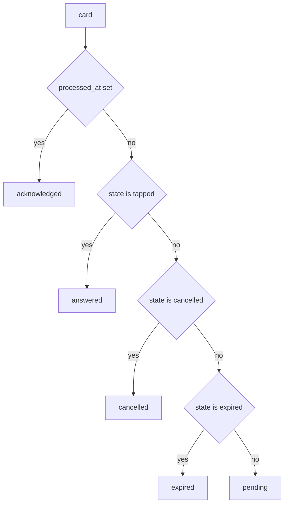
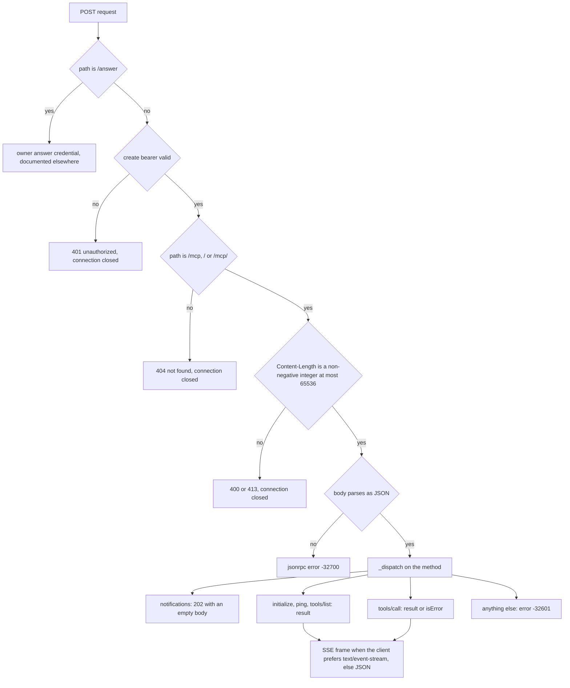

# The served MCP surface and envelope

Paraphe serves an MCP surface of twelve tools over authenticated Streamable HTTP.
The caller-facing authority for what each tool means, which fields it takes and
which lifecycle it takes part in is `docs/tools.md`; this page documents how that
contract is produced and served — the registry the names, schemas and texts come
from, the strictness rules that make the documented field set the whole field set,
the field families the surface carries (the shared create fields, the card-specific
fields, `choice_notes` and the provenance fields), the envelope a read returns, and
the JSON-RPC and HTTP behaviour around it.

The credential itself is a separate subject: the create bearer creates and reads,
and only the owner credential answers, as documented in
[the credential boundary](/openwiki/security/credential-boundary.md).

## One registry is the whole surface

`src/paraphe/inbox/__init__.py` holds the surface as data:
`TOOL_NAMES`, `TOOL_SCHEMAS`, `TOOL_DESCRIPTIONS`, and the handler map built inside
`Inbox.call_tool`. Nothing else defines a tool.

`TOOL_NAMES` is the registry, in its served order:

```
how_to_use, ask_question, request_approval, get_response, list_unprocessed,
list_pending, mark_processed, report_execution, update_request, cancel_request,
notify_user, request_feedback
```

By role:

| Role | Tools |
|---|---|
| create a card | `ask_question`, `request_approval`, `request_feedback` |
| status only, never a card | `notify_user` |
| read | `how_to_use`, `get_response`, `list_pending`, `list_unprocessed` |
| revise, withdraw, close out | `update_request`, `cancel_request`, `report_execution`, `mark_processed` |

`Inbox.list_tool_descriptors()` walks `TOOL_NAMES` in that order and emits
`{name, description, inputSchema}` per tool, so `tools/list` can only ever serve
the registry. `Inbox.call_tool` rejects any name outside `TOOL_NAMES` with
`InboxError("unknown tool")` before it looks at the arguments, then dispatches
through a handler map keyed by the same names. Order is part of the contract: the
suite asserts the served order, not just the set.

All four artefacts are indexed by the same names, so they are one registry with
four faces rather than four lists: `list_tool_descriptors` looks the description
and the schema up by name, `call_tool` looks the handler up by name, and every
field a handler accepts has to have a shape in `_field_schema` — which raises
`KeyError` for a name with no shape, at import time rather than at call time. A
tool rename or a new tool therefore touches all four places, plus the `## Tools`
table of `docs/tools.md`, which
`tests/inbox/test_surface_contract.py::test_the_served_tools_are_exactly_the_documented_ones`
asserts equal to `TOOL_NAMES`: it is a doc-and-test change, not just a code change.

Two properties hold over the names themselves: no tool is named `answer` or
`claim` (the surface cannot answer, only create and read), and every tool carries
a non-empty description that is not merely its own name.

## Schemas are derived, and static

`TOOL_SCHEMAS` is built at import time from frozen per-kind field sets and the
limit constants:

- `ASK_ONLY` (`question`, `context`, `choices`, `choice_notes`, `allow_freeform`),
  `APPROVAL_ONLY` and `FEEDBACK_ONLY` (`title`, `details`), `NOTIFY_FIELDS`
  (`title`, `message`, `result`), the shared create set `SHARED_CREATE` and the
  provenance set `PROVENANCE` (`runtime`, `repo`, `worktree`, `ticket`) are unioned
  per create tool — provenance rides the three asking tools only, so `notify_user`
  is the one create whose schema advertises no provenance field;
- `UPDATE_FIELDS` is the revise-in-place set: the shared create fields except
  `agent_name` and `wait_seconds`, plus `title`, `details`, `choices`,
  `choice_notes`, `renotify`, `expected_version` and the four provenance fields;
- the remaining tools get literal sets (`{"request_id", "wait_seconds"}` for
  `get_response`, `{"request_id", "outcome", "note", "result"}` for
  `report_execution`, and so on);
- `_schema` / `_field_schema` turn each field name into a JSON-schema property
  from `_LIMITS`, the enum frozensets (`RISK_VALUES`, `PRIORITY_VALUES`,
  `REPORT_OUTCOMES`, `CANCEL_REASONS`, `RESULT_OUTCOMES`) and the TTL constants,
  then attach `required`.

`required` is served only where the call cannot work without an argument:
`question` on `ask_question`; `title` on `request_approval`, `request_feedback` and
`notify_user`; `request_id` on `get_response`, `mark_processed`,
`report_execution`, `update_request` and `cancel_request`, with `expected_version`
alongside it on `update_request` and `outcome` alongside it on `report_execution`.
`how_to_use`, `list_unprocessed` and `list_pending` advertise no properties and no
`required` at all.

Because the schema is computed from module constants at import, what `tools/list`
advertises is identical in every deployment and independent of `Inbox` settings.
Enforcement is not: `_ttl` refuses an `expires_in_seconds` below the *configured*
`floor_ttl_seconds`, while the served schema's minimum for that field is the
built-in `FLOOR_TTL_SECONDS` (900), and the card's default life comes from the
configured `default_ttl_seconds` (14400 out of the box) rather than from anything
in the schema. Effective TTL bounds and defaults therefore come from the
deployment's configuration, not from `tools/list`.

A string field's advertised and enforced lengths come from one place:
`_field_schema` reads `_LIMITS` for `maxLength` and `_require_str` looks up the same
`_LIMITS` entry to validate, so those two cannot drift apart. The array shapes are
the exception — the `maxItems` and item `maxLength` of `choices`, `choice_notes`,
`links` and `prohibitions` are written literally in both `_field_schema` and the
array validators, so a limit change there is a change in two places in the same
file.

## The strictness rules

Two layers run before any field value is interpreted:

1. **`_reject_unknown`** — the tool's own field set is the allowed set;
   `set(args) - allowed` non-empty raises `InboxError("unknown parameter")`.
   Nothing is ignored and nothing is read past the check.
2. **`_reject_keys`** — the kind-specific field sets refuse to mix, raising
   `InboxError("kind fields do not mix")`.

Per tool, the presentable field set and the refusals are:

| Tool | Presentable field set | Refused |
|---|---|---|
| `ask_question` | ask fields + shared create + provenance | `title`, `details` |
| `request_approval` | `title`, `details` + shared create + provenance | `question`, `context`, `choices`, `choice_notes`, `allow_freeform` |
| `request_feedback` | `title`, `details` + shared create + provenance | `question`, `context`, `choices`, `allow_freeform` (the rest of the ask set — `choice_notes` also lies outside its allowed set, so it is `unknown parameter`, not a kind refusal) |
| `notify_user` | `title`, `message`, `result` + shared create | the whole ask set including `choice_notes`, plus `details` and all four provenance fields |
| `update_request` | `UPDATE_FIELDS` only | against the stored card's kind: a `question` card refuses `title`/`details`, an `approval` card refuses the ask set including `choices` |

On the four create tools the two layers overlap. `title` is simply not in
`ask_question`'s allowed set, so an `ask_question` carrying it is refused as
`unknown parameter` (nothing is read past that check); the explicit kind check in
each create handler is defensive, and the suite only asserts that mixing raises.

`update_request` is where the two layers genuinely differ. `UPDATE_FIELDS` spans
both kinds — it admits `title`, `details` and `choices` for every caller — so the
refusal comes from the kind check, which runs after the card is loaded: a revise
call is refused against the card that actually exists rather than against a tool
name. What the set does *not* admit is refused earlier, on every kind:
`question`, `context`, `allow_freeform`, `agent_name` and `wait_seconds` are all
outside `UPDATE_FIELDS`, so a revise cannot change which agent asked, cannot
change the freeform setting, and cannot carry a waiting window — but it can move a
card's life with `expires_in_seconds`. A `feedback` card takes neither branch of
the kind check, so a revise of one accepts `title`, `details` and `choices` alike.

Limits, all enforced with the same constants the schema advertises:

| Field | Constraint |
|---|---|
| `question`, `title` | string, 200 chars, non-blank |
| `context`, `details`, `message` | string, 2000 chars (absent or null allowed; a present blank string is refused) |
| `recommendation`, `consequence`, `note` | string, 1000 chars |
| `project` | string, 120 chars |
| `runtime` | string, 40 chars |
| `repo`, `worktree` | string, 120 chars |
| `source_thread`, `external_id`, `rule_key`, `ticket` | string, 200 chars |
| `agent_name` | string, 60 chars |
| `commit_message` | string, 500 chars (inside `result`) |
| `choices` | array of at most 4, each a non-blank string of at most 40 |
| `choice_notes` | array of at most 4 strings of at most 120, whose length must equal `choices` — notes without matching choices are refused |
| `links` | array of at most 8, each a string of at most 500 **containing `://`** |
| `prohibitions` | array of at most 8, each a string of at most 200 |
| `allow_freeform`, `renotify` | boolean; a non-boolean `allow_freeform` is refused |
| `wait_seconds` | number, 0–60 inclusive; booleans refused |
| `expires_in_seconds` | integer, configured floor to 2 592 000; booleans refused, never clamped |
| `expected_version` | integer ≥ 1; booleans refused |
| `risk` | `low` \| `medium` \| `high` \| `critical` (default `medium`) |
| `priority` | `low` \| `normal` \| `high` \| `urgent` (default `normal`) |
| `outcome` (`report_execution`) | `accepted` \| `rejected` \| `completed` \| `failed` |
| `reason` (`cancel_request`) | `cancelled` \| `resolved_elsewhere` (default `cancelled`) |
| `result` | object with no extra keys; `outcome` required and one of `success` \| `failure` \| `partial`; `files_changed` ≤ 50 strings of ≤ 300; `tests_passed`, `tests_failed`, `duration_seconds` non-negative integers; `commit_message` ≤ 500 |

A required field that is missing, null or blank reports "… is required"; a value
of the wrong type reports "… is invalid" — as does a blank `external_id`, which is
optional in shape but mandatory on the create path. Length overruns report "… is
too long". `external_id` is required on the three decision creates — it is the
caller's stable key and the basis of duplicate suppression — and optional on
`notify_user`, where it dedupes the notification rather than a card.

### `choice_notes` belongs to `choices`

`choice_notes` is the one field with a cross-field rule: it is a `choices`-parallel
array of one-line notes, served on `ask_question` and on `update_request` (not on
the other creates), at most four entries of at most 120 characters each. The
handler refuses a list whose length differs from the card's `choices`, so notes
without matching choices are not accepted silently. On a revise, sending `choices`
without `choice_notes` clears the notes that were written for the old choices,
while sending `choice_notes` alone edits the notes of the choices the card already
has.

### `rule_key` is accepted, then ignored

`rule_key` is listed in `SHARED_CREATE` and `UPDATE_FIELDS` because callers send
it, and `_opt_shared` / `_apply_shared` validate it as a string of at most 200
characters. It is then dropped: neither function copies it into the card, and
`Card` has no field for it. Always-allow is explicitly not product, so the only
compatible choice was to accept the field and ignore it rather than reject it as
unknown.

### Provenance travels with the ask

The provenance set is `runtime`, `repo`, `worktree`, `ticket`, and it is served on
`ask_question`, `request_approval`, `request_feedback` and `update_request`. It is
deliberately absent from `notify_user`, where any of the four names is refused as
`unknown parameter` — a status message has no ask to attribute.

The values are supplied by the caller, bounded, and **never guessed**: a create
that omits them stores nothing and forwards nothing, so an older client that knows
none of the four keeps working unchanged. On create they are copied into the card
along with the rest of the shared fields; on a revise, `_apply_shared` writes only
the fields present in the call, so updating the `worktree` leaves the `repo` and
`runtime` the card already carried. They then travel in the notification payload
the destination receives, where they render as the card's identity line — which is
why they are presentation and attribution metadata rather than anything the
lifecycle acts on: no tool reads them back, and nothing is woken from them.

## The reading envelope

`Inbox._envelope(card)` is the shape a read returns, and the shape a parked call
returns when its window closes:

| Field | Value |
|---|---|
| `request_id` | the card id |
| `status` | derived, see below |
| `version` | the card's revision |
| `response` | `null`, or `{choice, text, responded_at, responded_via}` |
| `processed_at` | closeout timestamp or `null` |
| `execution_status` | `report_execution`'s outcome or `null` |
| `kind` | the card's kind: `question`, `approval` or `feedback` |
| `pending` | `true` only while the persisted state is `open` |

The `response` object is present whenever the card is tapped or carries a recorded
choice or text, so a closed-out card still shows what the owner answered.
`responded_via` records how the answer actually arrived: `telegram` for a tap
through the bot, `telegram-reply` for the owner's long-press reply to the card
message, and `answer-path` for the local owner route. So a locally answered card
is never reported as a phone tap, and an owner reply is never reported as a tap on
a button. (`app` is the default of the test-only `record_tap` shortcut, which has
no production caller.)

`_status` maps the persisted card onto the served status with a strict precedence:


The derived `status`: `acknowledged` outranks `answered`, and `pending` is the fallback for an open card.

`acknowledged` outranking `answered` matters because closeout must not erase
authorship: after `mark_processed` the status changes but `response.choice` and
`responded_at` stay readable.

### Reads never consume

`_envelope` reads the card and writes nothing. Consequently:

- `get_response` returns the same answer on every call — reading twice yields the
  same `response.choice`;
- `list_unprocessed` re-derives its list on every call from cards whose state is
  `tapped` and whose `processed_at` is `null`, so an answer keeps appearing until
  `mark_processed` writes the timestamp; draining is a caller convention, not a
  server-side queue;
- `list_pending` refreshes expiry and returns the still-open cards in reverse
  creation order;
- `mark_processed` is the only tool that sets `processed_at`, and it does so once:
  a second call returns the same envelope with the same `processed_at`.

Nothing in the surface clears `response`, and only `update_request` bumps
`version`.

At the tool layer, reads do not require the create bearer: only the four create
handlers call `_require_create_bearer`, and every other handler ignores the
`bearer` argument entirely. Over HTTP every MCP call carries the bearer anyway, so
this asymmetry is visible only to a caller that invokes `call_tool` directly, for
which the create check is the real gate.

## The create view, and where the wait replaces it

`Inbox._create_view(card, duplicate=…)` is the other response shape:

| Field | Value |
|---|---|
| `request_id` | the new or existing card's id |
| `version` | 1 for a new card |
| `duplicate` | `true` when the `external_id` was already known |
| `pending` | `true` while state is `open` |
| `status` | derived as above |
| `kind` | the card kind |
| `read_with` | `"get_response"` — the served pointer at the reading path |

Every create returns it, and `update_request` returns it too (with
`duplicate: false`) instead of an envelope.

`notify_user` returns neither shape. It creates no card, so it cannot be read or
closed out: it answers `{ok: true, duplicate: <bool>, kind: "notify"}`, reporting
only whether that `external_id` had already been sent.

`call_tool` then applies the wait, and this is the one place the two shapes meet:
when the tool is in `WAIT_TOOLS` (`ask_question`, `request_approval`,
`get_response`), the handler returned a dict carrying `request_id`, and the
validated `wait_seconds` is greater than zero, the parked card's **reading
envelope** is returned *instead* of the handler's result. So a create with a wait
does not answer in the create shape at all — the caller gets
`status`/`response`/`pending`, not `duplicate`/`read_with`. A duplicate create
that also waits therefore reports the current card state rather than the duplicate
flag. `wait_seconds` of `0` (or absent) returns the handler's own result and does
not sleep. `request_feedback` accepts `wait_seconds` — it is in the shared create
set, and the handler's allowed set names it a second time — but it is not in
`WAIT_TOOLS`, so the value is validated and not slept on, exactly as
`docs/tools.md` documents.

The park runs after the inbox lock is released, so a parked call never blocks the
store for other requests, and the window is bounded per call. The full mechanism,
the waiter registration and the wake points are documented in
[the wait engine](/openwiki/architecture/wait-engine.md); the command-line
equivalent is [the ask and wait CLI](/openwiki/integrations/ask-and-wait-cli.md).

## The HTTP transport

`src/paraphe/inbox/http.py` serves one `ThreadingHTTPServer` per `serve_inbox`
call, so requests are handled on their own threads and a parked call cannot stall
the listener.

### Routes and authentication

| Request | Credential | Answer |
|---|---|---|
| `POST /mcp`, `POST /mcp/`, `POST /` | create bearer | the JSON-RPC response, or `202` for a notification |
| `POST` on any other path | create bearer | `404 not found`, connection closed |
| `POST /answer` | owner answer credential | the answered envelope under `200`, `400` for a malformed body, `409` with the refusal reason |
| `GET` on an MCP path | create bearer | `405 method not allowed` |
| `GET` on any other path | create bearer | `404 not found` |

The order of checks on the MCP path is: reject `POST /answer` first (that route
belongs to the owner answer path), then check `Authorization: Bearer <create
bearer>` with `secrets.compare_digest`, then check the path, then read the body.

- a missing or wrong bearer is `401 unauthorized`, and the connection is closed;
- an authenticated POST to any other path is `404 not found`, also closing the
  connection;
- `GET` on an MCP path is `405 method not allowed` (there is no SSE channel to
  subscribe to), and `GET` on another path is `404`; a `GET` refusal does not close
  the connection, because no request body was left unread;
- `POST /answer` never reaches this surface: it is routed to the owner answer path
  before any bearer check, and it accepts only the owner credential — the create
  bearer is refused there even when it is the configured one. The route is also
  POST-only, so `GET /answer` is answered by the MCP rules rather than by the
  answer path. The credential semantics are
  [the credential boundary's](/openwiki/security/credential-boundary.md) subject;
  what matters at the transport is that the credential is checked before the body
  is read, that a body which does not parse, is not a JSON object, or does not
  carry a non-empty `request_id` and an integer `version` is `400` (`invalid
  request`, `request_id and version are required`, or `invalid choice` for a
  non-string `choice`), and that a
  refused answer is `409` with its reason string (`stale_version`,
  `already_tapped`, `expired`, `cancelled`, or `refused` for any other failure) —
  so a failed answer never looks like a success or a server error;
- `check_bearer` refuses everything when no create bearer is configured on the
  inbox, so a misconfigured deployment serves nothing rather than everything.

Closing the connection on a POST refusal is deliberate: the rejected body is never
read, and on a keep-alive connection an unread body would otherwise be parsed as
the next request. The suite pins exactly that sequence — a `401` response whose
`Connection` header says `close`, followed by a fresh authenticated request on the
same socket that returns the correct tool list.

### The request body

`Content-Length` is the only length signal accepted, on both routes. A value larger
than 65 536 bytes (`MAX_BODY_BYTES`) or negative is refused with
`413 payload too large` without reading the body — and without echoing the bearer
or the bot token — and a value that is not an integer is `400 bad content-length`;
both close the connection. A missing or zero length is treated as `{}`, which then
falls through to method-not-found on the MCP path and to `400` on the answer path.

### JSON-RPC methods

| Request | Answer |
|---|---|
| `initialize` | `protocolVersion: "2024-11-05"`, `capabilities.tools.listChanged: false`, `serverInfo: {name: "paraphe", version: "0.1.0"}` |
| `ping` | `{}` |
| `tools/list` | `{tools: <descriptors in TOOL_NAMES order>}` |
| `tools/call` | the wrapped tool result, or `isError` |
| `notifications/initialized`, or any `notifications/*` carrying no `id` | HTTP `202` with an empty body |
| anything else | JSON-RPC error `-32601 method not found` |
| a payload that is not a JSON object | JSON-RPC error `-32600 invalid request` |
| a body that does not parse as JSON | JSON-RPC error `-32700 parse error` |

Notifications are the only request class that produces no JSON-RPC reply, which is
why they get `202` rather than a result. `tools/call` reads `params.name` and
`params.arguments` (absent or falsy arguments become `{}`).


The order of the transport checks, and where each class of request leaves the handler.

### Result and error framing

A successful `tools/call` is wrapped as
`result.content[0].text`. The text is `json.dumps` of the handler's dict or list —
or, for `how_to_use`, the handler's string verbatim, so the guide is readable text
rather than JSON-encoded JSON.

Any exception raised by `call_tool` becomes a **JSON-RPC result** with
`isError: true` and the exception message as `content[0].text` (or `"tool error"`
when the message is empty), still under HTTP `200`. An unknown tool name and an
argument the tool refuses are therefore not HTTP errors at all — they are a
successful RPC that carries `isError`. The refusal vocabulary of the surface is
the message text — `unknown parameter`, `kind fields do not mix`,
`external_id is required`, `card is not open`, `expected_version does not match`,
`unknown request_id`, `outcome is invalid`, and so on — not a status code. A wrong
bearer is the one refusal that is an HTTP status.

An accepted MCP response always carries `Mcp-Session-Id`, a random 32-hex-character
id generated once per `serve_inbox` call. It is informational: the server never
reads it back and does not validate it, and the error responses (`401`, `404`,
`405`, `400`, `413`, `-32700`) do not carry it.

Framing depends only on the request's `Accept` header: when it contains
`text/event-stream` **and not** `application/json`, the same body is framed as

```
event: message
data: {"jsonrpc": "2.0", "id": 7, "result": {"tools": []}}
```

with `Content-Type: text/event-stream`; otherwise it is served as
`application/json`. The framing is chosen per response; the surface never opens a
standing stream.

### Bind policy

`serve_inbox` refuses a public listener with `BindError("public bind refused")`.
Accepted hosts are loopback names and addresses, the Tailscale ranges
`100.64.0.0/10` and `fd7a:115c:a1e0::/48`, with the socket family chosen from the
host so an IPv6 literal binds IPv6. The returned `ServerHandle` exposes `host`,
`port`, `url` and `close()`; its `url` is always
`http://127.0.0.1:<port>/mcp`, so a deployment that must reach the surface over a
tailnet address builds that URL from `host` and `port` instead.

## What the served text carries

`TOOL_DESCRIPTIONS` is the short text in each descriptor; `Inbox._how_to_use`
returns the long guide. Both are written for a client that reads nothing else
(`docs/adr/0011-answer-returns-through-the-ask.md`), and the suite pins the
phrases a client depends on:

- how to compose the card is taught, not assumed: `ask_question` and
  `request_approval` say to compose purpose first — why the ask exists before the
  action detail — with the origin stated and the tap semantics plain, naming
  `consequence` and `prohibitions` for what the answer authorises and what it does
  not; `request_feedback` carries the same purpose-first sentence without naming
  those two fields;
- the asking tools say to "Record the returned request_id" and name
  `get_response` and `wait_seconds`, and the four tools that take provenance —
  `ask_question`, `request_approval`, `request_feedback`, `update_request` — say
  to pass the fields spelled `runtime/repo/worktree/ticket` (optional) so the
  card shows where the ask comes from;
- `get_response` adds that the answer is nested at `response.choice` and is not
  consumed, and that an owner reply arrives as `response.text` with
  `responded_via telegram-reply`; `get_response` and `list_unprocessed` both
  carry the drain rule ("drain the answers that are yours when you next run");
- the guide adds the tool list, the shared-bearer plus stable-`external_id` rule,
  the question/approval field split ("Mixing those names fails"), the request-id
  and `wait_seconds` protocol, where the owner answers, the phone rendering with
  its identity line (agent, runtime, repository, worktree, ticket) and the
  provenance instruction, the writing contract in full — origin stated, purpose
  first, tap semantics plain, including what Approve and what Deny each do — the
  reply channel and the reply rule ("a reply that is a question or not a
  decision is not a decision: do not execute it — explain, then re-ask with a
  fresh card"), the `paraphe wait` command with its exit codes, the credential
  one-liner ("this credential creates and reads. It cannot answer a decision."),
  the `update_request` / `report_execution` / `cancel_request` /
  `mark_processed` reminders, `rule_key is accepted and ignored`, "reads do not
  consume answers", the notify-only rule, the strictness rule, and a pointer at
  `docs/tools.md`.

## Invariants and failure modes

| Situation | Behaviour |
|---|---|
| Unknown parameter on any tool | `isError` with `unknown parameter`; no field is read |
| A provenance field on `notify_user` | `isError` with `unknown parameter` |
| Kind fields mixed | `isError` with `kind fields do not mix` (`unknown parameter` for a field outside the tool's set) |
| An `agent_name` or `wait_seconds` on `update_request` | `isError` with `unknown parameter` (both are outside `UPDATE_FIELDS`) |
| Unknown tool name | `isError` with `unknown tool` |
| Create without a bearer at the tool layer | `isError` with `create bearer is required` |
| Wrong or missing bearer over HTTP | `401`, connection closed, no tool runs |
| Body over 64 KiB | `413`, connection closed, nothing echoed |
| `params` is not a JSON object | the handler raises out of `_dispatch`; the connection is closed with no JSON-RPC reply |
| `expires_in_seconds` between the served minimum (900) and the deployment's configured floor | `isError` with `expires_in_seconds is below floor` |
| Card already closed out | `status: acknowledged`, answer still present in `response` |
| Card expired while parked | the window ends (or a read observes the expiry) and the envelope reports `expired` |

## Focused tests

- `tests/inbox/test_surface_contract.py` is the drift gate: `_documented_tools()`
  parses the tool names out of the `## Tools` table of `docs/tools.md` and
  `test_the_served_tools_are_exactly_the_documented_ones` asserts that set equals
  `TOOL_NAMES` (compared sorted, so the doc table's order is free) and that
  `list_tools()` equals `TOOL_NAMES` in order. The same file pins non-empty
  descriptions distinct from the tool names; the protocol language in `how_to_use`
  ("Record the request_id", `wait_seconds`, `get_response`, `list_unprocessed`,
  `paraphe wait`) and in the `ask_question` descriptor; the drain rule in the
  `get_response` and `list_unprocessed` descriptors; that the served text teaches
  provenance (`runtime`, `repo`, `worktree`, `ticket` in the guide and the literal
  `runtime/repo/worktree/ticket` in the four descriptors that take them); that it
  teaches the card-writing contract (`origin`, `purpose`, `authorise`,
  `prohibitions` in the guide, `purpose` and `authorise` in the `ask_question` and
  `request_approval` descriptors); that it teaches the reply rule (`telegram-reply`,
  `re-ask` in the guide, `telegram-reply` in the `get_response` description); that
  a created card's first line is the identity line rendered from the payload
  (`Hermes · Claude Code · paraphe · feature-better-tg-cards · card-3119` for the
  provenance a create carried); and that no served name carries `answer` or
  `claim` as an underscore-separated segment.
- `tests/inbox/test_mcp_lifecycle.py` covers the surface through the transport:
  twelve names over HTTP `tools/list`, `401` without a bearer, the SSE-framed POST
  plus `405` on `GET`, the `413` on an oversized `Content-Length`, the keep-alive
  refusal sequence, and the schema assertions a client depends on (`maxLength` 200
  on `question`, `maxItems` 4 × `maxLength` 40 on `choices`, 4 × 120 on
  `choice_notes`, the `risk` enum, no `title` on `ask_question`, no `question` on
  `request_approval`, `report_execution` requiring `request_id` and `outcome`,
  provenance lengths on `ask_question` and `update_request` and no `runtime` on
  `notify_user`). It also pins the field-set behaviour this page relies on:
  `rule_key` accepted and ignored, `choice_notes` round-tripping and resetting with
  new `choices`, and the provenance fields round-tripping on create and on a
  partial revise.
- `tests/inbox/test_wait_engine.py` pins the wait semantics this page relies on: a
  tap inside the window returns the answered envelope and leaves no waiter
  registered, the window end returns the pending envelope while a later read still
  answers, a call without `wait_seconds` does not sleep, a waited read on an
  already-answered card returns at once, other requests are served while one call
  parks, and a disconnected client leaves no waiter and does not change the card.
- `tests/inbox/test_setup.py::TestAnswerPath` covers the `/answer` route end to
  end: the create credential gets `401` and records nothing, the owner credential
  answers and records `responded_via: "answer-path"`, a superseded version is
  `409 stale_version` with the card unchanged, and a second answer is
  `409 already_tapped`.

The wider suite layout that these files belong to is in
[suite and integration](/openwiki/testing/suite-and-integration.md); the extension
seams behind the same surface are in
[adapters and the published tool surface](/openwiki/extension/adapters-and-tool-surface.md).
