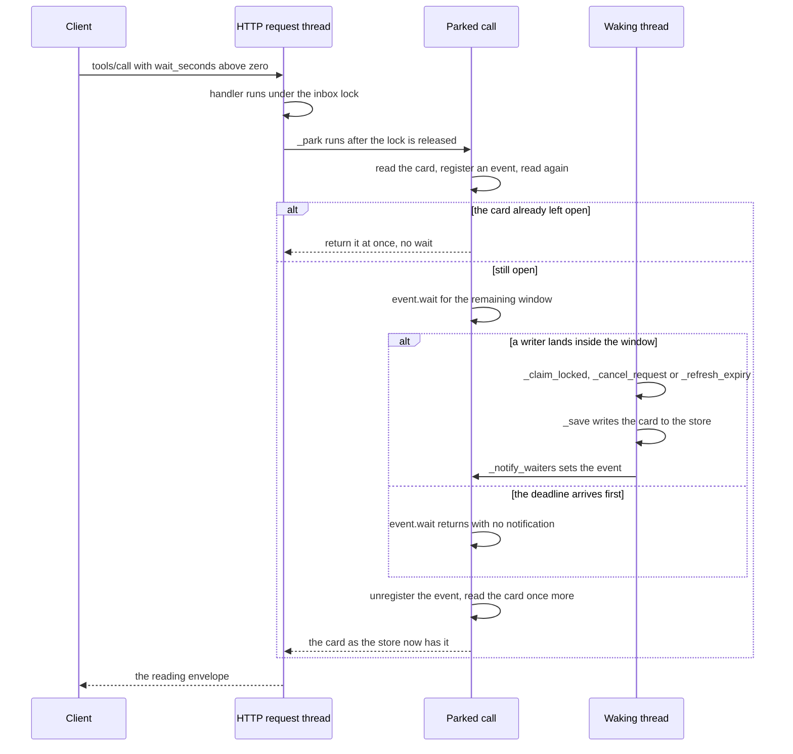
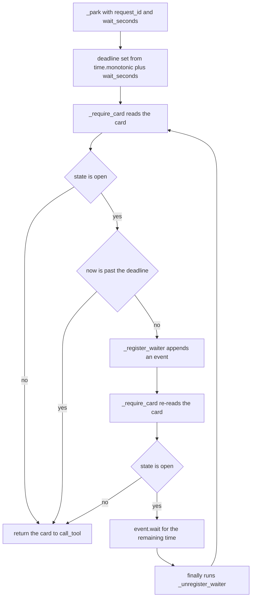

# The wait engine

The wait engine is the in-process half of the return path ADR 0011 chose: instead
of a server-initiated wake, an asking or reading call holds itself open until the
card it names leaves `open`, or until its bounded window ends. Everything here
lives in `src/paraphe/inbox/__init__.py` — `WAIT_TOOLS`, the `_waiters` table, and
`_park` with its registration helpers — plus the threaded HTTP transport that lets
a park coexist with the traffic that will end it.

The card side of this — what a tap writes and when — is
[the card lifecycle](/openwiki/architecture/card-lifecycle.md); the shape of the
envelope a park hands back is
[the served MCP surface](/openwiki/architecture/mcp-surface.md).

## What parks

`Inbox.call_tool` runs the handler under the inbox lock, releases it, and only
then applies the wait:

```python
with self._lock:
    args = dict(arguments or {})
    if name not in TOOL_NAMES:
        raise InboxError("unknown tool")
    handlers = {
        "how_to_use": self._how_to_use,
        "ask_question": self._ask_question,
        # … one entry per name in TOOL_NAMES
    }
<!-- openwiki: broken internal link [args, bearer=bearer] file "args, bearer=bearer" does not exist. Fix the href or restore the target, then delete this comment. -->
    result = handlers[name](args, bearer=bearer)
# The wait parks outside the lock: a parked call must not block the
# inbox, and the handler above already validated `wait_seconds`.
if name in WAIT_TOOLS and isinstance(result, dict) and "request_id" in result:
    wait_seconds = self._opt_wait(args) or 0.0
    if wait_seconds > 0:
        return self._envelope(self._park(result["request_id"], wait_seconds))
return result
```

`WAIT_TOOLS` is exactly three tools:

| Tool | Why it is a wait tool |
|---|---|
| `ask_question` | the asking call is the one whose answer resumes the agent |
| `request_approval` | same loop, approval-shaped |
| `get_response` | the reading call, for an id a create returned earlier or an id recovered later |

Three conditions must hold together: the tool is in `WAIT_TOOLS`, the handler
returned a dict carrying `request_id`, and the validated `wait_seconds` is greater
than zero. `wait_seconds` of `0` or absent is the reserved window *not* taken:
the handler's own result comes back and nothing sleeps.

`wait_seconds` is validated by `_opt_wait`: an `int` or `float` from `0` to `60`
inclusive, refused otherwise (including a `bool`) with
`InboxError("wait_seconds is invalid")`, returned as a float. The served schema
advertises the same bound as `{"type": "number", "minimum": 0, "maximum": 60}`.
The field is a member of `SHARED_CREATE`, so every create accepts it — the asking
tools, `notify_user` and `request_feedback` alike — and `_opt_shared` validates it
on that path; `get_response` accepts it explicitly. It is *not* in `UPDATE_FIELDS`,
so `update_request` refuses it as an unknown parameter. Only the `WAIT_TOOLS` sleep
on it: `request_feedback` (and `notify_user`) validate it like any create and
return immediately, because neither is in `WAIT_TOOLS`.

Because `call_tool` substitutes the parked call's **reading envelope** for the
handler's result, a create that waits never answers in the create shape
(`request_id`/`duplicate`/`read_with`) — and a duplicate create that waits reports
the existing card's current state instead of the duplicate flag.

## Waiter bookkeeping

Waiters are one dictionary on the inbox instance:

```python
# Parked clients by request id; the answer claim sets their events.
self._waiters: dict[str, list[threading.Event]] = {}
self._wait_lock = threading.Lock()
```

The value is a *list*, so several calls can be parked on the same card at once —
two clients, or a client plus a shell-side `paraphe wait`. Three helpers own the
table, and all three take `_wait_lock` (a plain `Lock`), never `self._lock`:

- `_register_waiter(request_id)` — creates a `threading.Event` and appends it to
  that request id's list.
- `_unregister_waiter(request_id, event)` — removes exactly that event and deletes
  the key when the list empties. A missing key or event is a no-op, so the
  `finally` in `_park` cannot raise.
- `_notify_waiters(request_id)` — copies the list under `_wait_lock`, releases the
  lock, then sets every copied event. No lock is held while an event is set, and
  the copy means a waiter that unregisters during the wake cannot corrupt the
  iteration.

The registration helpers take only `_wait_lock`, so they never contend with the
inbox lock. The one lock order in the engine is inbox lock → `_wait_lock`, because
every `_notify_waiters` call is made from a body that already holds `self._lock`;
nothing acquires the inbox lock while holding `_wait_lock`, so the order cannot
invert.

## The park loop

`_park` is a short loop with a deliberate ordering, documented in its own
docstring:

```python
def _park(self, request_id: str, wait_seconds: float) -> Card:
    """Block until the card leaves `open`, or the window ends.

    Runs outside ``self._lock``: parked calls must not block the inbox.
    The card is re-checked after the waiter registers, so an answer that
    landed just before the registration is not missed.
    """
    deadline = time.monotonic() + wait_seconds
    while True:
        card = self._require_card(request_id)
        if card.state != "open":
            return card
        remaining = deadline - time.monotonic()
        if remaining <= 0:
            return card
        event = self._register_waiter(request_id)
        try:
            card = self._require_card(request_id)
            if card.state != "open":
                return card
            event.wait(remaining)
        finally:
            self._unregister_waiter(request_id, event)
```

The order **read → register → re-read** is what makes the park correct: an answer
that landed between the first read and the registration is caught by the re-read,
and an answer that lands after the registration sets the event. Both interleavings
are covered, so neither ordering of "write" and "register" can lose a wake.

Two consequences follow from routing both reads through `_require_card`:

- the re-read carries the expiry check, so the parked thread can itself be the
  one that persists an observed expiry and calls `_notify_waiters` — its own
  event included — and the park then returns the expired card;
- whatever the card looks like when the park ends is what the caller gets, since
  the envelope is built from that last read. A revision bumped by
  `update_request` while a call parks is visible in the returned envelope.


The park and wake sequence: registration, the wake that follows the durable write, and the window end that needs no wake at all.


One iteration of the park loop; every exit, including the window end, runs the `finally` that removes the waiter.

The deadline is taken **inside** `_park`, so the work the handler already did —
validation, the store write, the owner notification — is not charged to the
window. It is taken from `time.monotonic()`, not from the injectable card clock
(`self._clock`) that card expiry uses, so a clock adjustment cannot extend or
truncate a park. `remaining` is recomputed from the same deadline on every
iteration, so a second iteration never accumulates time and a call with
`wait_seconds = 5` cannot sleep past five seconds.

## Who wakes a waiter

`_notify_waiters` is called from exactly three sites, each of them a state
transition that ends the question the caller was waiting on:

| Wake path | Written state | Where |
|---|---|---|
| `_claim_locked` — the tap, the owner's long-press reply, and the local owner answer path | `tapped` | after `self._save(updated)`, before `remember_message` and the control strip |
| `_cancel_request` on an open card | `cancelled` | after the save, before the control strip |
| `_refresh_expiry` observing `expires_at` | `expired` | after the save, before the control strip |

The first row is one site serving three doors, because all three enter the same
lock-held body:

- `claim` is the Telegram button path (`_on_callback` decodes the card id, version
  and choice index out of the callback data) and the local owner path, since
  `Inbox.answer` calls `claim(..., owner_verified=True)`. `POST /answer` therefore
  wakes the same waiters, with the same refusal vocabulary, as a phone tap;
- `claim_reply` is the long-press reply door. It resolves the card by the
  replied-to message id over the loaded card state, passes the card's *own*
  version rather than one from the wire, writes `responded_via="telegram-reply"`,
  and then hands off to `_claim_locked` — so a reply resolves a card and wakes
  parked callers with `response.text` on exactly the same path as a tap. A parked
  call returns the answered envelope with the owner's words, `responded_via`
  `telegram-reply`, and no `response_choice`.

The `responded_via` field is how a reader tells the doors apart after the wake:
`telegram` is a tap, `telegram-reply` is the owner's reply, `answer-path` is the
local owner answer route (pinned by `tests/inbox/test_setup.py::TestAnswerPath`).

Every door that wakes a waiter is served by the same process that parked the
call, though not by the same thread: `serve_inbox` spawns the HTTP server on its
own thread, `Runtime.run` performs the Telegram long poll on the runtime's main
thread, and each parked call occupies a connection thread of its own. A tap or a
reply therefore writes the card and sets the parked call's event from a
neighbouring thread, which is why a plain in-memory `threading.Event` is enough —
there is no wake port, no IPC and no cross-process signal to build.

`_refresh_expiry` only fires when something *looks* at the card. The lookers that
can actually persist an expiry are `_require_card` (hence `get_response`,
`mark_processed`, `report_execution`, `update_request`, `cancel_request`,
`record_telegram_message` and the parked calls' own reads), `_claim_locked`, which
refreshes before its version and state checks, and `list_pending`. `list_unprocessed`
also calls `_refresh_expiry`, but only on cards already filtered to `tapped`, where
the `state == "open"` guard makes it a no-op. An expiry nobody observes wakes
nobody, and the parked call reports it at the window end instead; the parked
call's own last read is usually what observes it.

## Who does not wake a waiter

| Path | Behaviour |
|---|---|
| `record_tap` | writes a tap with no `_notify_waiters`. It has no production caller — only tests use it, to place a card in an answered state without going through the claim ladder — so a parked call would keep waiting to its window end |
| `update_request` | the card stays `open`, so continuing to wait is the correct behaviour; the caller sees the bumped version in the envelope only when the park ends |
| `mark_processed`, `report_execution`, `notify_user` | no transition out of `open`; they cannot end a park (`mark_processed` and `report_execution` in fact refuse a card that is not already `tapped`, and `notify_user` writes no card at all) |
| a duplicate create | notifies the owner again and leaves the existing card's state alone; its `_refresh_expiry` is the same observed-expiry path that can wake, and nothing else about the duplicate does |
| a failing save | nothing at all is notified, because notification follows the write |
| **a client disconnect** | nothing detects it. There is no cancellation, no disconnect hook and no cleanup thread: the HTTP request thread stays parked until its own deadline and only then discovers the socket is gone |

The disconnect case is the one worth being explicit about. The engine does not
watch the connection, so an abandoned call is not reclaimed early — its residue
is bounded, not avoided. The waiter entry is removed by the same `finally` that
every other exit path runs, and the card is never touched by a park, so an
orphaned request leaves the store exactly as it found it (still `open`, same
version). The per-call window is what prevents residue — nothing else is watching.

## The invariant: notify after the write, then re-read

Two rules, together, make the engine safe without any coordination protocol:

1. **Waiters are notified only after the durable write.** The docstring on
   `_notify_waiters` states it — "Called after the durable write, never before" —
   and all three call sites obey it. A woken call can therefore always read the
   answered card from the store; it can never observe a pre-write state. If the
   save raises, no event is set and the parked call simply continues to its
   window end.
2. **The park re-reads the card after registering.** So an answer that landed just
   before registration is not missed, and an event that is never set costs only
   time: at the deadline the park reads the card again and reports it as it now
   stands (answered, cancelled, expired, or still pending).

A missed wake is therefore only ever a **poll miss**, never a lost answer. The
worst case is a call that waited its full window and then reported the state the
store already had — which is exactly what an agent that never waited would learn
from `get_response` or `list_unprocessed`. That is the property ADR 0011 leans on:
silence is never approval, and the store remains the source.

## One process only

`_waiters` is in-memory state on one `Inbox` instance. It is never persisted: the
store holds a `cards` table, a `notifications` table and a `durable_state` table,
and nothing else. It follows that

- a restart parks nobody — the waiting calls died with the process;
- a second process pointed at the same store (a second `paraphe` start, a
  duplicated service) has its own empty table, so a call parked in it can never be
  woken by a claim handled in the first one;
- all waiters for a card live in the process that received the parked calls, so a
  tap handled in that process wakes them and a tap handled elsewhere does not.

The durable read is the ground truth for exactly this reason; the waiter is an
optimization layered on top of it, not a second source of answers. The
cross-process equivalent is the `paraphe wait` command, which repeats the bounded
window by making a fresh `get_response` call per window, gets its status from the
envelope rather than from an event, and exits 0 on `answered`/`acknowledged`, 3 on
`expired`/`cancelled` and 4 on an unknown request id.

## Deliberate concurrency choices

- **The handler runs under the inbox lock; `_park` runs outside it.** This is not
  only about throughput. The answer path takes `self._lock` — `_claim_locked`,
  `_cancel_request` and `_refresh_expiry` are each written as a lock-held body
  that writes and then notifies — so a park holding that lock could never be
  woken: the writer would block behind the parked call and the call would always
  run to its deadline. The lock is released before `_park` is called, and the park
  re-reads without it (`_refresh_expiry` runs wherever a read happens, which is
  why a parked call's own read can be the writer that ends it).
- **Waiter bookkeeping has its own lock.** `_wait_lock` guards `_waiters`, so
  registration never contends with the inbox lock. The only lock order that exists
  is inbox lock → `_wait_lock` (a waker copying the list), and `_notify_waiters`
  releases it before setting any event, so no event is set under a lock and no
  code runs under `_wait_lock` beyond a list copy.
- **The HTTP server is threaded.** `serve_inbox` builds a `ThreadingHTTPServer`,
  so one connection thread per request: a parked call occupies its own thread and
  the listener keeps answering `tools/list`, other `tools/call`s and the tap or
  answer path that will end the park.
- **The window is per call and never slept past.** The deadline is fixed at park
  entry, `event.wait(remaining)` is given the *remaining* time rather than the
  whole window, and the loop re-checks the state before and after registration.
  Nothing in the engine holds a call open longer than the caller asked for; a
  longer return path is composed by repeating the window outside the model loop
  (`paraphe wait`, which clamps its window to 60 s and gives each request a 90 s
  client timeout so one window fits inside one HTTP call).

## Failure behaviour

| Situation | Behaviour |
|---|---|
| Card answered inside the window | the event is set after the write, and the park returns the answered envelope in milliseconds, well inside its own window |
| Owner replies inside the window | the reply resolves the card through `_claim_locked`, and the park returns the answered envelope carrying `response.text` with `responded_via` `telegram-reply` |
| Answer lands just before registration | the re-read after registration returns the answered envelope without waiting |
| Waited call on an already-closed card | returns at once, registering nothing |
| Nobody answers, deadline passes | the park returns the pending envelope; a later `get_response` still reads the answer once there is one |
| Card expires while parked, observed by a read | `_refresh_expiry` writes `expired` and wakes the park promptly |
| Card expires while parked, observed by nobody | the park's final read observes and persists the expiry, and reports `expired` at the window end |
| Card cancelled inside the window | the park returns the cancelled envelope promptly |
| `wait_seconds` absent or `0` | no registration, no sleep, the handler's own result |
| Client disconnects while parked | nothing detects it; the park ends at its deadline, the waiter entry is removed, the card is unchanged |
| Restart while calls are parked | those calls are gone; the card is unaffected and readable |
| Several calls parked on one card | every event in the list is set, so all of them return |

## Focused tests

`tests/inbox/test_wait_engine.py` is the whole engine's pin, in three classes:

- `TestWaitEngine` — a tap inside the window returns the answered envelope and
  leaves `_waiters` empty; the window end returns the pending envelope and a later
  read still answers; a call without `wait_seconds` (and with `0`) does not sleep;
  a waited read on an already-answered card returns at once; **the same tap writes
  identical fields with and without a waiter**, so the wait never changes what is
  stored; a cancel inside the window wakes promptly; an expiry observed by a read
  wakes the park; and an expiry nobody observes is reported at the window end. The
  `_waiters == {}` assertions are the leak check — every exit path leaves the table
  empty.
- `TestWaitHttpSurface` — `tools/list` answers in well under a second while one
  call parks, and a client that closes its connection mid-park leaves no waiter,
  changes no card state, and does not stop other traffic. The suite silences the
  server's error handler so the eventual write to the dead socket does not print a
  traceback; the engine itself does nothing about it.
- `TestWaitCommand` — the `paraphe wait` loop over per-call windows until the tap
  lands, exit codes 0, 3 and 4, the refusal when no create bearer is configured,
  and the config-file bearer resolution shared with `ask` (the test named for the
  config-file bearer drives `ask`, which reads the same `_bearer()` helper `wait`
  uses).

The owner-reply wake is pinned outside that file by
`tests/inbox/test_reply_intake.py::TestReplyIntake::test_reply_wakes_the_parked_waiter_with_the_text`,
which parks a `get_response` with `wait_seconds=30`, waits until the waiter is
registered on the card, sends the long-press reply, and asserts the parked result
carries the owner's words with `responded_via` `telegram-reply`; its sibling
`test_reply_writes_the_same_lifecycle_as_a_same_moment_tap` shows the reply and the
tap produce the same card state down to `responded_at`. The local answer door's
`responded_via = "answer-path"` is pinned in
`tests/inbox/test_setup.py::TestAnswerPath`.

The harness injects a `FakeClock` for card expiry while the park's own window runs
on real monotonic time, which is why the window-bound cases use short real windows
(`0.3`, `0.6` seconds) rather than a jumped clock. The wider suite layout is in
[the test suite and integration](/openwiki/testing/suite-and-integration.md); the
command-line half of the return path is
[the ask and wait CLI](/openwiki/integrations/ask-and-wait-cli.md) and the reply
door is [the owner reply intake](/openwiki/integrations/owner-reply-intake.md).
