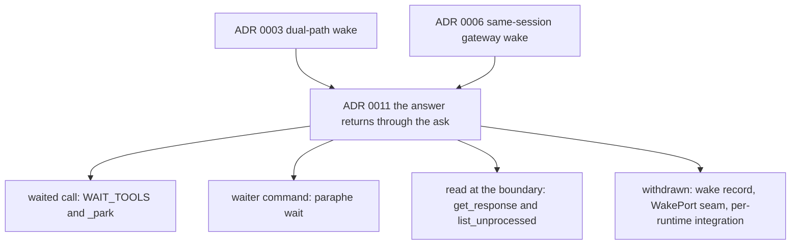

# Domain vocabulary and superseded decisions

`CONTEXT.md` is the product glossary: nouns only, definitions only, implementation deliberately
kept out of it. This page is the other half of that contract — where each noun lives in the tree,
and which decision records the current shape replaces. The glossary owns the words; the source and
its tests own what exists.

`AGENTS.md` stays the canonical instruction file for this repository and `CLAUDE.md` is its
one-line pointer, with the tracker and domain notes under `docs/agents/`; this page is the
vocabulary-to-code map, not a second copy of it.

Three reading rules follow from that split:

- **Stop at ADR 0011 when reading `docs/adr/` in order.** `docs/adr/0011-answer-returns-through-the-ask.md`
  supersedes ADR 0003 (dual-path wake) and ADR 0006 (same-session gateway wake); both files carry
  `Status: Superseded by ADR 0011`. Read them as history, not as a specification of the tree.
- **The layout table in `AGENTS.md` is not an inventory.** Its `src/paraphe/adapters/` row still
  reads "destinations (`console`, `telegram`) and the wake port". That directory contains
  `console.py`, `telegram.py` and `__init__.py` and no wake seam, because ADR 0011 withdrew the
  seam. Any page or table that still names a wake port, `WakePort`, `NullWakePort` or a wake
  adapter is describing the withdrawn mechanism, not this checkout.
- **The card work added words `CONTEXT.md` does not carry yet.** *Owner reply*, *provenance*, the
  *identity line*, the *rendered card* and its *trim marker* are the card work's words, not an
  ADR's: `docs/tools.md` and the v1 spec revision define them, the served `how_to_use` text teaches
  the reply channel, and the requirements behind them — R1–R14 and the acceptance examples, which
  spell the sections, the escaping and the visible trim marker — are
  `docs/plans/2026-09-11-1604-feat-card-context-and-reply-plan.md`. Use those words as those
  documents spell them, and do not mint a synonym the glossary would then have to retire.

## Noun to implementation

| Noun (`CONTEXT.md`) | Field, function or file that implements it |
|---|---|
| **Paraphe** | The package `src/paraphe/` and the console script `paraphe = "paraphe.__main__:main"` in `pyproject.toml`, so `paraphe` and `python3 -m paraphe` start the same service; every setting is spelled with the `PARAPHE_` prefix. `src/paraphe/__main__.py` dispatches each subcommand: `ask` / `wait` to `paraphe.cli` (the shell half of the return path), `check telegram` to `paraphe.check` and `store relocate` to `paraphe.store_cli` (the owner-side commands). |
| **Card** | The `Card` dataclass (`src/paraphe/inbox/card.py`), built by `Inbox._create_card` and addressed by the twelve names in `TOOL_NAMES`. `Card.state` is one of `open`, `tapped`, `cancelled`, `expired`; life is `expires_at` / `expires_in_seconds` with `DEFAULT_TTL_SECONDS = 14400`, `FLOOR_TTL_SECONDS = 900` and `MAX_TTL_SECONDS = 2592000` in `src/paraphe/inbox/config.py`. |
| **Revision** | `Card.version`, carried on the Telegram button and checked in the claim ladder; for an owner reply the binding is the card's recorded message identity instead — see [revision](#revision-the-version-on-the-button-and-the-message-a-reply-binds-to). |
| **Tap** | `Inbox.claim` and the one ladder `Inbox._claim_locked`; `ClaimRefused` and the null and fake tap ports live in `src/paraphe/inbox/claim.py`. A tap is one of three owner-side answer channels. |
| **Tap surface** | `TelegramAdapter` (`src/paraphe/adapters/telegram.py`); `ConsoleDestination` (`src/paraphe/adapters/console.py`) implements the same two-method contract when there is no phone. |
| **Owner reply** (card work) | `Inbox.claim_reply`, reached from `TelegramAdapter._on_reply` in `handle_update`. |
| **Inbox** | The `Inbox` object plus the SQLite `Store` in the per-user data directory, with the retained legacy location `LEGACY_STORE_PATH` and the relocation that moves off it (`src/paraphe/inbox/store.py`) — see [inbox](#inbox-the-object-the-per-user-store-and-the-retained-legacy-location). |
| **Owner** | `Inbox.owner_telegram_id` for taps and replies, plus the owner answer credential for the local answer path. |
| **Provenance / the identity line** (card work) | `PROVENANCE` — `runtime`, `repo`, `worktree`, `ticket` — accepted by the asking tools and `update_request`; `_identity_line` renders it. |
| **The rendered card** (card work) | `render_card` with `MESSAGE_BUDGET`, `PLATFORM_LIMIT` and `TRIM_MARKER` in `src/paraphe/adapters/telegram.py`. |
| **`responded_via` values** (card work) | `Card.responded_via`, surfaced in the read envelope: `telegram`, `telegram-reply`, `answer-path`. |
| **Return path** | `WAIT_TOOLS` and `_park` (the waited call), `paraphe wait` (`src/paraphe/cli.py`), and the `get_response` / `list_unprocessed` read. |
| **Setup** | `load_settings` (`src/paraphe/inbox/config.py`); `paraphe check telegram` (`src/paraphe/check.py`) is the preflight for the phone half; an owner-only `/config` message is recognised but is not a settings editor. |
| **Cutover** | Plan only — ADR 0004, ADR 0009 and `docs/specs/paraphe-v1.md`. No code path is named for it. |

_Avoid_, as `CONTEXT.md` states it: a clone of another inbox as the product name, a second app or a
second chat yes for **Paraphe**, a ticket or task tracker for **card**, card id + action as the only
callback payload for **revision**, a chat reply as the decision for **tap**, a web-console bounce or
a chat topic as the decision inbox for **tap surface**, a third-party cloud inbox or "git as the
live card store" for **inbox**, the owner as the announcement channel for **return path**, and
`/config` as the only first-run path for **setup**.

## Revision: the version on the button and the message a reply binds to

Both bindings exist so a superseded answer can be refused rather than merely be unlikely.

`encode_callback_data` (`src/paraphe/adapters/telegram.py`) writes the button payload as
`p1:<card uuid hex>:<version>:<choice index>`, refused when it would exceed Telegram's 64-byte
limit; `decode_callback_data` returns the card id, the version and the choice index. `Card.version`
starts at `1`, and `update_request` requires `expected_version`, refuses a mismatch and increments
`version`. `Inbox._claim_locked` refreshes expiry first, then compares the version the answer
carries against the live card **before** it looks at the card's state, so after a revision the
previous button refuses with `stale_version` even when its action string still reads `Approve`.
Card id plus action alone is not a claim — the property ADR 0007 records and
`tests/inbox/test_tap_claims.py::test_update_request_makes_previous_version_refuse` pins.

The reply channel binds to message identity instead of a wire version. A sent card records
`telegram_chat_id` + `telegram_message_id` (`Inbox.record_telegram_message`, which refuses a version
that no longer matches the live card), and `claim_reply` resolves the card by that pair. So a
superseded message refuses on both channels: a stale button as `stale_message` (or `stale_version`),
and a reply to a message a revision has replaced resolves to nothing and refuses `unknown`. The
ladder, the refusal reasons and the transition table are on
[the card lifecycle](/openwiki/architecture/card-lifecycle.md).

## Tap: one of three owner-side answer channels

No tool on the agent's surface can answer a card — `test_no_tool_answers_or_claims_a_card` pins that
no tool name contains `answer` or `claim`. The three owner-side channels are the Telegram tap
(`Inbox.claim`), the owner reply (`Inbox.claim_reply`) and the local owner answer (`Inbox.answer`,
reached only from `POST /answer` with the owner answer credential). All three run the same ladder,
`Inbox._claim_locked`, while holding the inbox lock, so the owner check, existence, expiry refresh,
version, state, choice-index, text-shape and message-identity checks exist in exactly one place,
each with its own refusal reason (`not_owner`, `unknown`, `stale_version`, `expired`, `cancelled`,
`already_tapped`, `invalid_choice`, `invalid_answer`, `invalid_message`, `stale_message`).

A successful claim is what **tap** means in the data: `state = "tapped"`, `response_choice` (or
`response_text` for words), `responded_at`, `responded_via`, and the message identity when the answer
carried one. The durable write (`_save`) happens before the parked calls are woken
(`_notify_waiters`) and before the destination is asked to strip the keyboard (`_request_strip`,
which swallows its own failures), so a failed strip cannot unrecord an answer. Refusals write
nothing. Silence is not a tap: nothing in the claim, the park or the read turns a window end into an
approval. `Inbox.record_tap` bypasses the ladder entirely and has no production caller — it is the
test shortcut for putting a card into the tapped state.

_Avoid_: chat reply as the decision, bouncing to a web console for the same yes. The owner reply
does not contradict the first of those — see the next section.

## Owner reply: the owner's own words

`Inbox.claim_reply(from_id, chat_id, message_id, text)` turns an owner's long-press reply **to a
card message** into that card's answer. It requires `from_id` and `chat_id` to be the owner, resolves
the card by the replied-to message id over the loaded card state (`_card_by_telegram_message`, so a
reply still resolves after a restart), and then hands the ladder the resolved card's own `version`
rather than a version from the wire. The text is recorded verbatim — no choice index, whitespace
preserved, blank or oversized text refused as `invalid_answer` — with
`responded_via = "telegram-reply"`, and the card closes with the same lifecycle writes a same-moment
tap makes. A reply to a status message (`notify_user`) matches no card; a reply to a closed card
records nothing.

The adapter holds this together: `TelegramAdapter.handle_update` treats a private-chat owner message
whose `reply_to_message` names a message as a reply attempt (`_on_reply`), swallows `ClaimRefused`
and re-raises anything else, so a refusal records nothing, wakes nothing and raises nothing while a
real failure such as the durable write still surfaces. The reply widens no authority: it arrives from
the owner's own Telegram id on the owner-side surface, and the create credential still cannot answer
on any surface (the served text says so outright — "This credential creates and reads. It cannot
answer a decision."). The tapping and keyboard mechanics are on
[the Telegram tap surface](/openwiki/integrations/telegram-tap-surface.md) and
[owner reply intake](/openwiki/integrations/owner-reply-intake.md).

_Avoid_: reading the `tap` avoid-line as "a reply can never answer". A reply answers only when it is
a reply to that card's live message; a plain chat message to the bot is not an answer, and a reply
that is a question or not a decision is not executed — the agent explains and re-asks with a fresh
card (`docs/tools.md`, and the served `how_to_use` text).

## Owner: one id for taps and replies, one credential for the answer path

The **owner** noun resolves to two things in code, and they are deliberately not interchangeable:

- `Inbox.owner_telegram_id` — the only `from.id` that can become a tap or a reply, and the only chat
  id a card is sent to.
- `PARAPHE_OWNER_ANSWER_TOKEN` / `owner_answer_token` — the credential for `POST /answer`, checked by
  `Inbox.check_answer_token`, which refuses the create bearer by explicit comparison as well as by
  value mismatch. `Inbox.answer` then calls `claim` with `owner_verified=True` and, from the route,
  `responded_via="answer-path"`, so there is one implementation of the owner and version checks for
  every channel. (`Inbox.answer`'s own parameter default is `owner`, which no production caller
  uses: `src/paraphe/inbox/http.py` is the only route and it always passes `answer-path`.)

[The credential boundary](/openwiki/security/credential-boundary.md) covers what each side may do;
the vocabulary point is that "owner" never means "the caller that created the card". Create is any
caller presenting the shared MCP bearer.

## Provenance and the identity line

**Provenance** is the `PROVENANCE` set — `runtime`, `repo`, `worktree`, `ticket` — accepted
(optionally, each bounded) by `ask_question`, `request_approval`, `request_feedback` and
`update_request`, copied onto the card by `_opt_shared` / `_apply_shared`, and taught in the served
text and in `docs/tools.md`. It is supplied by the caller and never guessed; older callers that omit
it keep working.

The **identity line** is its rendering: `_identity_line` joins the agent name with the present
provenance fields in the order `agent_name` · `runtime` · `repo` · `worktree` · `ticket`, omitting
absent fields, and renders a `ticket` that contains `://` as a tappable link. Nothing is invented to
fill a gap, which is why the line shrinks to nothing on a card that carries no provenance.

## The rendered card

**The rendered card** is `render_card` (`src/paraphe/adapters/telegram.py`), the layout owner the
destination holds rather than the asking agent. It composes fixed sections in a fixed order —
identity line, kind line (with a risk word for `high` or `critical`), bold title, context, numbered
options with their one-line notes, Recommended, If approved, Limits, links, reply hint, expiry —
and status messages render the identity line, the title and the message only. Every interpolated
value is escaped (`_escape`, `_link`) and lone surrogates replaced, so no field content can inject
markup or fail a send.

Rendering is total: the text is measured in UTF-16 code units as Telegram counts them
(`message_units`), and `_fit` trims the longest free-text sections until the message fits
`MESSAGE_BUDGET` (3800 of `PLATFORM_LIMIT` 4096) under the hard platform limit, marking each trimmed
section with the visible `TRIM_MARKER` (`… [trimmed]`). The mechanics and the keyboard lifecycle are
on [the rendered card in Telegram](/openwiki/integrations/telegram-card-rendering.md).

## Inbox: the object, the per-user store and the retained legacy location

`Inbox` holds the in-memory card map and the MCP surface; the durable half is `Store`
(`src/paraphe/inbox/store.py`), one SQLite file named `inbox.sqlite` with `cards`, `notifications`
and `durable_state` tables. The default location is `$XDG_DATA_HOME/paraphe` when `XDG_DATA_HOME` is
set, else `~/.local/share/paraphe` (`default_data_dir` → `default_store_path`), created `0700` with
the file at `0600` (`DATA_DIR_MODE`, `STORE_MODE`, `Store.prepare`).

The location earlier releases used survives as a **named constant**, `LEGACY_STORE_PATH`
(`/var/lib/paraphe/inbox.sqlite`) — the path ADR 0005 still records for the deployment. Two
behaviours hang off it, and together they are the vocabulary of "the store moved":

- **Resolution refuses rather than splitting the inbox.** `resolve_store_path` honours an explicit
  `store_path` (config file or `PARAPHE_STORE_PATH`) always; when nothing is configured and the
  default holds no store while the legacy location does, startup fails with one line naming both
  paths instead of quietly beginning a second, empty inbox.
- **Relocation is a first-class command, not a file copy.** `relocate_store(source, target, move=False)`
  copies through SQLite's own backup API, verifies `PRAGMA integrity_check` *and* the presence of the
  `cards` table, then installs the copy atomically with the owner-only modes — refusing a missing or
  unreadable source, an occupied target and a source that is not a Paraphe store. `paraphe store
  relocate` (`src/paraphe/store_cli.py`) is the wrapper that moves the retained legacy store to the
  current default location; the source is kept as a backup unless `--move` is given, and the move
  removes it only after the verified target exists.

`tests/inbox/test_setup.py` covers the whole set
(`test_default_store_path_is_per_user`, `test_relocation_away_from_the_previous_location_refuses`,
`test_store_relocation_copies_cards_with_owner_only_permissions`,
`test_store_relocation_refuses_to_overwrite_the_target`,
`test_store_relocate_command_copies_the_legacy_store`). The mechanics — the resolver table, the
modes, the snapshot and the container mount — are owned by
[data location and backup](/openwiki/operations/data-location-and-backup.md) and
[the owner-side commands](/openwiki/operations/owner-side-commands.md).

The store, never a destination, is the source of the answer: `_require_card` loads through it, and
the destination contract is only `notify` and `edit_and_strip`. See
[composition root and runtime](/openwiki/architecture/composition-root-and-runtime.md) for how one
invocation picks the destination and opens the store.

## Return path: the waited call, the waiter command, the read

This noun did not move. The **return path** maps to three concrete legs, all of them calls the asking
side makes (ADR 0011):

| Leg | Implementation |
|---|---|
| waited call | `wait_seconds` 0–60 validated by `_opt_wait`; for the tools in `WAIT_TOOLS` (`ask_question`, `request_approval`, `get_response`) `Inbox.call_tool` parks outside the inbox lock in `_park` until the card leaves `open` or the window ends. |
| waiter command | `paraphe wait <request_id>` → `cli.wait_for_answer`, which repeats the bounded `get_response` window until the card is answered or unanswerable: exit `0` answered, `3` expired or cancelled, `4` unknown request id. |
| boundary sweep | `get_response` and `list_unprocessed` read every answer with no waiter at all; reads do not consume the answer. |

Two vocabulary consequences are worth stating plainly, because they are easy to get wrong:

- **`source_thread` is descriptive metadata.** The card keeps the string the caller sent, and
  nothing wakes it: the only writes are `_opt_shared` at create and `_apply_shared` at update, both
  of which just copy the validated string, and the surface-contract test
  (`test_a_card_stores_the_source_thread_it_was_given`) pins the stored value with the comment that
  the origin is descriptive. The Hermes-style origin records ADR 0006 specified
  (`hermes:session:api_server:<id>`, `hermes:session:telegram:<id>`) and the "origin" user stories
  that repeat them in `docs/specs/paraphe-v1.md` therefore survive as history only; no code parses
  or matches on them.
- **Silence is not an answer.** Nothing in the park, the waiter or the read turns a timeout into an
  approval; a window end returns the pending envelope. The mechanics live in
  [the wait engine](/openwiki/architecture/wait-engine.md) and the end-to-end loop in
  [ask, answer, resume](/openwiki/workflows/ask-answer-resume.md).

## Setup: a file, the environment, a phone preflight and a command that is not an editor

The **setup** noun is `load_settings` (`src/paraphe/inbox/config.py`): a TOML config file plus
environment variables, with the environment winning for the same key, and `config.example.toml` as
the documented surface. The create bearer is required; a run needs either a bot token with an owner
Telegram id (the phone destination) or an owner answer token (the local answer path); an answer
credential equal to the create bearer is refused; missing required values fail closed at start.

The phone half of setup has its own preflight: `paraphe check telegram` (`src/paraphe/check.py`,
dispatched before the server path, so it needs no running service) loads the same settings, asks the
Bot API which bot the token belongs to, sends one plain setup message to the owner and names both.
It exits `2` when no phone destination is configured, when the token is refused or unreachable, or
when delivery to the owner fails, and it neither prints the token nor creates a decision card. The
command's output and exit codes are owned by
[the owner-side commands](/openwiki/operations/owner-side-commands.md).

The owner-only Telegram `/config` command is **recognised, not implemented**:
`TelegramAdapter.handle_update` answers the fixed string `ttl and owner knobs only`, `Runtime.poll_once`
discards that return value, and nothing writes settings — so changing knobs from Telegram is planned
by ADR 0008, not built. What *is* built and tested is the credential-shaped part: a `/config` from a
stranger or a non-private chat is ignored, and the bot token never appears in a reply.

## Supersession map

Which record replaces which, and what the replacement consists of.

**ADR 0011 supersedes ADR 0003 and ADR 0006.** Its decision 4 withdraws the gateway-wake machinery:
no wake record is written, no wake is attempted, `source_thread` is descriptive only, and the
`WakePort` seam with its adapter is removed. The tree agrees — `src/paraphe/adapters/` holds
`console.py` and `telegram.py`, the adapter is a tap and answer destination, and no module, class or
test implements a wake record, a `WakePort` or a gateway wake.

Two further records in the same directory are easy to misread once 0003 and 0006 are gone:

- **ADR 0009 still says the proof card is "tap → the same Hermes session acts → `report_execution` →
  `mark_processed`", and cites ADR 0006 for the resumption.** ADR 0009 is not itself marked
  superseded, but the mechanism it leaned on is: after ADR 0011 the same session acts because its
  call was parked (or because the next run drains the answer), never because it was woken.
- **`docs/specs/paraphe-v1.md` says so explicitly**: "where this spec and ADR 0011 disagree, ADR
  0011 wins", and its testing decisions already assert that `source_thread` "is stored as given and
  wakes nothing".

**ADR 0007 is not superseded, and the card work did not replace it.** "A Telegram callback is a
claim, not a decision" still holds, and the reply channel validates the same way — the answer is
bound to the card's live revision or message identity, and a refused answer records nothing. The
card surface that did change (rendering, provenance, reply intake) rides the shipped return path and
is recorded in the v1 spec revision and the plan named above rather than in a new ADR.

ADR 0011 also records what is deliberately *not* built: decision 2 states that no per-runtime
integration exists anywhere, the served tool text carries the protocol to clients that read nothing
else, and one shipped skill documents the per-runtime idioms. That is the vocabulary a client
actually sees — `TOOL_DESCRIPTIONS` and `_how_to_use` in `src/paraphe/inbox/__init__.py` name
`request_id`, `wait_seconds`, `get_response`, `list_unprocessed`, `paraphe wait`, the drain rule,
the card-writing contract (purpose first, origin stated, tap semantics plain), the provenance
fields and the reply rule — and `skills/paraphe-return-path/SKILL.md` is the per-runtime companion:
one copy step per runtime (Hermes, Claude Code, Codex, or the served text alone), the three ways to
hold the return path with the waiter's exit codes `0` / `3` / `4`, the environment the waiter needs
(`PARAPHE_MCP_CREATE_BEARER` plus `PARAPHE_MCP_URL` or host/port), the provenance bounds (`runtime`
≤40, `repo` ≤120, `worktree` ≤120, `ticket` ≤200), the reply rule, and the shell-side create
`paraphe ask "<question>" --external-id <id>`.
`tests/inbox/test_surface_contract.py` asserts those strings are in the served text. The full tool
and envelope contract is on [the served MCP surface](/openwiki/architecture/mcp-surface.md).

## Words that outlived their machinery

- **Wake port, `WakePort`, `NullWakePort`, wake record, gateway wake, per-runtime wake integration** —
  withdrawn by ADR 0011. No such seam, adapter or test exists. The word *wake* survives as history
  (the two superseded ADRs and the older plan documents under `docs/plans/`) and in one live but
  different sense: the in-process waiter wake (`_notify_waiters`, "the reply wakes the parked call"),
  which signals a `threading.Event` inside this process and nothing outside it.
- **`origin=none`, `hermes:session:*`, "api_server platform", chat-topic-as-wake** — vocabulary of
  ADR 0006's origin records. `source_thread` is stored and echoed; nothing routes on it.
- **`rule_key` / "Always allow"** — accepted and ignored (`_opt_shared` validates the type and drops
  the value); the spec lists bulk approve and Always-allow as dropped products, and
  `responded_via: auto` is not a shipped value. The live values `app` and `auto` are parsed by
  clients of the previous inbox, not written here — `app` is only the default of the test-only
  `record_tap`.
- **Telegram channel or chat topic as the inbox** — superseded by ADR 0002 and not implemented: the
  adapter ignores any chat that is not a private chat with the owner id.
- **`/config` as a settings editor** — the owner-only message is recognised in
  `TelegramAdapter.handle_update`, which returns the canned reply `ttl and owner knobs only`;
  `Runtime.poll_once` discards that return value and nothing writes settings, so changing knobs from
  Telegram is planned (ADR 0008), not implemented.
- **Cutover** — defined by ADR 0004, ADR 0009 and the spec's cutover sequence (add the credential
  beside the previous inbox, prove `tools/list`, then switch endpoint and behaviour-block in one
  owner-approved window; unattended batch callers stay behind). No module, entry point or test in
  the tree carries it.

## Focused tests

| Vocabulary claim | Test |
|---|---|
| revision refuses a superseded button | `tests/inbox/test_tap_claims.py` (`test_update_request_makes_previous_version_refuse`, plus the expiry / cancel / repeated-tap refusals) |
| non-owner never records a tap | `tests/inbox/test_tap_claims.py::test_non_owner_never_records_a_tap` |
| a failed strip cannot unrecord an answer | `tests/inbox/test_tap_claims.py::test_strip_failure_does_not_authorize_or_unrecord` |
| a reply is the owner's words, verbatim, with a tap's lifecycle | `tests/inbox/test_reply_intake.py` (`test_reply_records_the_owners_words_verbatim`, `test_reply_writes_the_same_lifecycle_as_a_same_moment_tap`) |
| a reply resolves after a restart, and not for a superseded message | `tests/inbox/test_reply_intake.py` (`test_reply_resolves_after_a_restart`, `test_reply_to_a_superseded_message_resolves_to_nothing`) |
| reply refusals record nothing, raise nothing, wake nothing | `tests/inbox/test_reply_intake.py::test_refusals_record_nothing_raise_nothing_and_wake_nothing` |
| the card renders in fixed order, escaped, trimmed under budget | `tests/inbox/test_card_renderer.py` (`test_full_card_renders_the_pinned_fixture`, `test_markup_metacharacters_are_escaped_and_never_injected`, `test_oversized_content_trims_with_a_visible_marker_under_budget`) |
| the identity line renders present fields and invents nothing | `tests/inbox/test_card_renderer.py::test_identity_line_renders_present_fields_in_order_and_invents_nothing`, `tests/inbox/test_surface_contract.py::test_a_created_card_renders_its_identity_line_from_the_payload` |
| the served text teaches provenance and the reply rule | `tests/inbox/test_surface_contract.py` (`test_the_served_text_teaches_provenance`, `test_the_served_text_teaches_the_reply_rule`) |
| no tool can answer or claim a card | `tests/inbox/test_surface_contract.py::test_no_tool_answers_or_claims_a_card` |
| waited call and `paraphe wait` semantics | `tests/inbox/test_wait_engine.py` (`TestWaitEngine`, `TestWaitCommand`: exit `0`, `3`, `4`) |
| `source_thread` is stored, wakes nothing | `tests/inbox/test_surface_contract.py::test_a_card_stores_the_source_thread_it_was_given` |
| the served text carries the return protocol | `tests/inbox/test_surface_contract.py::test_the_served_text_carries_the_async_protocol` |
| owner answers, create bearer cannot | `tests/inbox/test_setup.py` (`test_the_create_credential_cannot_answer`, `test_the_owner_credential_answers_and_records_how_it_arrived`) |
| owner-only `/config`, no token echoed | `tests/inbox/test_telegram_port.py` (`test_non_owner_config_is_ignored_and_token_absent`, `test_config_requires_private_owner_chat`) |
| store location, modes and relocation | `tests/inbox/test_setup.py` (`test_default_store_path_is_per_user`, `test_relocation_away_from_the_previous_location_refuses`, `test_created_data_directory_is_owner_only`, `test_store_relocation_copies_cards_with_owner_only_permissions`, `test_store_relocation_refuses_to_overwrite_the_target`, `test_store_relocate_command_copies_the_legacy_store`) |
| the phone preflight names the pair and never leaks or claims | `tests/inbox/test_check.py` (`test_the_pair_passes_only_after_identity_and_delivery`, `test_a_refused_token_is_named_without_leaking_it`, `test_no_phone_configuration_is_named`, `test_entry_point_routes_the_telegram_check`) |
