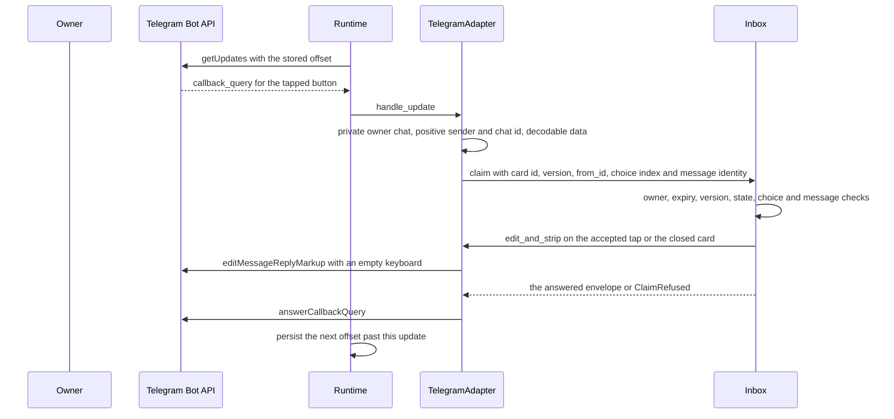
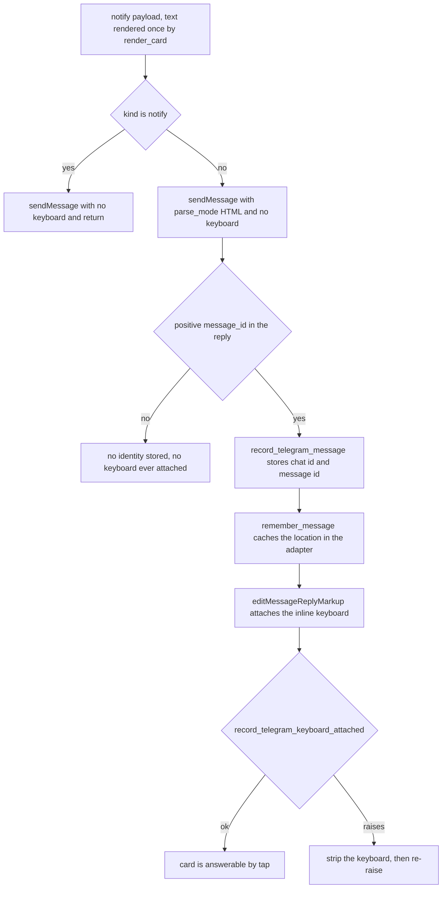

# The Telegram tap surface

One tap in a private Telegram chat is the decision surface Paraphe was built
around (ADR 0002): a dedicated bot, one private chat with the owner, no channel
and no second app. The card's authority stays in Paraphe, because Telegram does
not expire inline buttons — a `callback_query` is a **claim**, not a decision
(ADR 0007). This page covers the phone path end to end: the Bot API client, the
long-polling loop and its durable offset, callback data bound to the card's
version, the message and keyboard lifecycle including what a revision does to
the keyboard, owner-only filtering, and what `/config` actually does today.

Two neighbouring topics have their own pages. The text the owner reads is
composed by `render_card` — sections, HTML escaping, links and the UTF-16
message budget — documented in
[the rendered card](/openwiki/integrations/telegram-card-rendering.md). The
owner's free-text answer by long-press reply is
[owner replies as answers](/openwiki/integrations/owner-reply-intake.md); this
page only records where that branch sits in `handle_update` and hands off.

## Two halves

| | `src/paraphe/adapters/telegram.py` | `src/paraphe/inbox/runtime.py` |
|---|---|---|
| Object | `TelegramAdapter` | `TelegramBotAPI` and the `Runtime` loop |
| Role | the destination: renders the card text, owns the keyboard's message state, turns a `callback_query` into a claim | the transport: HTTP against the Bot API, and the long-polling loop that feeds the adapter |
| State | the in-memory message location per card | the stored next offset |

`Runtime.start` builds both when a bot token is configured and wires the adapter
in as **both** the notifier and the tap port (`inbox._notifier` and
`inbox._telegram` are the same object). Without a token there is no transport,
no polling and no tap port — the inbox gets `NullTelegramPort` and the console
destination instead, which is the local run described in
[adapters: the destination seam](/openwiki/extension/adapters-and-tool-surface.md).
The wiring and the startup order are in
[composition root and runtime](/openwiki/architecture/composition-root-and-runtime.md);
the claim ladder the adapter calls into is
[card lifecycle](/openwiki/architecture/card-lifecycle.md).

## The Bot API client

`TelegramBotAPI` holds one URL, `https://api.telegram.org/bot<token>/`, and five
methods, each a thin payload for the Bot API method of the same name:

| Method | Payload | Reply |
|---|---|---|
| `get_updates(offset, timeout)` | `offset`, `timeout`, `allowed_updates: ["message", "callback_query"]` | must be a list of updates, else `TelegramAPIError` |
| `get_me()` | `{}` | must be a dict (the bot identity), else `TelegramAPIError` |
| `send_message(chat_id, text, reply_markup, parse_mode)` | `chat_id`, `text`, `parse_mode` only when not `None`, and `reply_markup` only when not `None` | must be an object (the adapter reads `message_id` from it), else `TelegramAPIError` |
| `edit_message_reply_markup(chat_id, message_id, reply_markup)` | the three fields | discarded |
| `answer_callback_query(callback_id)` | `callback_query_id` | discarded |

The adapter always passes `parse_mode="HTML"` — both for a card and for a status
message — which is what makes the renderer's escaping load-bearing rather than
cosmetic ([the rendered card](/openwiki/integrations/telegram-card-rendering.md)).
The `allowed_updates` list is what keeps the poll narrow: message and callback
updates only, so edits, reactions, joins and channel posts are never delivered.

`get_me` is the one method the tap loop never calls. It posts an empty payload
and insists on an object identity back; the failure shape has its own fixed
string (`Telegram returned an invalid bot identity`) rather than the generic
request-failure text. Its only consumer is the owner-side
`paraphe check telegram` preflight in `src/paraphe/check.py`, which asks who the
configured token belongs to **before** it attempts delivery, so a token that
resolves to the wrong bot is caught before any message is sent and a refused
token is never reported as an unreachable API. Nothing in `Runtime` touches it.
The command's ordered steps, refusal lines and exit codes belong to
[the owner-side commands](/openwiki/operations/owner-side-commands.md).

### One wrapper, two error kinds

Every request goes through `_call`, which POSTs JSON and classifies the answer.
The socket timeout is derived from the caller's own long-poll window:
`max(15, int(payload.get("timeout", 0)) + 10)` — so the default 25-second poll
gets 35 seconds, and every other call at least 15.

| Outcome | Raised |
|---|---|
| a body that says `ok: false` (on an HTTP error status or on `200`) | `NotifyRejected` |
| a body that is not an object, or whose `ok` is not `true` | `TelegramAPIError` |
| connection refused, DNS failure, timeout, socket error, unreadable error body, invalid JSON | `TelegramAPIError` |
| a `result` of the wrong shape (updates not a list, identity not an object, sent message not an object) | `TelegramAPIError` |

The distinction is the notification reservation, not the HTTP status.
`NotifyRejected` means the provider *proved* the send did not happen, so the
inbox may roll back the reservation it stored before notifying and retry later;
`TelegramAPIError` means the outcome is unknown, so the reservation stays and
the card is never sent twice. `Inbox._notify_owner` applies that rollback only
when the card also has no recorded `telegram_message_id` — see
[card lifecycle](/openwiki/architecture/card-lifecycle.md) and the revision
section below, where that condition decides whether a renotify is retryable.

Inside this client the token appears in exactly one place: the request URL built
in `__init__`. Every exception message is a fixed string, so no error can quote
the URL, and `TelegramAdapter` — which is handed the token as well — only stores
it and never builds text from it. That is the boundary described in
[the credential boundary](/openwiki/security/credential-boundary.md).

## Callback data

A button carries no action name. Its `callback_data` is a `p1:` token binding
the card id, the card version and the choice index:

```python
token = f"p1:{UUID(card_id).hex}:{version}:{choice_index}"
```

- `encode_callback_data` refuses a `choice_index` that is a bool, not an int, or
  outside `0..3`, and refuses a token longer than 64 bytes (Telegram's limit).
  The hex form of the UUID is what keeps four tokens inside that budget.
- `decode_callback_data` requires exactly four colon-separated fields, the `p1`
  prefix, `version >= 1` and an index in `0..3`, and returns the canonical
  `str(UUID(hex=...))`. Anything else raises `ValueError`.
- `_markup` builds one row with one button per choice, falling back to
  `["Approve", "Deny"]` when the card records no choices. The button **text** is
  the choice label and the index travels instead of the label, which is why a
  choice of forty emoji still fits and still resolves to the original string.
  `_claim_locked` resolves that index against the *same* fallback list
  (`card.choices or ["Approve", "Deny"]`), so the label a tap resolves to is the
  label the button showed.

Binding the version is what makes a superseded button harmless: after
`update_request` bumps `version`, a leftover button carries the old version and
its claim is refused even though the card id and the index are still valid.
Card id plus action alone is explicitly not enough (ADR 0007).

## Tap to claim



One tap, from the poll to the acknowledgement: the claim decides, the strip
cleans the message, and the answer to the query is sent either way.

`_on_callback` in order:

1. the callback, its sender and its message must be objects, and the message
   must carry a chat object — otherwise the query is answered and nothing else
   happens;
2. the sender id and the chat id must both be **positive integers**, the chat
   must be **private**, and its id must be the owner's. A group chat, a chat
   with a missing `type`, a string or non-positive id, or someone else's private
   chat is answered and ignored: the update is consumed, never claimed. The
   adapter does **not** compare the sender id against the owner id — it only
   insists the field is a positive integer. `Inbox.claim` does the comparison,
   with `from_id`, and refuses `not_owner`, which is answered like every other
   refusal. Why the owner id is the tap's entire authentication is
   [the credential boundary](/openwiki/security/credential-boundary.md);
3. `data` must be a string and must decode — an undecodable or malformed token
   answers the query and claims nothing, so a forged or mangled button cannot
   even reach the inbox;
4. `claim(card_id, version=..., from_id=..., choice_index=..., telegram_chat_id=...,
   telegram_message_id=...)` runs. When the callback carries no usable
   `message_id`, both identity halves go in as `None`, so the identity shape
   check and the card's message-match check are skipped and the card cannot
   refuse `stale_message` on that path; the tap is still recorded and the strip
   falls back to the message the adapter remembers. A callback that does carry a
   `message_id` must match the card's recorded message or it refuses
   `stale_message`;
5. `_answer(callback_id)` is called on **every** path that got that far — the
   accepted tap, the refused claim, the stale button. `answerCallbackQuery` is
   required by Telegram even when the answer is a refusal: skipping it leaves
   the client spinning. `_answer` itself returns without a network call when the
   callback carries no non-empty string id, because there is nothing to answer
   with.

Refusals are recognized dynamically, by class name and a `reason` attribute —
the adapter imports nothing from the inbox. Two consequences follow:

| Refusal | Adapter's extra action |
|---|---|
| `ClaimRefused` with reason `stale_version` or `stale_message`, when the callback carried a message id | `strip_stale_message` removes the keyboard of **that** message, unless it is the message currently remembered for the card, so a stale leftover closes itself and the live message is left alone |
| `ClaimRefused` with any other reason (`not_owner`, `unknown`, `expired`, `cancelled`, `already_tapped`, `invalid_choice`, `invalid_message`) | answered only; the inbox has already dealt with the card |
| any other exception | answered first, then re-raised |

The last row is the sharp edge. `ClaimRefused` is swallowed, so a refused tap
can never take the service down, but any other exception from `claim` is answered
and then re-raised: it escapes `handle_update`, `poll_once` and finally `run`,
whose loop survives only `TelegramAPIError` and `NotifyRejected`, and the process
closes. An unexpected adapter fault is not retried silently.

## The send and keyboard-attach lifecycle

`notify` renders the text once with `render_card`
([the rendered card](/openwiki/integrations/telegram-card-rendering.md)) and
then branches on the payload's `kind`: a `notify` payload (the `notify_user`
tool) sends that text with no keyboard and stops — there is no card and no tap —
while a card payload goes to `send`. Both sends go out with `parse_mode="HTML"`.



Sending the message and attaching its buttons are two calls on purpose: the
identity is durable before anything inviting a tap exists on screen.

Details the diagram leaves out:

- `record_telegram_message` requires the version in the payload to equal the
  card's version, the chat id to be the owner's and the message id to be
  positive, and it saves the identity with `telegram_keyboard_attached = False`.
  A reply without a positive `message_id` ends the send there — no identity, no
  keyboard — and the card stays visible and unanswerable.
- `finalize_message` acts only when the payload version matches the location the
  adapter remembers, then attaches the keyboard by **editing** the message. It
  then records `record_telegram_keyboard_attached`, which requires the card to
  still be `open` and the identity to match. When that record fails — the card
  was cancelled or expired between the edit and the save, or the store refused —
  the adapter strips the keyboard and re-raises: the store never claims a
  keyboard that is still live on a closed card.
- When `record_telegram_message` itself fails (a full disk, say) the message has
  already been sent but nothing was stored. The reservation stays on record
  (`NotifyRejected` is the only rollback path, and this is not one), so no
  restart re-sends it, and no keyboard is ever attached. Ambiguity is resolved
  in the same direction after a restart: a send Telegram accepted but that was
  lost in transport is never repeated.

## What a revision does on the wire

`update_request` bumps the version and clears the stored identity before the
adapter is asked anything ([card lifecycle](/openwiki/architecture/card-lifecycle.md)
owns that ledger). The Telegram-visible consequences are these:

- the previously sent message is retired first: the destination is asked to
  strip it with `edit_and_strip(previous revision)` **before** any new message
  exists, so no moment has two live keyboards. The adapter ignores the version
  argument and strips the message it remembers, which is the message just
  retired;
- without `renotify` there is no new message at all. The retained text stays
  readable and loses its buttons, and the card holds no live message identity
  while the adapter still remembers that message's location — which is why a
  later `cancel_request` or expiry can still empty that retained keyboard,
  through the remembered location rather than through the store's identity;
- with `renotify: true` the notification reservation is reset, so the inbox
  sends a **complete new card** for the bumped version. The adapter's send path
  is unchanged (text, no keyboard, identity, attach), the payload's extra
  `renotify` key does not alter the rendered text
  ([the rendered card](/openwiki/integrations/telegram-card-rendering.md)), and
  the new buttons carry the bumped version, so the retained revision's buttons
  are refused as `stale_version` while the new message answers.

<!-- openwiki: mermaid parse failed and this diagram was converted to a text fence so it does not break rendering. Fix the diagram source and restore the mermaid fence. Parser error: Heuristic: a semicolon inside a label breaks rendering; rephrase the label. -->
```text
flowchart TD
    upd["update_request commits a revision: version bumped, stored identity cleared"] --> strip["edit_and_strip retires the retained message's keyboard"]
    strip -- "raises" --> back["the previous revision is written back; the error propagates"]
    strip -- "ok" --> rn{"renotify is true"}
    rn -- "no" --> silent["no new message: the retained text stays on screen with no buttons"]
    rn -- "yes" --> send["a complete new card is sent; its buttons carry the bumped version"]
    send -- "accepted" --> live["the new message answers; the retained one is already closed"]
    send -- "NotifyRejected" --> retry["the reservation rolls back: the retry reads the bumped version back and passes it as expected_version"]
    send -- "ambiguous failure" --> kept["the reservation stays: no resend, not even after a restart"]
```

The `NotifyRejected` branch retries and the ambiguous branch does not, and the
reason is the identity that the revision just cleared: the reservation rollback
in `_notify_owner` is gated on the card having no recorded `telegram_message_id`,
which is exactly the state of a revised card whose new message was never
accepted. So a refused renotify is re-sendable — by the caller, which must read
the bumped version back with `get_response` and pass it as `expected_version` so
the version check accepts its second attempt, or by `reconcile_notifications`
after a restart if the caller gives up. An ambiguous failure is still a dead
end, exactly as for a first send: the reservation stays and the process that
restarts sends nothing. What a renotify can never do is un-bump the version: the
committed revision is what the store holds, whatever the send result.

## Stripping

- `edit_and_strip(card_id, version)` ignores the version and strips the message
  the adapter remembers for that card; an unremembered card is a silent no-op.
  The inbox calls it when a claim lands, when a refusal finds the card already
  closed, on expiry, on `cancel_request`, and to retire the revision an
  `update_request` superseded. Every one of those call sites except the
  `update_request` one goes through `Inbox._request_strip`, which swallows a
  failure: the answer is already durable and a dead strip is an honest miss, not
  a failed answer. `update_request` calls the destination directly on purpose,
  so a strip it could not perform stops the revision instead of leaving a
  misleading card on screen.
- `strip_message` edits the message with the empty keyboard
  `{"inline_keyboard": []}`; `strip_stale_message` does the same but only for a
  message that is not the card's current one.
- The adapter's in-memory location map is lost on restart. It is rebuilt from
  the store at startup, which is why the card, not the adapter, holds
  `telegram_chat_id`, `telegram_message_id` and `telegram_keyboard_attached`.

## Startup reconciliation

In phone mode `Runtime.start` runs `inbox.reconcile_notifications()` **before**
the HTTP surface is served. Reconciliation:

1. re-remembers every stored message identity in the adapter, so a restart can
   strip a keyboard it attached in a previous life;
2. for each card: an open card past its deadline is expired (and stripped); an
   open card that has a message identity but `telegram_keyboard_attached` false
   gets its keyboard attached again by editing — **no resend**; an open card
   with no message identity goes through `_notify_owner`, which is a no-op when
   the reservation is on record and a fresh send when it is not (the refused or
   ambiguous renotify case above); a card that is no longer open is stripped.

That is what makes a crash between the send and the attach recoverable: on the
next start the missing keyboard is attached to the message that already exists,
and the owner is not told twice.

## Owner-only filtering and `/config`

`handle_update` handles exactly two update shapes and ignores everything else:
a `callback_query` (above), and a text message. A message is considered only
when the chat type is `private`, the chat id and the sender id are both the
owner's, and `text` is a string; anything else returns an empty list. A
stranger's message therefore creates nothing and the bot never grows a second
create path — the create surface is MCP only.

The text branch then has a fixed order:

1. a message that carries a `reply_to_message` object with a positive integer
   `message_id` is the owner answering **that** card. It is dispatched to
   `_on_reply` and the branch returns an empty list;
2. only a plain message — no reply target — falls through to the `/config`
   test.

Because step 1 comes first, a reply whose words happen to start with `/config`
is an answer attempt, never a command. The reply itself — resolution by the
replied-to message id, `Inbox.claim_reply`, the shared ladder, the waiter wake —
is [owner replies as answers](/openwiki/integrations/owner-reply-intake.md).

Today's `/config` is a stub, and it is honest about it: a plain message from the
owner in the owner's private chat whose text starts with `/config` (so
`/configuration` matches too) returns the single canned string
`ttl and owner knobs only`.

That is the whole implementation. No setting is read, validated or written, the
return value of `handle_update` is discarded by `Runtime.poll_once`, and no reply
is sent to Telegram — the string is visible only to a caller of `handle_update`.
Editing configuration from chat is ADR 0008's plan, not a shipped feature; the
same point is recorded in
[domain vocabulary](/openwiki/concepts/domain-vocabulary.md). What *is* real is
the credential shape: a `/config` from anyone but the owner, or in any chat that
is not the owner's private chat, is ignored, and the bot token never appears in
a reply — the adapter holds the token, builds no text from it, and the two tests
in `tests/inbox/test_telegram_port.py` assert both halves.

## Long polling and the durable offset

The next offset is durable state in the same SQLite store as the cards
(`durable_state`, key `telegram_next_offset`; see
[data location, permissions and backup](/openwiki/operations/data-location-and-backup.md)).
`load_telegram_next_offset` returns `None` when the key is absent, and raises
`RuntimeError("telegram next offset is invalid")` for a value that is not a
non-negative integer; `save_telegram_next_offset` refuses a negative. A corrupt
offset therefore refuses startup rather than silently restarting the backlog, and
`Runtime.start` closes the runtime when the restore fails.

### Bootstrap

`_restore_telegram_offset` runs in phone mode only, after the HTTP surface is up:

- with a stored offset, `next_update_id` is that value and nothing is asked of
  Telegram;
- on a first boot, it calls `get_updates(offset=-1, timeout=0)`, takes the
  newest valid `update_id` in the reply, and persists `newest + 1` (`0` for an
  empty reply).

The backlog queued while Paraphe was down is therefore **skipped**, not
dispatched: a tap that arrived while the service was off is refused on the next
interaction instead of approving a card nobody revalidated, which is the
direction ADR 0007 requires. The stored offset is what makes the second start
resume exactly where the first stopped without probing again. A malformed entry
in the bootstrap reply raises before anything is written, so a boot that could
not be trusted leaves no offset behind and probes again on the next start.

### Polling

`poll_once` is one `get_updates(next_update_id, timeout=poll_seconds)` call, and
then, per entry: validate the id, hand the update to the adapter, and persist
`max(next_update_id, update_id + 1)`. Persisting **after** handling means a
failure leaves the offset on the failed update, so a restart retries it instead
of dropping it, and an out-of-order entry can never move the offset backwards.

- `_require_update_id` accepts only a plain non-negative `int`. A non-mapping
  entry, a missing id, strings, floats, booleans, `int` subclasses, `IntEnum`
  members and negatives all raise `TelegramAPIError`. A malformed entry makes
  the whole poll that error, while the entries already handled keep their
  persisted offset — the loop backs off and retries from the failed entry rather
  than skipping it.
- `PARAPHE_TELEGRAM_POLL_SECONDS` sets the poll window: default 25, bounded
  `1`–`50`. It is the `timeout` of `getUpdates` and, through `_call`, the socket
  timeout basis.
- `run` waits on the stop event when there is no transport (the local run), and
  otherwise loops `poll_once`, swallowing `TelegramAPIError` and
  `NotifyRejected` with a one-second, stop-aware wait, so a Telegram outage or a
  rejected request never takes the service down. Any other exception escapes to
  the `finally` in `main`, which closes the runtime.

## Configuration

| Knob | Effect |
|---|---|
| `PARAPHE_BOT_TOKEN` (or `bot_token`) | presence selects the phone destination: `TelegramBotAPI` + `TelegramAdapter`, polling, and the tap port |
| `PARAPHE_OWNER_TELEGRAM_ID` (or `owner_telegram_id`) | the only user id that may tap or run `/config`; required, and must parse to a positive integer, when a token is configured |
| `PARAPHE_TELEGRAM_POLL_SECONDS` | the long-poll window, `1`–`50`, default 25 |
| `PARAPHE_STORE_PATH` (or `store_path`) | where the cards *and* the poll offset live |
| `PARAPHE_CONFIG_PATH` | the TOML file the settings above may also come from; an environment variable wins over the file |

Resolution, defaults and the refusals belong to
[composition root and runtime](/openwiki/architecture/composition-root-and-runtime.md)
and [data location, permissions and backup](/openwiki/operations/data-location-and-backup.md).

## Failure behaviour, collected

| Situation | Behaviour |
|---|---|
| Callback from a non-private or foreign chat, or with a non-integer/non-positive sender or chat id | answered, ignored, nothing written |
| Callback from a non-owner in the owner's chat | answered, `ClaimRefused not_owner`, nothing written |
| Malformed or undecodable `callback_data` | answered, no claim |
| Callback with no usable `message_id` | claimed with no message identity; the identity and message-match checks are skipped and the strip uses the remembered message |
| Button from a superseded version | `stale_version`, that message's leftover keyboard stripped |
| Button whose message is not the card's current message | `stale_message`, that message's keyboard stripped |
| Tap answered but the strip fails | swallowed; the answer is already durable |
| `ok: false` on a send with no message identity | `NotifyRejected`, reservation rolled back, retried later |
| Any transport, timeout, shape or JSON failure | `TelegramAPIError`, reservation stays, no resend |
| Send accepted but lost in transport | no resend after restart |
| Keyboard attach record fails | keyboard stripped and the error re-raised |
| Revision without `renotify` | the retained message keeps its text and loses its keyboard; no new message is sent |
| Revision whose strip fails | the previous revision is written back and the error propagates |
| Renotify refused (`NotifyRejected`) | the bumped version stays committed; the reservation rolls back, so the retry (with the version read back as `expected_version`, or a restart's reconciliation) sends the card |
| Renotify fails ambiguously | the bumped version stays committed and the reservation stays; no resend, even after a restart |
| Malformed `update_id` in a batch | the poll raises `TelegramAPIError`; earlier entries keep their offset |
| Malformed entry in the first-boot reply | `TelegramAPIError`; no offset is persisted, so the next start probes again |
| Telegram down or rejecting during polling | swallowed, one-second backoff, service stays up |
| Any other exception from the claim | answered first, then escapes the loop and closes the runtime |
| Owner reply to a card message | dispatched to `_on_reply` → `Inbox.claim_reply` before the `/config` test; refusals record nothing and are swallowed ([owner replies as answers](/openwiki/integrations/owner-reply-intake.md)) |
| `/config` from the owner, private chat | canned `ttl and owner knobs only`; no setting changes, no reply sent |
| `/config` from anyone else, or a non-private chat | ignored |

## What the tests pin

| Behaviour | Test |
|---|---|
| callback data binds card id, version and index inside 64 bytes | `tests/inbox/test_telegram_port.py::test_send_builds_callback_data_with_card_id_version_and_choice_index` |
| a long UTF-8 choice still fits and resolves to its label | `tests/inbox/test_telegram_port.py::test_long_utf8_choice_uses_compact_callback_and_resolves_label` |
| a renotified card is a complete new card whose buttons carry the bumped version | `tests/inbox/test_telegram_port.py::test_renotify_sends_complete_updated_card_and_persists_message` |
| a stale button after a renotify strips only its own message, never the live one | `tests/inbox/test_telegram_port.py::test_stale_callback_after_renotify_strips_only_old_message` |
| a revision without renotify strips the retained keyboard and leaves the card pending | `tests/inbox/test_telegram_port.py::test_non_renotify_update_strips_retained_keyboard_before_stale_callback` |
| a tap from a message that is not the card's strips only that message | `tests/inbox/test_telegram_port.py::test_current_callback_from_different_message_strips_only_that_message` |
| a refused renotify retries from the read-back version, and once after a restart | `tests/inbox/test_telegram_port.py::test_rejected_renotify_retries_from_readback_version`, `::test_rejected_renotify_retries_once_after_restart` |
| an ambiguous renotify never resends, even after a restart | `tests/inbox/test_telegram_port.py::test_ambiguous_renotify_does_not_resend_after_restart` |
| every callback is answered, accepted or refused | `tests/inbox/test_telegram_port.py::test_callback_is_answered_on_success_and_refuse` (its callback carries no `message_id`, so it also pins the identity-less tap) |
| callbacks require a private owner chat | `tests/inbox/test_telegram_port.py::test_callback_requires_private_owner_chat` |
| a stranger's text creates nothing | `tests/inbox/test_telegram_port.py::test_stranger_text_does_not_create` |
| cancel and expiry strip their keyboards | `tests/inbox/test_telegram_port.py::test_cancel_and_expiry_strip_their_keyboards` |
| a cancel or an expiry during the attach strips the buttons | `tests/inbox/test_telegram_port.py::test_cancellation_during_keyboard_attachment_strips_buttons`, `::test_expiry_during_keyboard_attachment_strips_buttons` |
| a revision without renotify keeps its retained keyboard strippable by cancel and by expiry | `tests/inbox/test_telegram_port.py::test_cancel_after_update_without_renotify_strips_retained_keyboard`, `::test_expiry_after_update_without_renotify_strips_retained_keyboard` |
| a cancel or expiry after a renotify empties both keyboards | `tests/inbox/test_telegram_port.py::test_cancel_after_renotify_strips_old_and_new_keyboards`, `::test_expiry_after_renotify_strips_old_and_new_keyboards` |
| a failed revision save, or a failed revision strip, keeps the prior version, identity and keyboard | `tests/inbox/test_telegram_port.py::test_failed_revision_save_keeps_prior_keyboard_and_identity`, `::test_failed_revision_strip_keeps_prior_version_and_identity` |
| an answer stays durable when its strip fails, and a second answer is still refused | `tests/inbox/test_telegram_port.py::test_close_asks_strip_and_late_claim_refuses_after_edit_failure` |
| a failed identity save does not resend after restart | `tests/inbox/test_telegram_port.py::test_message_identity_save_failure_does_not_resend_after_restart` |
| a failed keyboard record re-attaches on restart without resend | `tests/inbox/test_telegram_port.py::test_keyboard_state_persist_failure_finalizes_on_restart_without_resend` |
| restart restores the message identity so a strip is possible | `tests/inbox/test_telegram_port.py::test_restart_restores_message_identity_for_keyboard_strip` |
| a known unsent card is sent by reconciliation on the next start | `tests/inbox/test_telegram_port.py::test_restart_sends_known_unsent_card` |
| an accepted-then-unknown send is not re-sent, and its keyboard is attached on restart | `tests/inbox/test_telegram_port.py::test_accepted_then_unknown_does_not_resend_after_restart`, `::test_accepted_keyboard_then_unknown_finalizes_on_restart_without_resend` |
| a send without a positive `message_id` never duplicates the card | `tests/inbox/test_telegram_port.py::test_accepted_send_without_message_id_does_not_duplicate` |
| `/config` is owner-only, private-only, token-free | `tests/inbox/test_telegram_port.py::test_non_owner_config_is_ignored_and_token_absent`, `::test_config_requires_private_owner_chat` |
| startup wires one adapter as notifier and tap port, and polls | `tests/inbox/test_runtime.py::test_start_uses_one_store_loopback_and_polls_telegram` |
| first boot skips the queued backlog and persists the offset across a restart | `tests/inbox/test_runtime.py::test_first_boot_bootstraps_without_dispatching_queued_updates`, `::test_bootstrap_persists_next_offset_across_restart` |
| a malformed bootstrap entry is an error and writes no offset | `tests/inbox/test_runtime.py::test_malformed_bootstrap_persists_no_offset` |
| each handled update persists its offset and a restart resumes after the last | `tests/inbox/test_runtime.py::test_poll_persists_each_successful_update_and_resumes_after_last` |
| a failed update keeps its offset for the next poll | `tests/inbox/test_runtime.py::test_failed_update_does_not_replay_earlier_or_skip_failed_item` |
| coerced `update_id` values are rejected at bootstrap and inside a poll | `tests/inbox/test_runtime.py::test_bootstrap_rejects_coerced_update_ids`, `::test_poll_rejects_coerced_update_ids_without_skipping` |
| a malformed entry that is not a mapping or has no usable id is a `TelegramAPIError` with the offset unmoved | `tests/inbox/test_runtime.py::test_malformed_update_entries_are_telegram_api_errors` |
| the loop stays alive on a malformed batch | `tests/inbox/test_runtime.py::test_run_keeps_alive_on_malformed_update_entries` |
| malformed nested updates are dropped at the adapter boundary, not by the loop | `tests/inbox/test_runtime.py::test_run_ignores_malformed_nested_updates_at_adapter_boundary` |
| closing the runtime stops the listener and closes the store, idempotently | `tests/inbox/test_runtime.py::test_close_stops_http_and_closes_the_store` |
| `getMe` returns the bot identity and its result shape is enforced | `tests/inbox/test_runtime.py::TestTelegramBotAPI::test_get_me_returns_the_bot_identity` |
| `ok: false` is `NotifyRejected`; transport failures and invalid JSON are `TelegramAPIError`; `ok: true` returns the result | `tests/inbox/test_runtime.py::TestTelegramBotAPI::test_ok_false_is_notify_rejected`, `::test_http_error_ok_false_is_notify_rejected`, `::test_timeout_is_ambiguous_telegram_error`, `::test_invalid_json_is_ambiguous_telegram_error`, `::test_ok_true_returns_result` |
| a live version on an open card records the tap; a superseded one refuses | `tests/inbox/test_tap_claims.py::test_update_request_makes_previous_version_refuse` |
| a non-owner claim is refused `not_owner` and records nothing | `tests/inbox/test_tap_claims.py::test_non_owner_never_records_a_tap` |

`tests/inbox/test_telegram_port.py` drives the real adapter against a fake Bot
API and the real inbox against a temporary store, so every row above is the
shipped control flow rather than a mock of it; the only things faked are the
network, the clock and, in the failure cases, the store's `save_card`.
`tests/inbox/test_runtime.py` does the same for the transport and the loop,
patching `TelegramBotAPI` with a scripted stand-in while using the real
`Runtime`, store and adapter. The reply branch, the renderer and the claim ladder
have their own modules
([owner replies as answers](/openwiki/integrations/owner-reply-intake.md),
[the rendered card](/openwiki/integrations/telegram-card-rendering.md),
[card lifecycle](/openwiki/architecture/card-lifecycle.md)); how the suite is
run is [suite and integration](/openwiki/testing/suite-and-integration.md).
