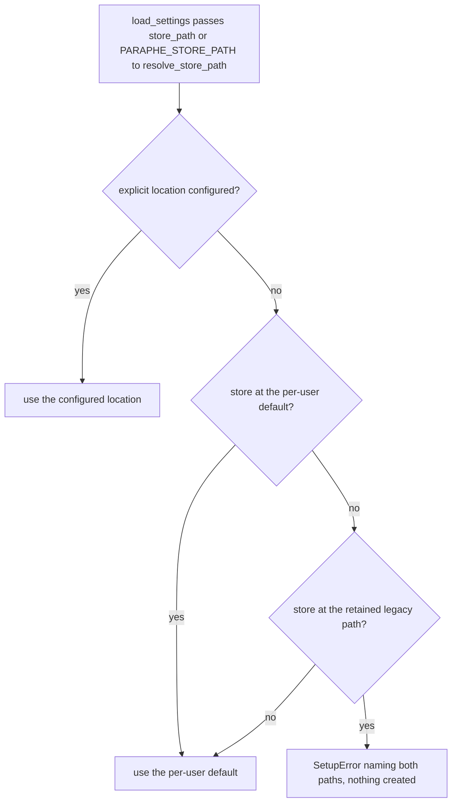

# Data location, permissions and backup

## One resolver, used everywhere

`resolve_store_path` (`src/paraphe/inbox/config.py`) is the only place a data location is decided.
`load_settings` calls it once and keeps the answer in `Settings.store_path`, and that one value is what
the runtime, the `Inbox` and `Store.prepare` then use. The point is that the path that is **checked** is
the path that is **opened**, so a misconfigured deployment fails at startup with a `SetupError` rather
than at the first card.

| Configuration | Result |
|---|---|
| `store_path` in the config file | honoured, always |
| `PARAPHE_STORE_PATH` in the environment | honoured, and it wins over the file |
| neither, and a store is at the per-user default | the per-user default |
| neither, the default is empty, and a store sits at the retained legacy path | `SetupError` naming both paths; nothing is created |
| neither, and neither location holds a store | the per-user default, ready to be created |

Two details of that resolution matter when reading a deployment:

- An **empty** environment value counts as unset, so `PARAPHE_STORE_PATH=""` does not erase a location
  named in the config file.
- A configured `~` is expanded, which is why `config.example.toml` can suggest
  `~/.local/share/paraphe/inbox.sqlite`.

The per-user default is `$XDG_DATA_HOME/paraphe` when `XDG_DATA_HOME` is set and non-blank, else
`~/.local/share/paraphe`, with the store file `inbox.sqlite` inside it.



How one call resolves the data location: an explicit location always wins, and the default is chosen
only when it would not strand a store left at the retained legacy path.

## Why the default refuses

Earlier releases kept the store at a fixed system path — `/var/lib/paraphe/inbox.sqlite`, still named
in code as `LEGACY_STORE_PATH` and still the location ADR 0005 records for the deployment. If a run
resolves the **default** and that location holds no store while a store exists at the retained location,
Paraphe refuses with one line naming both paths, and creates nothing:

```
no store at <default>; a store exists at <retained>. Set store_path to <retained> to keep using it, or start from an empty location.
```

Two deliberate details:

- **An explicit location is honoured**, even while a store exists elsewhere. Naming a location is a
  decision; drifting to a default is not. This is what keeps an existing deployment running against its
  old path by configuring `store_path` to the retained path; relocating the store is the other, now
  documented upgrade route (below).
- **An unreadable path counts as no store.** The check uses a helper (`store_exists`) that treats a
  permission error as "nothing to strand" rather than propagating it, because a process that cannot read
  a directory cannot have been keeping its cards there.

The consequence is a product guarantee, not just an error message: a change of data location never
silently begins a second, empty inbox while the real cards sit somewhere else.

## Relocating instead of reconfiguring

The upgrade route the README leads with is the command, not a hand-edited setting:

```console
paraphe store relocate          # copy the retained legacy store to the current default, keep the source
paraphe store relocate --move   # same, then remove the source
```

Stop the running server first, as the README's upgrade note says, then run one of the two. The command
knows its own source and target — `LEGACY_STORE_PATH` and `default_store_path()` — and takes no location
arguments, so it is the upgrade from the retained legacy location, not a general move to an arbitrary
path. Copying is the default because it leaves the old store in place as a backup; `--move` is the
opt-in for an owner who does not want two stores.

Relocation does **not** weaken the startup guard. The guard in `resolve_store_path` is unchanged and
still fires in the one case it was written for: a default location with no store while the retained
location has one. Once the verified copy lands at the default, resolution finds a store there and
startup proceeds normally. The two behaviours compose rather than replace each other, and the tests pin
both — the refusal and `test_startup_accepts_the_relocated_default_store`. Setting `store_path` to the
old location also remains available when relocation is not wanted; it is the alternative, not the only
option it once was.

`docs/roadmap.md` still lists "An upgrade path that moves an existing store" under **Next**; that line is
stale. `src/paraphe/store_cli.py`, `relocate_store`, the README upgrade note and
`tests/inbox/test_setup.py` all ship it.

What the command does internally — the read-only SQLite copy, the verification that the copy is a
Paraphe store, the atomic install with the owner-only modes, the rollback of a failed `--move` and the
cleanup of an unfinished snapshot — is owned by
[the owner-side commands](/openwiki/operations/owner-side-commands.md).

## Modes

`Store.prepare` creates the data directory if it does not exist, sets it to `0700`, then touches the
store file and sets it to `0600`. The chmod is explicit rather than left to `mkdir`'s mode, because a
umask would otherwise decide how private the owner's data is. `Store.open` calls `prepare` first, so
every process that opens the store re-establishes those modes, and the relocation installs the same
`0700` directory and `0600` file at the target.

A failure at that point — an unwritable directory, a read-only filesystem — arrives as the product's
single-line setup error (`data directory is not usable: <path>`, `store file is not usable: <path>`),
not as a later `OSError` from somewhere inside a request handler.

## What is in the file

| Table | Contents |
|---|---|
| `cards` | one row per card, keyed by request id, the card serialised as JSON |
| `notifications` | the external ids already notified, so a retry does not notify twice |
| `durable_state` | small key/value state that must survive a restart, today the Telegram long-poll offset |

The three tables are created on open (`CREATE TABLE IF NOT EXISTS`). `durable_state` holds one key the
runtime genuinely needs across restarts: `telegram_next_offset`. The Telegram loop restores it at
startup, seeds it from the newest update id when it is absent, and writes the advanced offset back after
each handled update, so a restart resumes the poll where it stopped instead of replaying or skipping
messages. A stored offset that is not a non-negative integer raises rather than being used.

The inbox loads every card into memory on first use and fails closed if a stored payload does not
parse: `_ensure_store` opens the store, builds the card map, the external-id index and the notified set,
and closes the store and re-raises on any error. Cards are small and few by nature — this is an inbox,
not a log — so holding the whole set in memory is the honest implementation rather than a cache with a
policy.

Cards are the only durable state, and the store reads and writes nothing outside the resolved location:
the data directory that holds `inbox.sqlite` and the file itself. Nothing else in the repository or on
the host is a store.

## Backup

The decision record fixes the contract: a SQLite file under a dedicated service user, and a **consistent
snapshot taken before the daily backup service reads its include list**, rather than copying a live
database. On a fresh location that include-list line is an operator prerequisite — the product does not
add it — and the list must name whichever location resolves: `/var/lib/paraphe` for the deployment ADR
0005 describes, the per-user directory (or the configured `store_path`) for one that has relocated.
Restoring is: install the service user and the unit, restore the data directory to the resolved location
(preferring the snapshot when the live file is dirty), and start.

The scheduled helper is still not in this repository; it belongs to the deployment's own host
configuration, alongside the unit and the include list, because it is about one host's backup system
rather than about the product. What the repository does contain is one working implementation of the
same mechanism: `relocate_store` copies through SQLite's online backup API from a read-only source and
verifies the result with `PRAGMA integrity_check` and the presence of the `cards` table — which is why
the shape "snapshot first, then move the directory, and never copy a half-written file" is enforced code
here and host configuration there.

## The container

The image keeps the data location outside itself: `/data` is declared as a volume and
`PARAPHE_STORE_PATH` points inside it. `USER paraphe` is an unprivileged, login-disabled account created
by the image, so the mounted directory has to be writable by that user — which is why the README's
container block starts by creating it with permissive mode.

The container binds loopback inside itself. Reaching it from outside the container means either
configuring the phone destination and setting `PARAPHE_MCP_HOST`, or putting a proxy in front — never
both the answer path and a world-reachable bind, because startup refuses that combination (see
[composition root and runtime](/openwiki/architecture/composition-root-and-runtime.md)).
