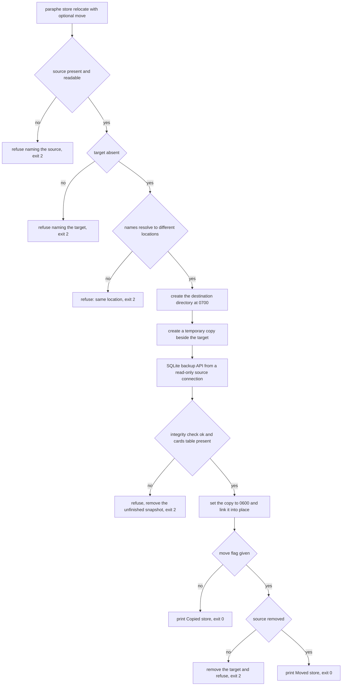

# Owner-side commands: check telegram and store relocate

Two commands exist for the owner rather than for the agent, and neither starts the
service. `paraphe check telegram` proves the phone destination a run is about to use
(`src/paraphe/check.py`), and `paraphe store relocate [--move]` installs the store a
release left at an older location into the current per-user location
(`src/paraphe/store_cli.py`, with the work in `relocate_store` in
`src/paraphe/inbox/store.py`). Both are reached through the installed `paraphe`
command; the entry point's dispatch order, and the fact that each subcommand is
imported in its own branch so neither one loads the server, is owned by
[composition root and runtime](/openwiki/architecture/composition-root-and-runtime.md).

Both are **owner-side**: they read the owner's own settings and the owner's own files,
need no running service, and give an agent nothing. `check telegram` prints no
credential, and `store relocate` never touches a credential at all — it takes no
configuration, no bearer and no `--config` pair.

## The argument contract

| Invocation | What happens |
|---|---|
| `paraphe check telegram` | the preflight runs; exit `0` only after identity **and** delivery both succeed |
| `paraphe check` with anything else as the argument list | one line on stderr, `paraphe: check needs exactly 'telegram'`, exit `2` |
| `paraphe store relocate` | copy the retained legacy store to the current per-user default, keep the source |
| `paraphe store relocate --move` | the same copy, then remove the source |
| `paraphe store` with anything else | the store usage on stderr, exit `2` |
| `paraphe store -h`, `paraphe store --help`, `paraphe store help` | the store usage on stdout, exit `0` |

Neither command takes extra arguments, a location or a flag beyond `--move`, and each
accepted form is matched by whole-list equality — so the word after the subcommand is
the whole contract. `check` has no help form: `paraphe check -h` is the usage refusal
above, not help.

Exit codes are deliberately two-valued for both commands:

| Code | Meaning |
|---|---|
| `0` | the command did what it says: the check proved the destination, the relocation installed a verified store |
| `2` | every refusal — a wrong argument list, a setup error, a refused or unreachable Telegram call, a missing or occupied or unverifiable store |

An operator who scripts this can therefore treat non-zero as "nothing changed": the
check exits `0` only when the destination is proven, and a refused relocation leaves no
partially installed target (see [the relocation sequence](#the-ordered-sequence)).

## `paraphe check telegram`

### What it resolves before any network call

The preflight resolves the **same settings the server would resolve**, through
`load_settings`, so it fails where startup would fail rather than after a message has
been sent. In order:

1. If the configuration file it would read — `PARAPHE_CONFIG_PATH`, else `paraphe.toml`
   in the working directory — does not exist **and** neither `PARAPHE_BOT_TOKEN` nor
   `PARAPHE_OWNER_TELEGRAM_ID` is set to something non-blank, it refuses immediately
   with `paraphe: no phone destination is configured` and exit `2`, without loading
   anything.
2. Otherwise `load_settings` runs with the same file-and-environment rules as a server
   start (the environment wins per key), and **any `SetupError` it raises is printed as
   one `paraphe: <message>` line with exit `2`**. That is wider than it first looks: a
   missing `mcp_create_bearer` refuses the check too, even though the check creates
   nothing, and so does an invalid owner id or TTL, and so does the store-location guard
   described in
   [data location, permissions and backup](/openwiki/operations/data-location-and-backup.md).
   A check on a half-migrated host can therefore stop on the store, not on Telegram.
3. If the resolved settings carry no bot token (a local-only configuration with an
   answer credential), it refuses with the same `paraphe: no phone destination is
   configured` line and exit `2`.

The two paths to that one message differ in what the operator should do: the first
means nothing phone-shaped is configured anywhere, the second means a local
configuration is being asked a phone question. Neither calls the Bot API — the tests
assert the API object was never constructed in the no-configuration case.

### The two calls, and what is printed

Only after those steps does it build a `TelegramBotAPI` for the configured token:

1. **`getMe`** — the reply names the bot: `Telegram token identifies @<username>.`
   when the identity carries a username, else
   `Telegram token identifies the configured bot.` This line goes to **stdout before
   delivery is attempted**, so a run that names the bot and then fails on delivery
   prints both the name and the refusal.
2. **`sendMessage`** to the configured owner id, carrying the fixed plain text
   `Paraphe Telegram check passed. This is a setup test, not a decision card.`, with a
   `reply_markup` of `None` and no parse mode. It is one plain message: no buttons, no
   ordered card sections, no expiry, nothing to tap.
3. On success: `Telegram check passed for owner <id>.` on stdout, exit `0`.

The identity-and-delivery ordering is the point of the command. A token that resolves
to the wrong bot is caught by step 1; a correct bot with a wrong `owner_telegram_id`,
or with no private chat ever opened with the bot, is caught by step 2.

### Which refusal you are looking at

The Bot API client classifies every call into two kinds — a request Telegram
**refused** (`NotifyRejected`) and a request that could not be **reached**
(`TelegramAPIError`) — and the check keeps them apart for both calls, so it never
blames the owner id for a network failure:

| Situation | Line on stderr | Exit |
|---|---|---|
| no phone destination configured (either path above) | `paraphe: no phone destination is configured` | `2` |
| settings refuse to load | `paraphe: <setup message>` | `2` |
| `getMe` refused (bad or revoked token) | `paraphe: Telegram refused the configured bot token` | `2` |
| `getMe` unreachable | `paraphe: could not reach the Telegram Bot API` | `2` |
| delivery refused for the configured owner | `paraphe: Telegram could not deliver to owner <id>; check the id and open a private chat with the bot first` | `2` |
| delivery unreachable | `paraphe: could not reach the Telegram Bot API` | `2` |

The distinction the table encodes is the same one the runtime relies on when notifying
an owner: `NotifyRejected` means the provider proved the send did not happen,
`TelegramAPIError` means the outcome is unknown. The classification itself, and where
the token lives inside the client, is on
[the Telegram tap surface](/openwiki/integrations/telegram-tap-surface.md).

### What the check never does

- **No decision card.** The message is composed by the check, not by the inbox: the
  check does not open the store, writes no card, makes no notification reservation and
  records no Telegram message id. Nothing about a check appears in `cards`,
  `notifications` or `durable_state`.
- **No credential in the output.** The bot token never appears, and neither does the
  token-bearing request URL that `TelegramBotAPI` builds from it — the client's
  exception messages are fixed strings for exactly this reason, as
  [the credential boundary](/openwiki/security/credential-boundary.md) records. The
  suite asserts the absence of both the token and the URL on the pass path and on each
  refusal path.
- **No socket to the inbox.** The check binds nothing and talks only to the Bot API, so
  it can be run before, after or entirely without the server.

## `paraphe store relocate`

### What moves where

The command computes both ends itself and takes no location arguments:
`source` is the retained legacy location `LEGACY_STORE_PATH`
(`/var/lib/paraphe/inbox.sqlite`) and `target` is `default_store_path()`
(`$XDG_DATA_HOME/paraphe/inbox.sqlite`, else `~/.local/share/paraphe/inbox.sqlite`).
That is what makes it an upgrade route rather than a general-purpose move: to relocate
from anywhere else, set `store_path` instead. Copying is the default because it leaves
the old store in place as a backup; `--move` is the opt-in for an owner who does not
want two stores. The README's upgrade note says to stop the running server first, and
it is worth obeying: the source is opened read-only, but a server still running against
the same target can start it while the copy is being built, and the command then refuses
rather than racing it.

### The ordered sequence

`relocate_store` is eight ordered steps, and the first settles every refusal that can
be decided before the filesystem changes. The order is the safety property: nothing at
the target is created until a verified snapshot exists, and no snapshot survives a
failure.

1. **Refuse, without touching anything.** The source is probed and the target is
   probed; a probe that cannot read its path (a service-owned legacy directory, say) is
   reported as one line naming that path rather than raising out of the command. Then:
   `source store does not exist: <source>`, `target store already exists: <target>` for
   an occupied target, and `source and target store are the same` when both names
   resolve to one location.
2. **Create the destination directory** `0700` — `mkdir(parents=True, exist_ok=True,
   mode=0o700)` followed by an explicit `chmod`, so a umask does not decide how private
   it is. Failure is `data directory is not usable: <dir>`. The final database path is
   deliberately **not** created here, so a server starting mid-relocation can never see
   a partial copy.
3. **Build the copy under a temporary name** in that same directory
   (`tempfile.mkstemp` with a dot-prefixed name and a `.tmp` suffix). Both files living
   in one directory is what lets step 6 be atomic rather than a copy-with-replace.
4. **Take a consistent snapshot with SQLite's backup API**, from a read-only connection
   opened with the `file:...?mode=ro` URI. The bytes are never copied while a
   transaction or journal may be active.
5. **Verify the snapshot** before it becomes the real store. `PRAGMA integrity_check`
   must return `ok` and the database must carry the `cards` table; the integrity check
   alone passes an empty or foreign database, which would install something that is not
   the owner's data. Failures are `copied store failed its integrity check` and
   `source store is not a Paraphe store: <source>`.
6. **Secure the file, then install it atomically.** The copy is set to `0600` and
   `os.link`ed to the target path, which refuses if a file appeared there meanwhile —
   a concurrent writer is reported as `target store already exists: <target>` rather
   than overwritten. The target is then chmodded `0600` and the temporary name removed;
   an `OSError` after the link rolls the target back.
7. **With `--move`, remove the source only after the target exists.** If removal fails,
   the target is removed (rolled back) and the command refuses with
   `could not remove source store: <source>` — a move that cannot complete leaves the
   store where it was, not in two places and not in none.
8. **Remove the unfinished snapshot on every failure path**, in a `finally`. A
   `sqlite3.Error` becomes `store could not be copied: <source>` and any other `OSError`
   becomes `store could not be relocated: <source>`; `store_cli` prints any of these as
   one `paraphe: <message>` line on stderr with exit `2`. On success it prints
   `Copied store from <source> to <target>.` or `Moved store from <source> to <target>.`
   on stdout and exits `0`.

The relocation step sequence: the preflight refusals before any filesystem change, then
the snapshot, its verification, the atomic install, and the `--move` removal with its
rollback.

### What a failed run leaves behind

The tests pin the negative space as tightly as the happy path: a source that is not a
Paraphe store, a source that cannot be read, and a target that already exists all leave
the source bytes exactly as they were, create no target, and leave **no leftover
temporary file** in the destination directory. A successful copy lands with the data
directory at `0700` and the store at `0600` — the same modes `Store.prepare` gives a
freshly created store, which is why the relocated file is indistinguishable from one
Paraphe made itself. Details of the modes, the three tables and the backup contract are
on
[data location, permissions and backup](/openwiki/operations/data-location-and-backup.md).

## Relocation and the startup guard

The command exists because of a startup rule, and it does not replace it. When no
explicit `store_path` is configured, `resolve_store_path` refuses to start if the
per-user default holds no store **while a store exists at the retained legacy path** —
one line naming both, nothing created — so an upgrade can never quietly begin a second,
empty inbox.

The two behaviours compose:

- **Before** the relocation, that guard is what an operator sees, and the message names
  both paths and the two ways out (configure the old path, or start from an empty
  location).
- **After** a verified copy has landed at the default, resolution finds a store there
  and startup proceeds normally; the guard's condition can no longer be met.
- Setting `store_path` to the retained location remains a legitimate alternative when
  relocation is not wanted — naming a location is a decision, and an explicit location
  is always honoured, even while a store exists elsewhere.

So a relocation run and a server start are never in conflict: the command moves the
store to where the default would look, and the guard keeps a start from happening
before that.

## Where the witnesses are

- `tests/inbox/test_check.py` covers the preflight: pass only after identity **and**
  delivery, a refused token named without leaking it, an unreachable token not reported
  as a refusal, a refused delivery naming the owner and the next step, an unreachable
  delivery not blaming the owner id, the no-configuration message with the API never
  constructed, and `check telegram` routed through `paraphe.__main__.main`. Every
  assertion on output also asserts the token and the token-bearing URL are absent.
- `tests/inbox/test_setup.py` covers relocation end to end: cards survive a copy with
  owner-only modes, a move happens only with `--move`, an occupied target is refused
  with both files untouched, a failed copy leaves no partial target and no temporary
  file, an unreadable source is reported by name, a source without a `cards` table is
  refused, both CLI forms return the documented exit codes and words, and startup
  accepts the relocated default.

The suite's one invocation, and the harness these tests are written against, are on
[suite and integration](/openwiki/testing/suite-and-integration.md).
