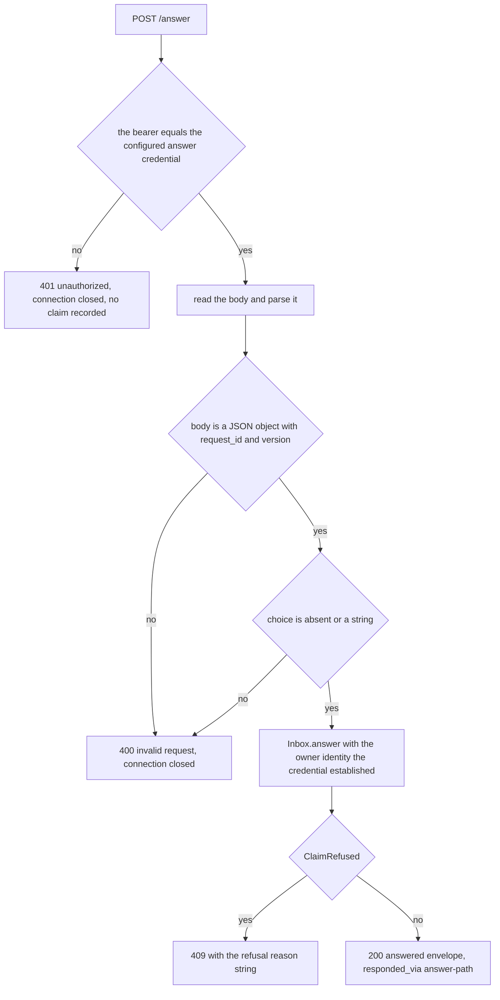

# The credential boundary

## The rule

**The credential an agent holds creates and reads. It cannot answer.** An inbox
an agent can approve on its owner's behalf is not an owner-decision inbox, so
this is neither a setting nor a role: it is two credentials and an owner
identity, and one route that accepts the owner's.

| Credential | Configured as | Held by | May |
|---|---|---|---|
| create bearer | `mcp_create_bearer` / `PARAPHE_MCP_CREATE_BEARER` | the agent | create a card, read a card, update it, cancel it, report on it and mark it processed — it cannot answer one |
| owner answer credential | `owner_answer_token` / `PARAPHE_OWNER_ANSWER_TOKEN` | the owner, in a local deployment | answer a card, through `POST /answer` only |
| the owner's Telegram account | `owner_telegram_id` / `PARAPHE_OWNER_TELEGRAM_ID` | the owner, in a phone deployment | answer a card by tapping a button, or by long-press replying to the card message; it has no MCP access |

The owner's Telegram account answers through two gestures and one ladder. A tap
(a `callback_query`) reaches `Inbox.claim`; a long-press reply reaches
`Inbox.claim_reply`, which resolves the card from the replied-to message id over
the loaded card state and then records through the same `_claim_locked` the tap
reaches. So `_claim_locked` is the one place an answer is written, and the owner
check, the expiry refresh, the version check, the write, the waiter wake and the
keyboard strip are the same code for both gestures rather than a parallel
implementation. Both are gated by the same owner identity — the configured
`owner_telegram_id`, compared as the sender id and, for a reply, as the private
chat id as well — so there is no second password and no separate allow-list. A
reply hands the ladder the resolved card's own version, so a superseded revision
cannot be answered by replying to the message a revision replaced. The reply
intake's own checks and refusals are documented in
[owner replies as answers](/openwiki/integrations/owner-reply-intake.md).

The boundary is asserted in three places rather than by one check:

- the **configuration layer** refuses an answer credential equal to the create
  bearer (`SetupError("the answer credential must differ from the create
  credential")`) and refuses a start with neither a phone destination nor an
  answer credential, so a deployment must have *some* owner identity and cannot
  quietly alias the two;
- `Inbox.check_answer_token` refuses the create bearer **explicitly**, before
  comparing, as well as by comparison — the boundary does not depend on the two
  values merely differing;
- the **served surface holds no answering tool**: `TOOL_NAMES` is the create,
  read and closeout set, and the suite asserts that no served tool name carries
  `answer` or `claim` as an underscore-separated token
  (`tests/inbox/test_surface_contract.py::test_no_tool_answers_or_claims_a_card`).

Both checks compare in constant time (`secrets.compare_digest`) and both are
fail-closed when their expected value is unset, so a half-configured inbox
refuses everything instead of accepting anything. `Settings.__repr__` prints
only the owner id and the TTL values, so logging the resolved settings cannot
leak the bearer, the bot token or the answer credential either.

## The no-answering-tool argument, in three checkable steps

- **No name can answer.** The registry is `TOOL_NAMES`: `how_to_use`, the four
  create tools, the reading tools and the four closeout tools. The contract test
  walks that list asserting no name splits into an `answer` or a `claim` token
  (`tests/inbox/test_surface_contract.py::test_no_tool_answers_or_claims_a_card`),
  and a companion test in the same file pins the tool table of `docs/tools.md`
  equal to `TOOL_NAMES`, so the served set and the documented set cannot drift
  apart by editing prose.
- **The create bearer is required for the create tools and for reading the
  surface, and refused for the one argument-level state change that is an
  answer.** `_require_create_bearer` is called by the four create handlers —
  `_ask_question`, `_request_approval`, `_request_feedback`, `_notify_user` — so
  creating a card without the bearer fails in the handler as well as at the
  transport. The read and closeout handlers ignore the bearer argument, because
  no request reaches them without the transport check: `do_POST` refuses a missing
  or wrong bearer with `401` before dispatch, which is also what puts
  `how_to_use`'s read of the whole surface behind the create bearer. And the same
  bearer cannot make the argument-level state change that answering is:
  `POST /answer` refuses it before the body is read, so no `choice` or `version`
  it carries can be applied.
- **One writer.** An answer is written in exactly one place, `_claim_locked`,
  reached from `claim` (the tap path and the owner answer path) and from
  `claim_reply`. A refused credential never reaches it, so the card is left
  unchanged — the witnesses are
  `tests/inbox/test_setup.py::TestAnswerPath::test_the_create_credential_cannot_answer`
  (the card reads back `pending` after the `401`) and
  `test_a_superseded_version_is_refused_and_the_card_is_unchanged` (the refusal
  path through the same ladder leaves `response: null`).

## Where the answer credential is checked

`POST /answer` is routed to the owner answer path *before* the MCP bearer check,
and `_answer_as_owner` checks its own credential before the body is read and
before anything in the store is touched:

The credential is checked first, then the body, then the inbox claim.

The order matters at every step:

- a missing or wrong credential is refused with `401`, and **no claim is
  recorded and the card is unchanged** — an attempt is not an answer;
- the create bearer is refused explicitly as well as by comparison;
- only then is the request validated (`400`), and only then handed to the inbox,
  whose refusals come back as `409` with their reason
  (`stale_version`, `already_tapped`, `expired`, `cancelled`, …); any other
  exception out of `Inbox.answer` is also answered `409 refused`, so a failed
  local answer never looks like a server error or a success.

Because the check is at the boundary, `Inbox.answer` has no credential check of
its own: it calls `claim` — the same method the Telegram tap goes through — with
`from_id=self.owner_telegram_id` and `owner_verified=True`, the boundary having
already established that the caller is the owner, and with
`responded_via="answer-path"`. One implementation of the version and lifecycle
checks means one place for them to be wrong, and no tool handler can reach that
entry point: `answer` is called by the HTTP route and by nothing else.

## Why the answer path is loopback-only

The answer path refuses to start on a non-loopback bind. Not a warning, not a
log line: `Runtime.start` raises `SetupError("the answer path refuses a
non-loopback bind")` and the process exits, so the refusal lives in the
composition root rather than in the transport (see
[The composition root and runtime](/openwiki/architecture/composition-root-and-runtime.md)).

The reasoning is that a loopback bind is not a control, since every process on
the host can reach it, but a *world-reachable* one is strictly worse — the
owner's own approval endpoint would be open to every peer on the network while
the implementation still looked correct in review. A deployment that must be
reachable from outside therefore uses the phone destination, where answering
requires the owner's Telegram account rather than network reach.

Two details keep that rule honest. `serve_inbox` has its own, *wider* bind guard
— loopback plus the Tailscale ranges (`100.64.0.0/10`, `fd7a:115c:a1e0::/48`) —
and refuses everything else as `BindError("public bind refused")`; the stricter
loopback-only rule for an enabled answer path is enforced one layer up, and
`Runtime.start` is the only production caller of `inbox.serve`. And the answer
credential therefore buys little on its own off-host: it is only usable where
the route is reachable, and the shipped runtime keeps that local.

## The owner-side consequence: prove the destination, never the secret

The boundary has one owner-side surface that is neither the tap nor the answer
route: `paraphe check telegram` (`src/paraphe/check.py`), the preflight an owner
runs before trusting a phone deployment. It resolves the settings through the
same `load_settings` a server start uses, so a configuration the boundary
refuses — an answer credential equal to the create bearer, or neither a phone
destination nor an answer credential — stops the check with the same `paraphe:
<message>` line and exit `2`, before any Bot API call. What it then prints is
identity, not secrets: the bot the token resolves to
(`Telegram token identifies @<username>.`) and the owner id the test message
reached (`Telegram check passed for owner <id>.`). It prints no credential value
— not the bot token, and not the token-bearing request URL the Bot API client
builds from it, which is why that client's failures are fixed strings rather
than interpolated URLs. The suite asserts both absences on the pass path and on
every refusal path. The command's argument contract, ordered steps and exit
codes are owned by
[Owner-side commands](/openwiki/operations/owner-side-commands.md).

The local destination keeps the same discipline in the other direction. The
console destination prints the card and, with it, the `curl` command that
answers it, and that command names `PARAPHE_OWNER_ANSWER_TOKEN` — the
environment variable, never a value. The credential an owner must supply is
therefore shown as a name to export, and card text that an agent can cause to be
printed to stdout or a log carries nothing that could answer it.

## What the wait surface does not add

`ask_question`, `request_approval` and `get_response` accept `wait_seconds`
(0–60), and a call that takes the window parks until the card is answered or the
window ends (see [The wait engine](/openwiki/architecture/wait-engine.md)). That
surface is a *read* of a card the caller already holds, and it grants no
answering ability:

- `WAIT_TOOLS` is exactly those three tools, and `Inbox.call_tool` applies the
  park only after the handler has run under the inbox lock and the lock has been
  released, and only when the validated `wait_seconds` is greater than zero. The
  park is an optimization layered on a result the call already produced, never a
  second way to act on the card.
- `_park` is a read loop: it re-reads the card through `_require_card`, returns
  as soon as the card is no longer `open`, and otherwise registers a per-card
  event and waits on the remaining window; the re-read after registration closes
  the race with an answer that landed just before. The only write a parked read
  can make is the expiry transition performed by `_require_card` →
  `_refresh_expiry`; it never writes an answer.
- `_notify_waiters` is called by the *writers*, after their durable write and
  never before: `_claim_locked` (the tap path, the owner answer path and the
  reply path), `cancel_request` and `_refresh_expiry`. A parked call therefore
  only ever observes state a writer already committed — the owner's answer, or a
  card closed by the agent itself or by its deadline.
- The parked call hands back the ordinary reading envelope, so a window that ends
  with nobody answering returns `pending` with `response: null`. No tool
  parameter supplies a choice, and no served tool name carries `answer` or
  `claim`; the suite also pins that the same tap writes identical fields with and
  without a waiter, so waiting never changes what is stored.

## What each credential's leak costs

- A leaked **create bearer** lets an attacker raise decisions — the inbox can be
  filled with cards the owner's phone will show — read the answers that are
  already there, and revise or cancel cards. It cannot answer one, on the answer
  route or through any served tool: the explicit refusal in `check_answer_token`
  is what makes that true even if the values were somehow made equal.
- A leaked **owner Telegram account** lets an attacker answer any card they can
  see, by tap or by reply, and it cannot create through the MCP surface, because
  it holds no bearer. A tap on a card owned by someone else is refused before
  anything is written.
- A leaked **answer credential** lets an attacker answer, but only where the
  route is reachable: the shipped runtime keeps it on loopback, so the leak is a
  local-host problem first and the rule above is why it does not become a
  network-wide one.

What a refusal does is exact, and it is what makes the two directions honest:

- A wrong or missing owner credential at `POST /answer` records **no claim** and
  leaves the card unchanged — `401 unauthorized`, connection closed, nothing
  written, nothing woken.
- A refused tap **callback is still answered**: given a callback id,
  `_on_callback` calls `answerCallbackQuery` on every path, including a refusal
  and undecodable callback data, so the owner's client does not spin on a dead
  button; the refusal itself is recorded nowhere and the card is untouched. A
  reply has no callback to answer, so it has no toast channel at all.

What the store does record about an answer is how it actually arrived
(`responded_via`: `"telegram"` for a tap through the bot, `"telegram-reply"` for
the owner's long-press reply, `"answer-path"` for the local route), so a locally
answered card is never reported as a phone tap; a tap or reply also records the
Telegram message identity it came from. What it does **not** record is which
credential created a card — the bearer is checked at the boundary and never
stored, and `agent_name` on a card is caller-supplied text, not proof of
anything.

## The shortcut that exists, and is not used

`record_tap` records an answer with neither the owner check nor the version
check. It has no production caller: the test suite uses it to reach post-tap
states, and the answer path deliberately does not, precisely because it bypasses
the two checks that make a stale or foreign answer impossible. It is not in
`TOOL_NAMES`, so the MCP surface cannot reach it either. A future integration
that finds it convenient is a regression, and the suite's boundary tests are
what would catch it.

## Fail-closed summary

| Situation | Behaviour |
|---|---|
| Create bearer presented to `POST /answer` | `401`, connection closed, no claim, card unchanged |
| No or wrong answer credential at `POST /answer` | `401`, no claim |
| No answer credential configured | `check_answer_token` refuses every token, so the route accepts nothing |
| Answer credential equal to the create bearer | refuses to start |
| Answer path enabled on a non-loopback bind | refuses to start |
| Neither a phone destination nor an answer credential | refuses to start |
| Non-owner, group-chat or foreign-chat tap callback | refused, `answerCallbackQuery` still sent, nothing recorded |
| Non-owner or foreign-chat reply | refused, nothing recorded, nothing raised, nothing sent back |
| Reply to a message a revision replaced | resolves to nothing; the live message still answers |
| Answer for a superseded revision | `409 stale_version`, card unchanged |
| Answer for a card that is no longer open | `409` with `expired`, `cancelled` or `already_tapped` |
| Any other failure inside `Inbox.answer` | `409 refused` |
| No credential at all on the MCP path | `401`, connection closed |
| A parked call whose card nobody answers | the window ends and it returns the pending envelope; the card is unchanged and a later `get_response` still reads the answer |
| A credential in preflight output | never printed; only the bot identity and the owner id are |

## Focused tests

- `tests/inbox/test_setup.py::TestAnswerPath` pins the route end to end: the
  create credential gets `401` and leaves the card `pending`; a wrong credential
  gets `401`; the owner credential answers with `responded_via == "answer-path"`;
  a superseded version is `409 stale_version` with `response` still `null`; a
  second answer is `409 already_tapped`. The same class pins the local channel's
  printed card: it carries the `/answer` command and the credential's environment
  variable name, never a value.
- `tests/inbox/test_setup.py::TestSetup` pins the setup rules: the answer
  credential must differ from the create bearer, a start with no phone
  destination and no answer credential refuses, a non-loopback bind
  (`0.0.0.0`, `100.64.1.2`, `8.8.8.8`) with the answer path refuses, and
  `check_answer_token` accepts the answer credential while refusing the create
  bearer.
- `tests/inbox/test_surface_contract.py::test_no_tool_answers_or_claims_a_card`
  is the surface-level half: no served tool name carries `answer` or `claim`, so
  the MCP surface has no tool that could answer a card.
- `tests/inbox/test_reply_intake.py` is the reply half of the owner identity:
  refusals from a non-owner, a group chat, a foreign chat or an unknown target
  record nothing and wake nothing, the reply records through the same ladder a
  tap uses, and the owner-only seam refuses a non-owner directly.
- `tests/inbox/test_wait_engine.py` is the wait-side evidence — a window that
  ends unanswered returns the pending envelope, and the same tap writes the same
  fields with and without a parked waiter.
- `tests/inbox/test_check.py::TestTelegramCheck` is the owner-side half: the
  preflight names the bot and the owner id, and neither the bot token nor the
  token-bearing request URL appears on the pass path, on a refused token, on an
  unreachable Bot API, on a refused delivery, or through
  `paraphe check telegram`.
