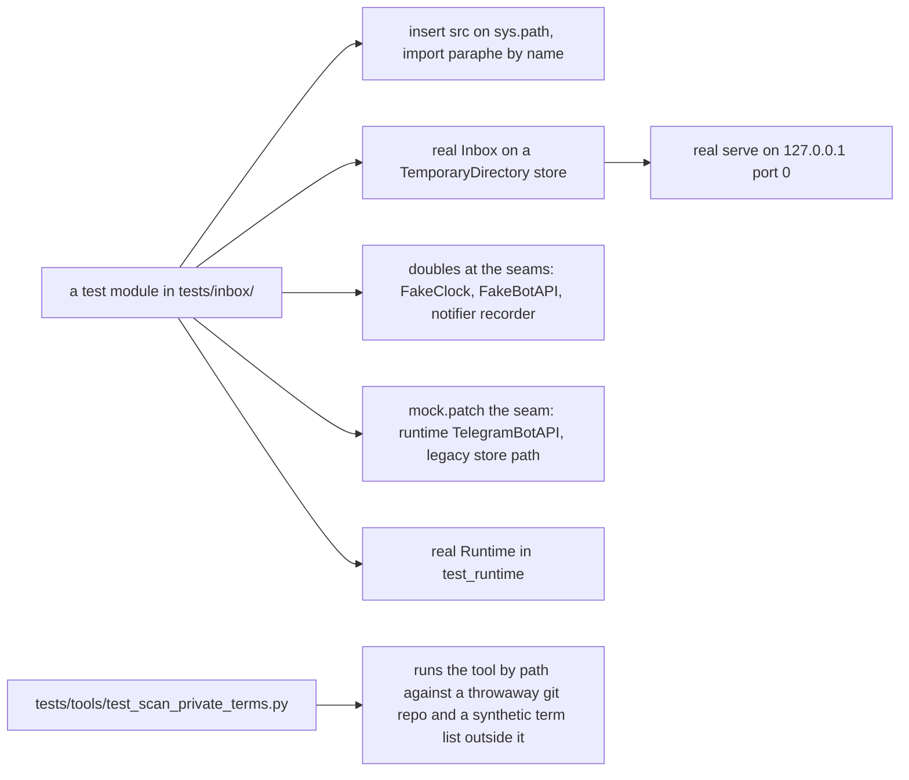
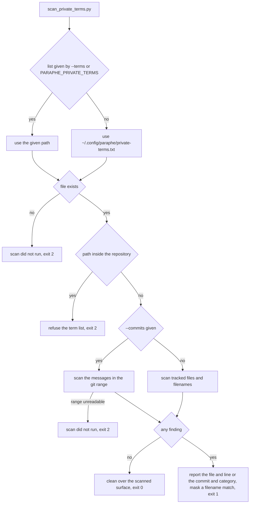

# Suite and integration

`tests/inbox/` holds ten `unittest` modules and `tests/tools/` holds the witness for
the repository's own private-term scan: eleven modules, no third-party runner, no
fixture layer and no install step. This page records the one valid invocation, what
the repository's instruction files commit a change to, how the tests are written,
what each module witnesses, the six jobs in `.github/workflows/ci.yml` that gate
every push, and the private-term gate that refuses to pass without a term list. The
behaviours themselves live on the pages the inventory links to; this page is about
the harness that proves them.

## The invocation is part of the contract

```bash
python3 -m unittest discover -s tests -p 'test_*.py'
```

Three things depend on that being written down:

- a bare `python3 -m unittest` discovers nothing, runs **zero tests** and exits
  `0` — the worst possible green;
- the suite is the only witness that a change to the storage, the credentials or
  the namespace altered no behaviour;
- a green run that ran fewer tests than the previous one is a red flag, not a
  pass.

Both `CONTRIBUTING.md` and `AGENTS.md` state the command and the trap, because a
contributor who runs the wrong one gets a success message with no tests behind it.
`AGENTS.md` is the canonical instruction file — `CLAUDE.md` is a one-line pointer
to it, and neither level repeats the other — and its "Run the suite" section adds
the habit that closes the trap: always pass `-s tests -p 'test_*.py'`, and read
the count. The CI suite job runs the identical command, so a local run and the gate
discover the same modules instead of two different sets.

Both `tests/inbox/` and `tests/tools/` are packages, so discovery from `-s tests`
imports them as `inbox.test_*` and `tools.test_*`. `CONTRIBUTING.md` names both
directories, and the pinned command discovers both from one invocation.

### What the instruction files commit a change to

`AGENTS.md`'s Rules section and `CONTRIBUTING.md`'s "What a mergeable change looks
like" are the merge gate in prose:

- **Nothing outside the standard library at runtime.** A dependency needs a
  reason that survives the question "what does this buy a self-hoster who
  installs once and reads the source?"
- **The suite is the witness.** It stays green in every commit, and the behaviour
  a change adds or fixes is covered by a test that fails without the change.
- **A change to the create/answer credential boundary needs a test that proves
  the boundary holds** — the create credential is refused on the answer path, no
  claim is recorded and the card is unchanged.
- **The create credential creates and reads, never answers.** No commit may give
  it the ability to answer a decision, on any surface.
- **Sending to a destination is best effort; the store is the source of the
  answer.** Never treat a missed wake as no answer.
- **No secrets** in code, tests, commits, logs or issues. Credential *names* are
  fine; values never appear.
- **No private reference in a tracked file**: no personal name, no host or
  machine name, no absolute path from anyone's machine, no private tracker key —
  enforced by the scan below, whose term list lives outside the repository.
- **Small and focused**: one failure mode per change, a rename that also
  refactors is two reviews in one diff, and a new test goes next to the behaviour
  it covers.

### Branches, and the scan before a push

`dev` is the integration branch: every change lands through a pull request whose
base is `dev`, and `main` moves only by a pull request from `dev` — the
`main-source` check below refuses anything else. Both branches refuse direct
pushes, force-pushes and deletion, and the required checks are listed in
`docs/launch/rulesets/README.md`. Commit messages are scanned like the tracked
tree, because public history is as permanent as the tree:

```bash
python3 tools/scan_private_terms.py --commits origin/dev..HEAD
```

`CONTRIBUTING.md` gives that pre-push form; `AGENTS.md` gives the tree form,
`python3 tools/scan_private_terms.py`, to run before every push. The `messages`
job runs the commit-message form in CI.

### What AGENTS.md carries besides the rules

The rest of `AGENTS.md` is short sections of operating context, and this page is
where they are accounted for because they are what an agent reads before
touching the suite:

- **Card surface** — the Telegram renderer's ordered rich sections (identity
  line, kind with a risk word, bold title, context, numbered options with notes,
  Recommended, If approved, Limits, links, reply hint, expiry), and the owner's
  long-press reply recorded as the card's text answer on the same claim path as
  a tap (`response.text`, `responded_via` `telegram-reply`) on an owner-side
  seam that never gives the create credential a way to answer.
- **Layout** — the directory map: the inbox package, the adapters, the suite,
  `docs/`, `tools/` and the example configuration.
- **Branches** — the integration branch, the `main-source` rule and the refusal
  of direct pushes, force-pushes and deletion.
- **Tracker** — this repository's own issue tracker and its triage labels, in
  `docs/agents/`.
- **Domain docs** — a single context: root `CONTEXT.md` plus `docs/adr/`,
  described in `docs/agents/domain.md`.
- **Private-term scan** — the command to run before every push, detailed below.
- **CodeGraph** — if `.codegraph/` is missing, run
  `CODEGRAPH_TELEMETRY=0 codegraph init -y` in the checkout; run `codegraph
  explore "<symbol names or question>"` before greps and file reads (the same
  output as the MCP `codegraph_explore` tool when that server is present); never
  run `codegraph install`; never commit `.codegraph/`, which `.gitignore`
  already ignores.
- **OpenWiki** — `openwiki/` is generated, optional just-in-time context rather
  than required startup reading; source code and tests stay authoritative over
  it, and a brief's unknowns or review items are verification gaps rather than
  requirements. Do not hand-edit generated pages unless explicitly asked.

The instruction file's OpenWiki note calls the refresher "scheduled", which is
not what the workflow file says. `.github/workflows/openwiki-update.yml` is
triggered by `workflow_dispatch` only — a maintainer starts it by hand — so
nothing refreshes `openwiki/` on a timer, and that is the trigger difference
worth knowing before wondering why the wiki stands still. What the file does
when it is started: it checks out full history (`fetch-depth: 0`, so `openwiki
code --update` can diff `HEAD` against the commit it last documented), installs
Node.js 22 plus `openwiki@0.5.0` with `mermaid` and `jsdom` for diagram
validation, runs `openwiki code --update --print` against the OpenRouter
provider, deletes the transient `openwiki/.run.json` run state (git-ignored like
`.codegraph/`), and opens or updates a pull request on branch `openwiki/update`
whose `add-paths` are `openwiki`, `AGENTS.md`, `CLAUDE.md` and the workflow file
itself. The generation step is `continue-on-error`, so a partial run still
produces that PR and only then fails the job — the pages completed before the
failure survive for review instead of being discarded.

Its Layout table is the one place that still names a wake port beside the
destinations. ADR 0011 withdrew that seam, and neither a wake-port module nor a
test module for one exists — the return path is witnessed by the wait-engine and
reply-intake modules listed below.

Nothing needs installing first. `pyproject.toml` declares no runtime
dependency, the runtime is standard library only by rule, and every module that
imports the product puts `src` on `sys.path` itself before importing it — so the
suite runs from a bare checkout, which is the property a contributor relies on
and the CI suite job proves by installing nothing.

## How the suite is written

The harness is deliberately thin, and it is what makes these modules witnesses
rather than mocks:

- **Import by path, test the shipped package.** Each module derives the
  repository root from `__file__`, inserts `src` on `sys.path` and then imports
  `paraphe` (or `paraphe.inbox.runtime`, `paraphe.adapters.telegram`) by name,
  so the code under test is the shipped package rather than a file loaded by
  path under an invented name. The one exception is
  `tests/tools/test_scan_private_terms.py`, which runs
  `tools/scan_private_terms.py` as a subprocess with `sys.executable` because
  the tool is a command, not a library.
- **Doubles sit at the seams, nowhere else.** A `FakeClock` is a callable
  returning a fixed epoch, a `FakeBotAPI` records `send_message`,
  `edit_message_reply_markup` and `answer_callback_query`, and a notifier
  recorder collects the payloads an `Inbox` would send. `unittest.mock` is used
  to patch the seams the runtime would otherwise open — `TelegramBotAPI` in
  `paraphe.inbox.runtime` (and in `paraphe.check`), or the legacy store path —
  never to replace the object under assertion.
- **Drive the real thing.** Every test builds a real `Inbox` on a
  `tempfile.TemporaryDirectory` store, and the wait, lifecycle, tap and reply
  modules run the real `Inbox`, the real `TelegramAdapter`, and for the HTTP
  cases a real `inbox.serve("127.0.0.1", 0)` endpoint that they speak JSON-RPC
  to. The runtime module starts the real `Runtime`. The suite therefore
  witnesses the composition the product actually runs.
- **No fixtures and no host assumptions.** A test builds the object it needs and
  asserts on the result; state that belongs to the host is patched away —
  `tests/inbox/test_setup.py` points the legacy store path at an absent file so
  the run is host-independent. The scan-tool module brings its own synthetic term
  list and a throwaway `git init` repository, because the real list must never
  appear in the repository. A new test goes next to the behaviour it covers,
  which is what `CONTRIBUTING.md` asks of a change.



One module's object graph: the shipped package is what gets asserted, and every
double replaces a boundary the process would otherwise own.

## What the tests witness

One row per module, all ten counted from `tests/inbox/` plus the scan tool's own
module in `tests/tools/`:

| Module | Behaviour it witnesses |
|---|---|
| `tests/inbox/test_setup.py` | fail-closed setup and the answer path: settings resolution from file and environment (the environment wins, an empty environment value does not erase a file value), the TTL default `14400` and floor `900` with a below-floor value refused, the per-user default and configured store locations, store file mode `0600` and directory mode `0700`, the refusal to relocate away from a location an earlier release used, the store relocation copy and `paraphe store relocate` command, the refusal of a non-loopback bind whenever the answer path exists, the console command's paths, and the create/answer credential boundary over real HTTP |
| `tests/inbox/test_check.py` | the owner-side `paraphe check telegram` preflight, so it cannot pass without reaching the owner |
| `tests/inbox/test_surface_contract.py` | the published contracts: `docs/tools.md` against the served tool names, the served text, the stored `source_thread`, the rendered identity line, the console destination |
| `tests/inbox/test_mcp_lifecycle.py` | the twelve-tool card lifecycle over the `Inbox` seam and over the served HTTP/SSE endpoint — idempotent creates, revisions, closeout, notify durability across restarts, fail-closed store handling |
| `tests/inbox/test_wait_engine.py` | the wait engine: parking and waking at the `Inbox` seam, a parked call over the real HTTP surface, and the `paraphe wait` CLI exit codes |
| `tests/inbox/test_telegram_port.py` | the Telegram destination: callback encoding, renotify and stale-callback keyboard stripping, refused-renotify retries, restart reconciliation, non-owner refusal |
| `tests/inbox/test_tap_claims.py` | the claim refusal reasons — non-owner, expired, cancelled, already tapped, superseded version — at the `Inbox` seam |
| `tests/inbox/test_reply_intake.py` | owner reply intake: a private-chat reply to a card message becomes the card's text answer with the same lifecycle writes a tap makes, wakes a parked waiter, and survives a restart |
| `tests/inbox/test_card_renderer.py` | the Telegram card renderer: the pinned full-card fixture, identity-line ordering, HTML escaping, the message budget with its trim marker, and the status-message layout |
| `tests/inbox/test_runtime.py` | startup, long polling and offset durability against a temporary store and a Telegram API double, shutdown, and the Telegram API error mapping |
| `tests/tools/test_scan_private_terms.py` | the private-term gate's own witness: a clean tree and a clean message range pass, a seeded finding reports the category but never the matched value, a filename match is masked, a message finding names the commit, the range limits the scan, and the three cannot-run paths exit `2` |

What each row is traceable to:

- **setup** pinned the answer path over real HTTP: the create credential and a
  wrong token are `401` and leave the card pending, a superseded version is
  `409 stale_version`, a second answer is `409 already_tapped`, and the owner
  token records the answer as `responded_via` `answer-path`. The same module
  checks with `git check-ignore` that `paraphe.toml` is git-ignored; that
  relocation away from a location an earlier release used is refused by a
  message naming **both** locations; that a created data directory is `0700`
  with the store `0600`, that a relocated store keeps those modes and its cards,
  and that a card survives a restart against the same location; that the console
  command prints usage and exits `0` when nothing is configured, prints the
  installed version for `--version`, and exits `2` with a `paraphe:` line when
  configuration is incomplete; and that neither credential appears in the
  inbox's `repr`.
- **check** drives `paraphe.check.telegram` with the environment, stdout and
  stderr injected and a `FakeTelegramAPI` patched into the module's
  `TelegramBotAPI` seam, and it keeps refusal and unreachability apart: a token
  Telegram refused is reported as refused with the token itself never printed, a
  refused delivery names the owner and the next step ("check the id", "open a
  private chat"), while a transport failure says only that the Telegram Bot API
  could not be reached and never blames the owner id. The pass case requires identity **and**
  delivery — the fake records the check message sent to the owner's id — and the
  no-configuration case exits `2` with the API never constructed. Every
  assertion on output also asserts the token and the token-bearing API URL are
  absent, and the last test routes `check telegram` through
  `paraphe.__main__.main`.
- **mcp lifecycle** holds the default `TWELVE_TOOLS` list, duplicate
  `external_id` behaviour (including two concurrent creates resolving to one
  card and one notify), field mixing and length/TTL validation, provenance
  round-trips, tap-only `report_execution` and `mark_processed`, expiry moving a
  card off `list_pending`, the served `inputSchema` inventory, `401` without a
  bearer, SSE `POST` answering while `GET` is `405`, a wildcard bind refusing
  and a tailnet address binding, the `413` oversized body plus keep-alive
  poisoning, and durability: no ghost `external_id` after a failed save, one
  notify per card across rejected or ambiguous sends and restarts, a corrupt
  store load refusing to serve a prefix, and failed saves leaving tap, mark and
  renotify state unchanged.
- **telegram port** covers compact callbacks for long UTF-8 choices, renotify
  sending the complete updated card, stale callbacks stripping only the stale
  message, cancel and expiry stripping their keyboards (including while the
  keyboard is still being attached, and after a renotify), retries from the
  read-back version after a refused renotify, restart reconciliation of
  accepted-but-unknown sends, callback answering, and stranger/non-private
  refusal.
- **tap claims** drives the `FakeTelegramPort` seam to assert both the refusal
  reason (`not_owner`, `expired`, `cancelled`, `already_tapped`,
  `stale_version`) and which cards were asked to strip, including the boundary
  cases at `expires_at` and a strip failure that neither authorizes nor
  unrecords a tap.
- **reply intake** adds the refusals that record nothing (stranger, group chat,
  wrong chat, unknown or absent reply target, a second reply, a reply to a
  status message, a reply to a superseded message) and shows the live reply on
  the renotified message still answering.
- **card renderer** also pins URL tickets rendered as links, escaping of every
  caller-supplied field with only five `<b>` labels surviving, longest-free-text
  trimming, UTF-16 budgeting of emoji, lone surrogates that must not fail a
  render, and a status message with no `Recommended`, hint, `Expires` or
  numbered options.
- **runtime** asserts one store, a loopback server and the adapter as both
  destination and notifier at startup; `poll_once` offsets (`-1, 0` bootstrap
  then `25`) and `next_update_id` persisted across a restart; first boot
  recording the offset of queued updates without dispatching them; malformed
  update ids and malformed nested updates rejected as `TelegramAPIError` without
  replaying an earlier update or skipping the failed one; `close()` stopping HTTP
  and closing the store twice safely; and `TelegramBotAPI` mapping `ok: false` to
  `NotifyRejected`, a timeout or invalid JSON to an ambiguous
  `TelegramAPIError`, and `ok: true` to its result.
- **the scan tool** builds the repository the tool inspects instead of inspecting
  this one: a temporary `git init`, a term list written outside it, and synthetic
  terms only, since the real list must never appear in the repository. It pins
  the exit discipline — `0` clean over the tree or over a message range, `1` for
  findings, `2` when the tool cannot run (no list, a list inside the repository,
  a range git cannot read) — and that a range argument really limits the scan.

The ten inbox modules line up with the related pages: the lifecycle and surface
rows with [the MCP surface](/openwiki/architecture/mcp-surface.md), the runtime
row with [the composition root](/openwiki/architecture/composition-root-and-runtime.md),
the reply and renderer rows with
[owner reply intake](/openwiki/integrations/owner-reply-intake.md) and
[Telegram card rendering](/openwiki/integrations/telegram-card-rendering.md),
the tap row with [the Telegram tap surface](/openwiki/integrations/telegram-tap-surface.md),
the wait row with [ask, answer and resume](/openwiki/workflows/ask-answer-resume.md),
and the check and setup rows with
[owner-side commands](/openwiki/operations/owner-side-commands.md) and
[data location and backup](/openwiki/operations/data-location-and-backup.md).

There is no `tests/inbox/test_wake_port.py`, because there is no wake port.
ADR 0011 withdrew the `WakePort` seam: the answer returns through the ask itself
(or the next read), and a destination only shows the card and strips its
controls. The return path's witnesses are `tests/inbox/test_wait_engine.py`,
which covers three seams — `TestWaitEngine` parks and wakes at the `Inbox` seam
(a tap, a cancel, an observed expiry, an unobserved window end, plus the pins
that a call without `wait_seconds` does not sleep and that a tap writes the same
card fields with and without a waiter), `TestWaitHttpSurface` drives a real
`serve("127.0.0.1", 0)` endpoint over HTTP while other calls still run and
leaves no waiter residue when a client disconnects, and `TestWaitCommand` pins
the `paraphe wait` exit codes — `0` for an answer, `3` for an expired card, `4`
for an unknown request id, and `1` without a create bearer — and
`tests/inbox/test_reply_intake.py`, which shows an owner reply waking a parked
waiter with the reply text.

`tests/inbox/test_surface_contract.py` is where documentation and the served
surface are forced to agree. It reads the tool table out of `docs/tools.md` and
asserts it equals `TOOL_NAMES` and `list_tools()`, that every served tool
carries a description that is not its own name, and that the served `how_to_use`
text and the tool descriptions carry the async protocol — record the
`request_id`, `wait_seconds`, `get_response`, `list_unprocessed`,
`paraphe wait`, `drain` — while no served tool name answers or claims a card. It
further asserts that the served text teaches provenance (`runtime`, `repo`,
`worktree`, `ticket`), the card-writing contract (origin, purpose, authorise,
prohibitions) and the reply rule (`telegram-reply`, re-ask), and that a created
card renders its identity line from the payload it was given.

Two of the assertions are deliberately more than regression cover:

- **the credential boundary** — that the create credential is refused on the
  answer path, that no claim is recorded and the card is unchanged. A change to
  the boundary without a test proving the boundary holds is not mergeable;
- **the stored `source_thread`** — the value a card keeps is the value the caller
  sent, because the origin is descriptive and nothing is woken from it. It is
  pinned because two wake-port implementations once disagreed about what the
  inbox stored for a card's origin, and the disagreement was visible in stored
  data.

## Integration

`.github/workflows/ci.yml` is the gate: six jobs, on every push to any branch
and every pull request.

| Job | What it proves |
|---|---|
| `suite` | the pinned discovery command passes on Ubuntu **and macOS** across three Python versions — the non-Linux leg is real, not decorative |
| `distribution` | a clean environment installs the built distribution, the console command runs, and exactly one top-level package is installed |
| `container` | the image builds, runs with a mounted data location, and fails the job if the ready line never appears |
| `private-terms` | the tracked tree carries no private reference |
| `messages` | the commit messages in the pushed range carry no private reference |
| `main-source` | a pull request targeting `main` comes from this repository's `dev` branch |

- **`suite`** — display name
  `suite (python ${{ matrix.python }} on ${{ matrix.os }})` — runs
  `python3 -m unittest discover -s tests -p 'test_*.py'` on `ubuntu-latest` and
  `macos-latest` across Python 3.11, 3.12 and 3.13, with `fail-fast: false` so
  one failing leg does not cancel the others, and needs no install step at all.
- **`distribution`** —
  `the distribution installs and the command runs` — creates
  `python3 -m venv /tmp/paraphe-ci`, `pip install .` on Python 3.12, runs the
  `paraphe` console command and greps its output for `Paraphe`, then requires
  the top-level names in `site-packages` (ignoring `.dist-info`,
  underscore-prefixed entries and `bin`/`pip`) to be exactly `paraphe` — which is
  the single package `pyproject.toml` ships, with no dependencies and the
  `paraphe = paraphe.__main__:main` script. A dependency that leaked a second
  top-level package fails the job.
- **`container`** — `the container builds and reports ready` — builds the image,
  runs it detached with a mounted data location (`/tmp/paraphe-data` at `/data`)
  and both credentials in the environment as CI placeholder values, then polls
  `docker logs` for `Paraphe ready`; if the line never appears within 30
  one-second attempts it prints the last 20 log lines and fails. The mount is
  what the image expects: the data location is a volume at `/data` and the store
  path points inside it, and the process runs as an unprivileged user built on
  the Python 3.11 floor.
- **`private-terms`** — `the tracked tree carries no private term` — writes the
  `PRIVATE_TERMS` secret to a path outside the workspace and runs the tree scan.
- **`messages`** — `the pushed commit messages carry no private term` — checks
  out with `fetch-depth: 0`, resolves the range the push actually added, and runs
  the scan in `--commits` mode over it. For a pull request the range is the
  base-to-head pair GitHub reports; for a new branch it is the merge base with
  `origin/main` up to the pushed head; for a force-push whose previous tip is no
  longer in the checkout it fetches that tip, and failing that falls back to the
  fork point with `main`, then to the pushed head's reachable history; a deleted
  branch has no range to scan. If no range can be resolved the job exits `2`
  rather than scanning nothing, and the scan itself exits `2` when git cannot
  read the range.
- **`main-source`** — `main only accepts pull requests from dev` — only runs on a
  pull request whose base is `main`, and fails unless the head repository is this
  repository and the head ref is `dev`. That job is what makes the branch rule in
  `AGENTS.md` and `CONTRIBUTING.md` enforceable, since GitHub cannot restrict a
  pull request's source branch.

These jobs are what the branch rulesets require: `docs/launch/rulesets/README.md`
lists the required checks by their exact check names — eleven on `main`, ten on
`dev` — and the names are the job `name:` strings verbatim. A rename on either
side silently unhooks a required check, so `ci.yml` and the ruleset definitions
have to change in the same commit. `private-terms` and `messages` fail closed
when the secret is missing, which is also why a fork pull request needs a
maintainer to re-run them from the repository.

`ci.yml` is the only workflow a push runs. The repository's other two workflow
files gate nothing on a push: `.github/workflows/openwiki-update.yml` is
manual-dispatch only and opens a documentation pull request, as described above,
and `.github/workflows/publish.yml` runs on a published release — it builds the
wheel and the sdist, asserts the dist holds exactly one of each, and publishes to
PyPI through OIDC trusted publishing (no stored token) with `skip-existing`, so a
re-cut release of a version PyPI already serves skips rather than fails.

## The private-term gate

`tools/scan_private_terms.py` is standard library only, and its term list is
**not in the repository**:

- locally it reads `~/.config/paraphe/private-terms.txt`, or a path given by
  `--terms` or `PARAPHE_PRIVATE_TERMS`;
- the list is `category:regex` lines — the category is the label the list gives
  itself, and it is what a finding reports — with blank and `#` lines skipped;
- in integration both `private-terms` and `messages` write the `PRIVATE_TERMS`
  secret to `${{ github.workspace }}/../private-terms.txt`, outside the
  workspace, and fail with an explicit message when the secret is unset;
- by default it walks `git ls-files` and reads each tracked file as UTF-8,
  skipping what it cannot decode, and reports a `content` finding as the file and
  line;
- with `--commits RANGE` it reads `git log` over the range and reports a
  `message` finding as the commit (the first 12 characters of its hash) and the
  category;
- it reports the **file and line, or the commit, and the category**, never the
  matched value, and masks a filename match because for that category the path
  *is* the matched value;
- it refuses a term list that resolves inside the current working directory —
  which is the repository when the scan is run as documented — and exits `2`
  with "scan did not run" when it has no list at all, or when git cannot read
  the requested range.



How the scan decides, including the three paths that exit `2` instead of
reporting clean. A list that exists but carries nothing usable is also not a
pass: a line without `category:regex`, or a list with no usable lines, aborts
with an error message instead of reporting clean, so an empty or malformed term
file cannot be mistaken for a clean tree.

That fail-closed behaviour is the point of the gate. A scan that passes when it
cannot run is worse than no scan, because it converts an unknown into a false
assurance. Both integration jobs fail with an explicit message when the secret is
missing, for the same reason, and the gate has its own witness:
`tests/tools/test_scan_private_terms.py` seeds a finding of each kind and asserts
what the tool reports — and what it must not print.
