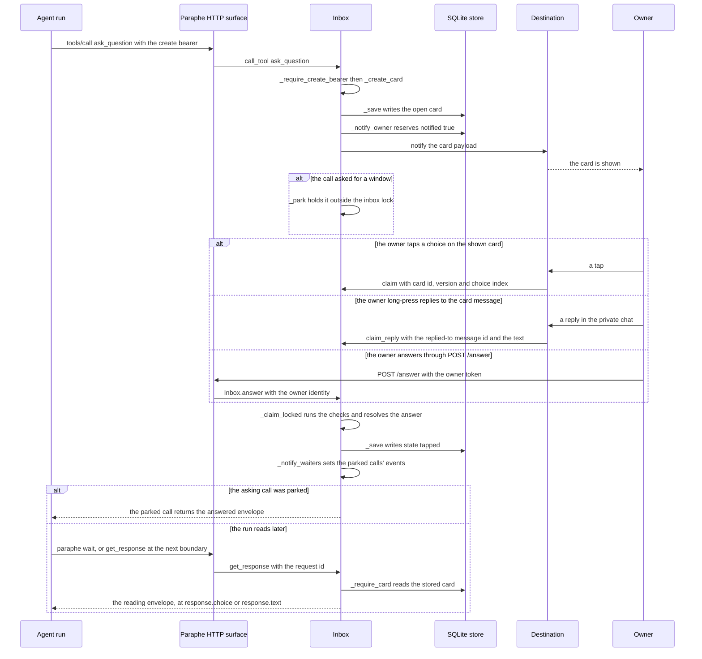
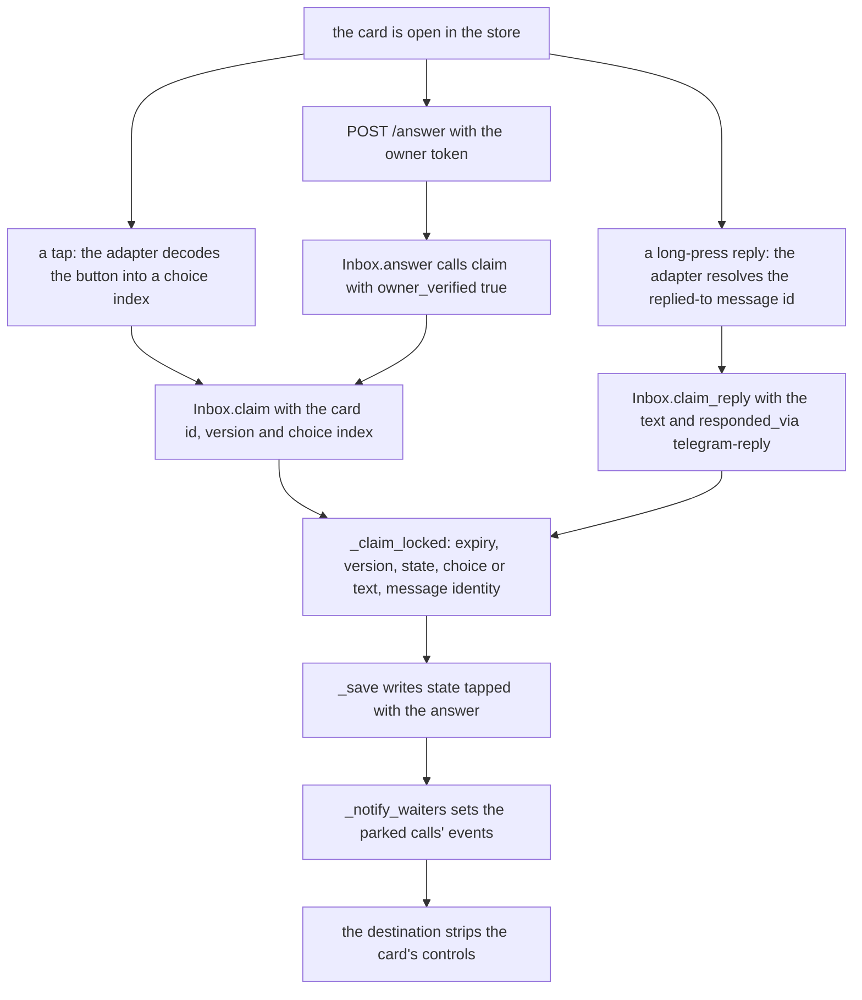
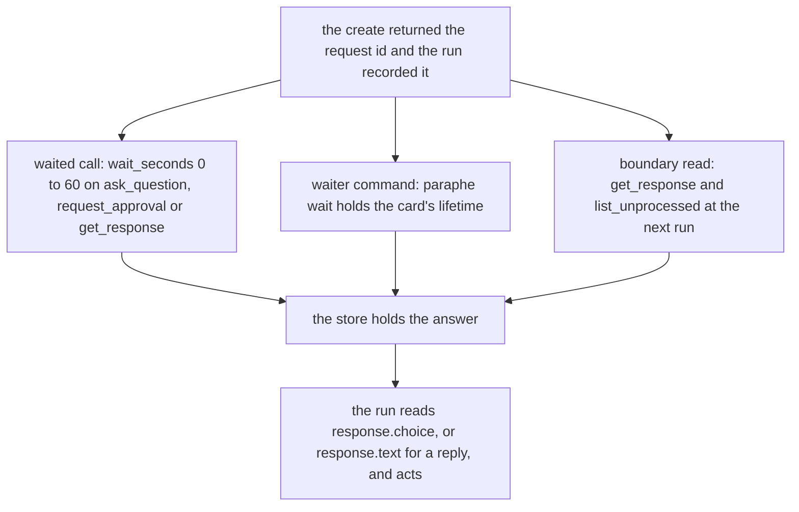

# The ask → answer → resume workflow

One agent raises one decision; the owner answers it; the run that asked picks the
answer up and carries on. The README states that loop in one line — ask → you see
the card → you answer → the asking agent resumes — and everything in Paraphe
exists to make it close without the owner having to announce the answer in chat,
and without any runtime being integrated: the answer returns **through the ask
itself**.

The loop is a flow across five systems — the agent run, the MCP surface, the
`Inbox`, the SQLite store, and the destination the owner looks at — and its
honest failure behaviour matters as much as its happy path. This page traces the
whole thing with the real call names and states what happens at each hop when
something goes wrong. The rules of the card record itself are in
[the card lifecycle](/openwiki/architecture/card-lifecycle.md), the parking
mechanism in [the wait engine](/openwiki/architecture/wait-engine.md), and which
credential may do what in
[the credential boundary](/openwiki/security/credential-boundary.md); this page
stays on the flow.

## The loop end to end



The founding loop with every hop named: the create is written and reserved before
the owner is told, the owner's three answer entries meet in one method, the answer
is written before any waiter is woken, and all three resume routes read the same
stored card.

The README names those three routes and treats them as equals: the call may wait
(`wait_seconds`), `paraphe wait` can hold the card's lifetime, and any run that
missed both drains the answer from the store at its next boundary. Nothing has to
be said in chat.

## Hop 1 — the ask

The agent sends a JSON-RPC `tools/call` for `ask_question` to `POST /mcp` with
`Authorization: Bearer <create bearer>`. The surface dispatches it to
`Inbox.call_tool`, which runs `_ask_question` under the inbox lock:
`_require_create_bearer` first, then the strictness checks (unknown parameters
refused, `question`/`context`/`choices`/`allow_freeform` and the approval fields
never mixed), then `_require_str(args, "question")`.

`_create_card` is where the card is born. It needs a stable `external_id`; a
repeat with a known key returns the existing card as a create view marked
`duplicate: true` rather than making a second decision, and a key already used
for another `kind` is refused (`external_id kind mismatch`). A new card gets a
fresh `uuid4` `request_id`, `expires_at = now + ttl`, and is written to the store
by `_save` **before** anything outside the process is told about it. The create
result is the create view: `request_id`, `version`, `duplicate`, `pending`,
`status`, `kind`, and `read_with: "get_response"` — the served pointer at the
reading path the run will need.

That `request_id` is the run's only handle on the decision, which is why the
protocol tells every client to record it. A create tool that waits never returns
this shape: see the waited call below.

### Telling the owner, and what a rejected send means

`_notify_owner` reserves the notification: it saves a copy with `notified: true`
and only then calls the destination's `notify(payload)`. The payload is the
card's fields, and the destination is chosen at start-up — the Telegram tap
adapter when a bot token is configured, the console destination otherwise.

The order is what makes the hop safe in both directions:

- a destination error that proves the send did not happen (`NotifyRejected`, with
  no destination message attached yet) rolls the reservation back to
  `notified: false`, so the card is still notifiable and a retry or a duplicate
  create sends again — the error itself still propagates to the caller;
- any other destination error leaves the reservation on record and propagates,
  so an ambiguous crash can never double-notify: the safe direction, because the
  card already exists and is readable.

## Hop 2 — the owner answers

The card the owner looks at is composed from the notification payload, and on the
phone it is ordered rich text rather than a wall of prose: an identity line naming
who is asking and from where (agent, runtime, repository, worktree, ticket — what
the caller supplied, never guessed), the kind line with its risk word when that is
high or critical, the bold title, the numbered choices with their one-line notes
and the recommended one marked, the limits, the links and the expiry.

The owner has three ways to answer, and all three end in the same method:



Three answer entries, one ladder: only the stored write is the answer.

- **The tap.** `TelegramAdapter._on_callback` (driven by the long poll in
  `Runtime.poll_once`, on a thread inside the same process as the inbox) decodes
  the button's `callback_data` through `decode_callback_data` into card id,
  `version` and `choice_index`, checks the sender and chat are the owner's private
  chat, and calls `inbox.claim(...)` with the message identity. `claim` runs the
  owner check, loads the store, finds the card by id, and hands it to
  `_claim_locked`, which resolves the choice index against the card's choices
  (falling back to `Approve`/`Deny` when the card carries none).
- **The long-press reply.** The card message carries the renderer's reply hint
  ("Reply to this message to answer in your own words or ask a question."), so the
  owner answers the card message in the private chat with words instead of a
  button. `TelegramAdapter.handle_update` requires a private chat whose id and
  sender are both the owner's, a string `text`, and a
  `reply_to_message` carrying a positive integer `message_id`; it then calls
  `_on_reply`, which calls `Inbox.claim_reply(from_id=..., chat_id=...,
  message_id=..., text=...)`. `claim_reply` re-checks the owner, loads the store,
  resolves the card by the replied-to message id over the loaded card state
  (`_card_by_telegram_message`), and hands **that** card to `_claim_locked` with
  its own `version`, the `text`, and `responded_via="telegram-reply"` — no choice
  and no choice index. Passing the card's own version is why `stale_version` is
  unreachable through this door: a reply to a message a revision superseded finds
  no card at the lookup and is refused `unknown` instead. No tool, no route and no
  new wake mechanism exists for the reply: it is an owner answer entered through
  the destination seam, and
  [owner replies as answers](/openwiki/integrations/owner-reply-intake.md) has the
  intake detail.
- **The owner credential.** `POST /answer` is routed before the MCP bearer
  check; `_answer_as_owner` verifies the owner answer credential, then requires a
  JSON body with `request_id` and `version`, then calls `Inbox.answer`, which does
  no checking of its own and routes straight into `claim` with
  `owner_verified=True` and `responded_via="answer-path"`. One implementation of
  the owner and version checks means one place for them to be wrong.

`_claim_locked` is the single door the two adapter entries and the local route
share. It refreshes expiry, then runs its checks in a fixed order — version,
state, choice shape, text shape, message identity — and refuses each failure with
its own reason. Only after the checks does it write `state: tapped`, the choice
**or** the text, `responded_at` and `responded_via` through `_save`, and only
**after** that write does it call `_notify_waiters` to set the events of any calls
parked on that request id. The answer is durable before anything is woken, so a
woken call can always read the answered card from the store and can never observe
a pre-write state. The strip comes last and is best-effort: after the wake the
answer path asks the port to `remember_message` and then to `edit_and_strip`, and
a strip that fails is swallowed — the answer is already durable and the wake
already sent.

The design line sits here. The credential an agent holds creates and reads; it
cannot answer. Presenting the create bearer to `POST /answer` gets `401`, no
claim is recorded, and the card is unchanged — an attempt is not an answer.

### What a reply answer means to the asking run

A reply is a real answer, not a comment: the words are recorded verbatim as the
card's answer, they come back to the exact session that asked on whichever of the
three return routes it holds, the card closes exactly as a tap would, and what
differs is only the shape the run reads back — `response.choice` is `null`,
`response.text` carries the owner's words, and `responded_via` is
`telegram-reply`. Nothing server-side classifies those words. The rule therefore
lives in what the surface teaches the agent: a reply that is a question or not a
decision is not a decision, the run must not execute it, and it explains and
re-asks with a fresh card. A run that reads a reply envelope as an authorisation
has misread its own protocol, not the store.

## Hop 3 — the resume, on three equal routes

A run never has to be *woken*: it either holds a call open, backgrounds a
command that does, or reads at the next boundary — the call that waits
(`wait_seconds`), `paraphe wait` holding the card's lifetime, or the drain at the
next boundary. All three routes are first-class, all three read the same stored
card, and none of them is a fallback for another. What the owner's answer was — a
choice or the owner's own words — is invisible to the routing: the envelope
carries whichever the card recorded.



Three routes to the same answer, chosen by what the runner can do — not by how
much of a fallback it is.

### The waited call

`ask_question`, `request_approval` and `get_response` accept `wait_seconds`
(0–60, validated by `_opt_wait`). When the tool is in `WAIT_TOOLS`, the handler
returned a dict carrying `request_id`, and the validated `wait_seconds` is
greater than zero, `call_tool` applies `_park` **outside** the inbox lock — a
parked call must not block the inbox, and the answer path needs that lock to
write. `_park` reads the card, registers an event, re-reads (so an answer that
landed just before registration is not missed), and waits out the remaining
window; the wake is an event set by the writer, and the window end needs no wake
at all.

Two consequences of replacing the result:

- a create that waits returns the **reading envelope**, not the create view —
  `status`/`response`/`pending` instead of `duplicate`/`read_with`;
- `wait_seconds` of `0` or absent is the window not taken: the handler's own
  result comes back and nothing sleeps. `request_feedback` accepts the parameter
  and does not sleep on it, because it is not a wait tool.

One call is bounded by design: runtimes expire calls, and the surface refuses a
window longer than 60 seconds. A longer return path is composed *outside* the
model loop, which is what the second route is for.

### The waiter command

`paraphe wait <request_id>` (→ `cli.wait_for_answer`) is the same window repeated
outside the model loop, by a process that has no reason to expire: each iteration
makes one `get_response` call with `wait_seconds` clamped to
`WINDOW_SECONDS` 60, and the envelope decides the next move.

| Envelope status | Command result |
|---|---|
| `answered` / `acknowledged` | prints the envelope as JSON on stdout, exit `0` |
| `expired` / `cancelled` | `paraphe: the card is <status>` on stderr, exit `3` |
| anything else, including `pending` | holds another bounded window |
| unknown request id | exit `4`, recognised from `unknown request_id` in the tool error |
| transport failure | 20 consecutive failures tolerated at 3 s apart, then exit `1` |

A runner with no tool bindings asks with `paraphe ask`, backgrounds
`paraphe wait`, and reads the answer from the command's stdout. The full command
contract — endpoint resolution, bearer resolution, parsing — is
[the ask and wait CLI](/openwiki/integrations/ask-and-wait-cli.md).

### The read at the next boundary

`get_response` returns the reading envelope and never writes an answer, so the
answer is not consumed: reading twice yields the same `response.choice` — or the
same `response.text` for a reply. `list_unprocessed` re-derives its list on every
call from cards whose state is `tapped` and whose `processed_at` is `null`, so an
answer keeps appearing until `mark_processed` records the closeout, and a replied
card is in that list on the same terms as a tapped one. A client that cannot
background a command drains with these at its next run; that is a first-class
path, which is why the served text points at it in both places — `get_response`:
"Drain the answers that are yours when you next run", `list_unprocessed`: "The
tapped answers not yet marked processed: drain them when you next run".

### The store is the source, not the destination or the waiter

`_waiters` is in-memory state on one `Inbox` instance and is never persisted. A
restart parks nobody; a second process pointed at the same store has its own
empty table. The destination never carries the answer back either — its whole
contract is `notify(payload)` and `edit_and_strip(card_id, version)`. What is
authoritative is the card in the store: a new `Inbox` on the same store path
serves the same cards, answers included. That holds for the reply channel too,
because `claim_reply` resolves the card out of loaded store state rather than out
of the adapter's in-memory message map, so a reply after a fresh process still
answers the card it targets.

That is why a missed wake is only ever a *poll miss*, never a lost answer: the
worst case is a call that waited its full window and then reported the state the
store already had — exactly what a run that never waited would learn from
`get_response` or `list_unprocessed`. Silence is never approval, and no tool
parameter or timeout turns into a choice.

## Hop 4 — closing the loop

The run acts on the answer and then closes its own card out, which is what makes
the answer stop appearing in `list_unprocessed`:

- `mark_processed` is the idempotent closeout: it sets `processed_at` once, and a
  second call returns the same timestamp. The derived status becomes
  `acknowledged` while the recorded answer stays readable, so closeout never
  erases authorship.
- `report_execution` records the outcome of a tapped approval (`accepted`,
  `rejected`, `completed`, `failed`, with an optional `result` object) — the
  approval-shaped closeout beside the closeout itself.

## Failure table

| Situation | Honest outcome |
|---|---|
| The destination rejects the send and proves it (`NotifyRejected`, no message attached yet) | The card is already saved; the reservation is rolled back to `notified: false`, the error propagates to the caller, and the card **is still notifiable** — a retry or a duplicate create with the same `external_id` sends again |
| Any other destination error | The reservation stays on record and the error propagates; the card is never notified again, and it exists and is readable |
| The window ends with no answer | The waited call returns the pending envelope (`status: pending`, `response: null`); nothing is approved, and a later `get_response` or `list_unprocessed` still reads the answer once the owner gives one |
| The waiter process dies, or was never backgrounded | Nothing detects it; the card is unaffected, and the next run drains the answer with `get_response` / `list_unprocessed`. A waiter that loses the service for 20 consecutive attempts exits `1` **even though the card is still answerable** |
| A session ends with an open card | The request id and its continuation are recorded for the next run; no fresh session executes a dead origin |
| The card expires while a read observes it | `_refresh_expiry` persists `expired` and wakes the parked calls; reader and park both surface `expired` |
| The card expires and nobody observes it | The park's own next read (or the next `get_response`) persists the expiry; the parked call reports `expired` at its window end |
| The owner answers with a superseded `version` | Refused `stale_version` — `409` on the answer path with the reason as the body — and the card is unchanged; parked calls keep waiting |
| The owner answers a card already answered, cancelled or expired | Refused `already_tapped` / `cancelled` / `expired`; the card is unchanged |
| A reply arrives from a stranger, a group chat, a foreign private chat, or as a plain message with no reply target | Dropped in the adapter before any claim: nothing written, nothing sent, nobody told |
| A reply targets a status message, or a message a revision superseded | Resolution finds no card carrying that message identity, so the refusal is `unknown` — recorded nowhere, sent nowhere; the live message still answers |
| A reply's text is blank, whitespace-only, or over 4096 UTF-16 units | Refused `invalid_answer`; the card is unchanged |
| A reply arrives on a card that already has an answer | Refused `already_tapped`; the first answer stands and no new card state is written — and unlike a tap there is no callback toast, so the refusal is silent |
| The create bearer is presented to `POST /answer` | `401`, connection closed, no claim recorded, card unchanged |
| A create arrives without the create bearer | Tool error (`create bearer is required`), no card written |
| `paraphe wait` is given an unknown request id | Exit `4`; there is no card to wait on |
| The parked client disconnects | Nothing detects it: the park ends at its own deadline, the same `finally` removes the waiter entry, and the card is untouched |
| The service restarts while calls are parked | Those calls died with the process; the store still holds the card and the answer, and a new process serves it |

The record-level rules behind these rows — what a claim refuses and why, how a
revision bumps, how expiry is persisted — are
[the card lifecycle](/openwiki/architecture/card-lifecycle.md), and the
credential rules behind the `401` row are
[the credential boundary](/openwiki/security/credential-boundary.md).

## The recorded instance

`docs/demo/console-loop.md` is the loop recorded on a clean checkout — the
recording the README's loop section points at — with no Telegram bot, no
third-party account and no external service in the path: recorded on 2026-09-10
against `docs/repo-grooming`, it is a clone, a virtual environment,
`pip install .`, a configuration file with two reader-supplied values, and
`.venv/bin/paraphe --config paraphe.toml`, which prints
`Paraphe ready: mcp http://127.0.0.1:8899/mcp answer-path on`. The animated
terminal capture of those five steps is committed as `docs/demo/console-loop.gif`
and embedded on the README.

```
1. asked      : 43c1b52f-… version 1 pending True
2. agent credential answering is refused: 401
3. answered   : 200 answered
4. agent resumed (poll): Yes via answer-path
5. closed     : acknowledged processed_at set: True
```

The five steps are the flow on this page: the card went to the store; the same
credential was presented to the answer path and refused with no claim recorded
and the card unchanged — the product's line, observed rather than assumed; the
owner answered through the owner-only answer path; the run read the answer with
`get_response` and saw `responded_via: answer-path`; and `mark_processed` closed
the card. The document also records what the owner saw: the console card composed
purpose first, with its origin line, choices, recommendation and consequence,
followed by the exact `curl` command that answers it through the owner answer
path.

Note which leg the recording exercises: step 4 is the **boundary read**, not the
waited call and not the waiter command, and step 3 is the local answer route, not
the tap and not the reply. The console run is the poll leg of the loop made
observable end to end; the waited call, `paraphe wait` and the two phone answer
entries are pinned by tests rather than by that recording. The console destination
is what makes the demo possible — `docs/adapters.md` calls it the smallest
complete implementation of the two-method contract: it prints the card and the
exact `curl` command that answers it, using the same `notify` and
`edit_and_strip` methods the Telegram tap adapter implements, with no network call
of its own.

The phone variant is the same loop with the tap adapter as destination, and its
reply channel is a third way in for the same answer. The repository ships a still
of the approval card as it arrives on the phone (`docs/demo/phone-approval.png`,
shown on the README), but no recorded run of the phone loop itself: the demo
document states that making one needs a phone, so the tap path stays documented in
`docs/adapters.md` and pinned by `tests/inbox/test_telegram_port.py`.

## What the loop teaches its clients

There is no per-runtime integration anywhere. Nothing parses `source_thread`,
nothing writes a wake record, and no server-initiated turn exists — ADR 0011
withdrew that machinery, and `source_thread` survives as descriptive metadata
only.

Instead, the protocol travels in two places a client actually reads:

- the **served tool text** — `how_to_use` and `TOOL_DESCRIPTIONS` name
  `request_id`, `wait_seconds`, `get_response`, `list_unprocessed`,
  `paraphe wait` and its exit codes, the rule that a session ending with an
  open card records the id and its continuation for the next run, and the reply
  rule: the owner may answer with a reply instead of a tap, the words arrive as
  `response.text` with `responded_via telegram-reply`, and a reply that is a
  question or not a decision is explained and re-asked with a fresh card rather
  than executed;
- **one shipped skill**, `skills/paraphe-return-path/SKILL.md`, which the README
  lists as "the async return protocol, per runtime": the same three routes in the
  order a client should try them, an install table of one copy step per runtime
  (Hermes, Claude Code, Codex, or the served text alone where a runtime has no
  skills directory), the two environment values the waiter needs
  (`PARAPHE_MCP_CREATE_BEARER` and the endpoint), and the rules — the create
  credential never answers, provenance is never guessed, an answer is bound to
  the card's `version`, and a reply that is not a decision is explained and
  re-asked.

That is the whole teaching surface: a client that reads nothing but `tools/list`
still learns the loop, and a runner that can background any command is returned
by the answer.

## Focused tests

| What the page asserts | Where it is pinned |
|---|---|
| tap inside the window returns the answered envelope; window end returns the pending envelope and a later read still answers | `tests/inbox/test_wait_engine.py` (`TestWaitEngine`) |
| expiry observed by a read wakes the park; expiry nobody observes surfaces `expired` at the window end | `tests/inbox/test_wait_engine.py` (`test_an_expiry_observed_by_a_read_wakes_the_waiter`, `test_an_expiry_nobody_observes_is_reported_at_the_window_end`) |
| the same tap writes identical fields with and without a waiter | `tests/inbox/test_wait_engine.py` (`test_the_same_tap_writes_the_same_fields_with_and_without_a_waiter`) |
| `paraphe wait` prints the answer and exits `0`, `3`, `4`, looping over windows | `tests/inbox/test_wait_engine.py` (`TestWaitCommand`) |
| the create bearer is refused on `POST /answer` with no claim recorded | `tests/inbox/test_setup.py` (`test_the_create_credential_cannot_answer`) |
| the owner credential answers and records `responded_via: answer-path` | `tests/inbox/test_setup.py` (`test_the_owner_credential_answers_and_records_how_it_arrived`) |
| the console destination prints the card and the answer command, and implements only the two-method contract | `tests/inbox/test_setup.py` (`test_the_console_destination_prints_the_card_and_the_answer_command`), `tests/inbox/test_surface_contract.py` (`test_the_console_destination_implements_the_two_method_contract`) |
| a reply records the owner's words verbatim with `choice` null and `responded_via telegram-reply` | `tests/inbox/test_reply_intake.py` (`test_reply_records_the_owners_words_verbatim`) |
| a reply writes the same lifecycle as a same-moment tap, and wakes a parked waiter with the text | `tests/inbox/test_reply_intake.py` (`test_reply_writes_the_same_lifecycle_as_a_same_moment_tap`, `test_reply_wakes_the_parked_waiter_with_the_text`) |
| a reply still resolves after a restart, and every refusal records nothing, wakes nothing and raises nothing | `tests/inbox/test_reply_intake.py` (`test_reply_resolves_after_a_restart`, `test_refusals_record_nothing_raise_nothing_and_wake_nothing`) |
| reads do not consume the answer; closeout is idempotent and keeps the answer readable | `tests/inbox/test_mcp_lifecycle.py` (`test_get_response_nested_choice_is_not_consumed`, `test_mark_processed_is_idempotent_and_read_still_shows_tap`) |
| a new `Inbox` on the same store serves the answer — the drain at the next run | `tests/inbox/test_mcp_lifecycle.py` (`test_card_state_survives_new_inbox_on_same_store`) |
| the served text carries the return protocol and the reply rule | `tests/inbox/test_surface_contract.py` (`test_the_served_text_carries_the_async_protocol`, `test_the_served_text_teaches_the_reply_rule`) |

The wider layout is in
[the test suite and integration](/openwiki/testing/suite-and-integration.md).
